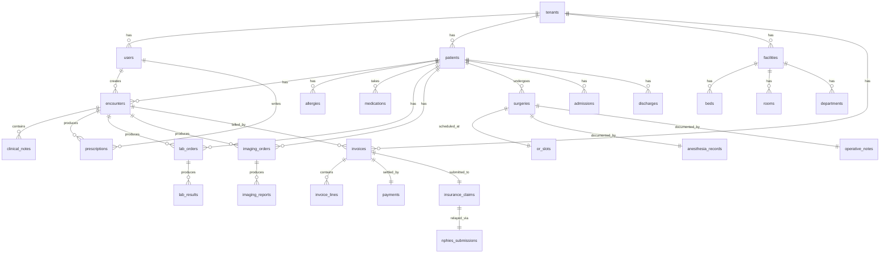

# AUTHENTICATION, AUTHORIZATION (RBAC), SSO, MIGRATIONS PLAN
**Last updated:** 2026-08-10

---

## 1. Authentication

### Stack

- **express-session** (cookie-based)
- **Redis** (session store)
- **bcryptjs** (password hashing, cost 12+)
- **speakeasy** (TOTP MFA)
- **crypto_envelope.js** (PHI at rest)

### Login flow

```
POST /api/auth/login
  Body: { email, password }
  → bcrypt.compare(password, user.password_hash)
  → if user.mfa_required: respond { mfa_required: true, mfa_token: ... }
  → else: create session, set cookie, respond { user, tenant }
  
POST /api/auth/mfa
  Body: { mfa_token, totp_code }
  → speakeasy.totp.verify({ secret: user.mfa_secret, encoding: 'base32', token: totp_code })
  → if valid: create session, set cookie, respond { user, tenant }
```

### MFA enforcement

- Mandatory for: owner, admin, doctor, finance, accounts, quality, infection
- Optional for: nurse, pharmacist, lab tech, radiologist, cashier
- Disabled for: patient portal users (use SMS OTP instead)

### Session policy

- Idle timeout: 30 minutes
- Absolute timeout: 8 hours
- Cookie: `nama.sid`, httpOnly, secure, sameSite=strict
- Renewal on activity
- Logout invalidates session

### Password policy

- Min 12 chars
- Upper + lower + digit + special
- Not in top-10K common list
- bcrypt cost factor 12+
- No forced rotation (NIST 800-63B)

### Account lockout

- 5 failed logins → 15 min lockout
- 10 failed → 1 hour lockout
- 20 failed → admin notification + IP block

### SMS OTP (patient portal)

- 6 digits
- 5 min TTL
- 3 max attempts
- Rate limit: 1 per 30s, 5 per day per phone

---

## 2. SSO (Single Sign-On)

### Providers

| Provider | Saudi | Notes |
|---|---|---|
| Saudi National SSO (Absher / Nafath) | ✅ | Government employees + citizens |
| Apple ID | ✅ | iOS users |
| Google Workspace | ✅ | Hospital staff |
| Microsoft 365 | ✅ | Hospital staff |
| Okta / Auth0 | ✅ | Enterprise customers |

### Nafath integration

```python
# 1. Redirect to Nafath with request_id
GET /api/auth/nafath/start?return_url=...
  → request_id = random()
  → store request_id in Redis with TTL 5min
  → redirect to https://iam.nafath.gov.sa/...?request_id=...

# 2. Nafath callback
GET /api/auth/nafath/callback?request_id=...
  → poll Nafath for status
  → if approved: receive { national_id, full_name, mobile, email }
  → match user by national_id
  → if matched: create session
  → else: redirect to register page
```

### Apple / Google / Microsoft OAuth2

Standard OAuth2 Authorization Code flow with PKCE.

### SAML 2.0 (planned)

For hospital enterprise customers with on-prem AD/Okta.

---

## 3. RBAC (Role-Based Access Control)

### Roles

| Role | Specialty Scope | Description |
|---|---|---|
| Owner | All | Hospital owner (multi-facility) |
| Admin | All | System admin |
| CMO | All | Chief medical officer |
| CNO | All | Chief nursing officer |
| Doctor | Own specialty | Physician |
| Specialist | Own specialty | Specialist (consultant) |
| Resident | Own specialty | Resident / trainee |
| Nurse | All | Nurse |
| Receptionist | All | Front desk |
| Pharmacist | Pharmacy | Pharmacy operations |
| Lab Tech | Lab | Lab operations |
| Radiologist | Radiology | Radiology operations |
| Cashier | Billing | Cashier |
| Accountant | Billing | Accountant |
| HR Manager | HR | HR admin |
| HR Staff | HR | HR staff |
| Quality Manager | Quality | Quality admin |
| Quality Staff | Quality | Quality staff |
| Infection Manager | Infection | Infection admin |
| Maintenance | Facility | Maintenance tech |
| Transport | Facility | Transport |
| Housekeeping | Facility | Housekeeping |
| Dietary | Facility | Dietary |
| Social Worker | Facility | Social work |
| Patient | Portal | Patient portal user |

### Permission matrix (sample)

| Action | Doctor | Nurse | Receptionist | Pharmacist | Lab Tech |
|---|---|---|---|---|---|
| Read patient chart | ✅ (own specialty) | ✅ | ✅ (demographics) | ✅ (allergy + meds) | ✅ (orders + results) |
| Write patient chart | ✅ (own specialty) | ✅ (vitals, intake) | ❌ | ❌ | ❌ |
| Prescribe medication | ✅ | ❌ | ❌ | ❌ | ❌ |
| Dispense medication | ❌ | ❌ | ❌ | ✅ | ❌ |
| Order lab | ✅ | ❌ | ❌ | ❌ | ❌ |
| Enter lab result | � | ❌ | ❌ | ❌ | ✅ |
| Verify lab result | ✅ (pathologist) | ❌ | ❌ | ❌ | ❌ |
| Create invoice | ❌ | ❌ | ❌ | ❌ | ❌ |
| Pay invoice | ❌ | ❌ | ❌ | ❌ | ❌ |

---

## 4. Specialty-Based Access (Golden Access Rule)

### Rule

A doctor can access a patient only if:
1. The patient is in their specialty (e.g., cardiologist sees cardiology patients)
2. OR a cross-specialty consult was requested
3. OR the patient was transferred to their specialty
4. OR explicit permission was granted (e.g., for emergencies)

### Enforcement

```js
// Server-side
app.get('/api/patients/:id',
  requireAuth,
  requireTenantScope,
  requirePermission('patients:read'),
  requireSpecialtyAccess, // checks patient.specialty == user.specialty OR consult/transfer
  async (req, res) => { ... }
);

// DB-side
CREATE POLICY patient_specialty_access ON patients
  FOR SELECT
  USING (
    tenant_id = current_setting('app.tenant_id')::int
    AND (
      current_setting('app.user_role') = 'admin'
      OR patient.specialty = current_setting('app.user_specialty')
      OR EXISTS (
        SELECT 1 FROM consultations
        WHERE consultations.patient_id = patients.id
        AND consultations.specialty = current_setting('app.user_specialty')
        AND consultations.status = 'active'
      )
    )
  );
```

---

## 5. Database migrations

### Policy

- Never DROP column · only ADD or RENAME
- Never DROP table · only RENAME
- Never lose data
- Both `_up.sql` and `_down.sql`
- Test on local → staging → production
- Run during low-traffic window (Friday 02:00)

### Migration runner

```js
// migrate.js
const fs = require('fs');
const path = require('path');
const { Pool } = require('pg');

const pool = new Pool({ /* config */ });

async function run() {
  const client = await pool.connect();
  await client.query('BEGIN');
  try {
    await client.query(`
      CREATE TABLE IF NOT EXISTS schema_migrations (
        id SERIAL PRIMARY KEY,
        version VARCHAR(255) UNIQUE NOT NULL,
        applied_at TIMESTAMPTZ DEFAULT NOW()
      )
    `);
    
    const applied = await client.query('SELECT version FROM schema_migrations');
    const appliedVersions = new Set(applied.rows.map(r => r.version));
    
    const migrationDir = path.join(__dirname, 'migrations');
    const files = fs.readdirSync(migrationDir)
      .filter(f => f.endsWith('_up.sql'))
      .sort();
    
    for (const file of files) {
      const version = file.replace('_up.sql', '');
      if (appliedVersions.has(version)) continue;
      
      const sql = fs.readFileSync(path.join(migrationDir, file), 'utf8');
      console.log(`Applying ${version}...`);
      await client.query(sql);
      await client.query('INSERT INTO schema_migrations (version) VALUES ($1)', [version]);
    }
    
    await client.query('COMMIT');
  } catch (e) {
    await client.query('ROLLBACK');
    throw e;
  } finally {
    client.release();
  }
}
```

### Migration template

```sql
-- migrations/e60_add_cds_hooks_table_up.sql
BEGIN;

CREATE TABLE cds_hooks (
  id BIGSERIAL PRIMARY KEY,
  tenant_id INT NOT NULL REFERENCES tenants(id),
  patient_id BIGINT REFERENCES patients(id),
  hook_type VARCHAR(50) NOT NULL,
  context JSONB NOT NULL,
  response JSONB,
  created_by BIGINT REFERENCES users(id),
  created_at TIMESTAMPTZ DEFAULT NOW()
);

CREATE INDEX cds_hooks_tenant_idx ON cds_hooks(tenant_id);
CREATE INDEX cds_hooks_patient_idx ON cds_hooks(patient_id);

ALTER TABLE cds_hooks ENABLE ROW LEVEL SECURITY;
CREATE POLICY cds_hooks_tenant_isolation ON cds_hooks
  FOR ALL
  USING (tenant_id = current_setting('app.tenant_id')::int);

COMMIT;
```

```sql
-- migrations/e60_add_cds_hooks_table_down.sql
BEGIN;

DROP TABLE IF EXISTS cds_hooks;

COMMIT;
```

---

## 6. ERD (Entity-Relationship Diagram)

### Core entities



### Full ERD

See `.ai-brain/02_MODULES/DEP-NNN/{18_ERD}.mmd` for each department.

---

## 7. Migrations tracker

87+ migrations applied. New migrations added per wave:
- Wave 38: audit hash chain
- Wave 37: Redis metric
- Wave 36: RLS defense
- Wave 35: logrotate hotfix
- Wave 34: backup activation
- Wave 33: OpenAPI
- Wave 32: Prometheus
- Wave 31: RLS audit
- Wave 30: backup DR
- Wave 29: Redis sessions
- Wave 28: performance

---

End of auth/RBAC/SSO/migrations plan.
