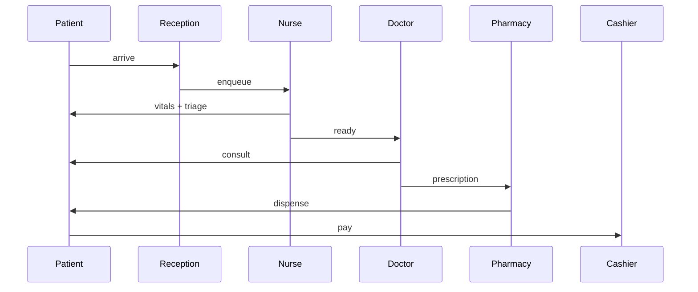

# WORKFLOW SCENARIOS + DATA FLOW CATALOG
**Last updated:** 2026-08-10  
**Purpose:** Every clinical/admin workflow has a happy-path scenario + data flow + orchestration diagram.

---

## A. Outpatient visit (OPD)

**Scenario:** Patient arrives → triage → vitals → nurse assessment → doctor consult → prescription → dispense → check-out → billing.

### Data flow

```
1. Patient check-in (queue)
   queue_patients → patient_id, arrived_at, triage_level, room
   ↓
2. Vitals (nurse)
   nursing_vitals → HR, BP, SpO2, Temp, RR, Pain
   ews_assess → score (0-30), risk_level
   ↓
3. Triage (ESI 1-5)
   nursing_triage → chief_complaint, ESI, acuity
   ↓
4. Doctor consult (clinical record)
   clinical_records → template_id, recorded_values, notes
   clinical_smart_template → structured fields
   ↓
5. E-prescription
   prescriptions → medication_id, dose, route, frequency, duration
   pharmacy_wasfaty → Saudi e-prescription intent
   ↓
6. Lab order (if needed)
   lab_orders → test_code, priority, sample_type
   ↓
7. Imaging order (if needed)
   radiology_orders → modality, body_part, clinical_info
   ↓
8. Patient checkout
   queue_patients.status = checked_out
   ↓
9. Billing
   invoices → line_items, total, payment_method
   insurance_claim → claim_id, payer_id, status
```

### Orchestration diagram



---

## B. Inpatient admission (IPD)

**Scenario:** Admission order → bed assignment → nursing intake → daily rounds → discharge summary → billing.

```
1. ADT admit
   encounters.admit → ward, bed, attending_doctor
   adt_admit → admission_type (elective/emergency)
   ↓
2. Nursing intake (assessments)
   nursing_risk_assessment → fall risk, pressure ulcer, pain
   nursing_assessment_scale → Braden, Morse
   nursing_io → input/output tracking
   ↓
3. Care plan
   care_plans → goals, interventions, expected_outcomes
   ↓
4. Daily rounds
   clinical_notes → SOAP, progress notes
   nursing_scores → EWS, qSOFA
   ↓
5. Med administration
   emar_orders → schedule
   mar_administration_not_given → tracking
   ↓
6. Procedures
   surgery_create → OR booking
   lab_order_create → tests
   ↓
7. Discharge
   adt_discharge → discharge_type, summary, follow-up
   medical_reports → discharge report
   ↓
8. Final billing
   invoice_generate → consolidate charges
   insurance_claim_create → submit to payer
```

---

## C. Emergency department (ED)

**Scenario:** Patient arrives → ESI triage → immediate treatment if ESI 1-2 → registration → ED provider → disposition (admit / discharge / transfer / observation / expired).

```
1. ESI Triage (DEP-021)
   er_triage → ESI 1-5, chief_complaint
   ↓ ESI 1-2: immediate resuscitation
   ↓ ESI 3-5: registration + waiting
2. Trauma assessment
   emergency_trauma_assessment → mechanism, injuries, vitals, GCS
3. Provider assignment
   er_assign_provider → provider_id, role
4. Orders
   lab_orders → STAT priority
   imaging_orders → STAT modality
5. Disposition
   er_disposition → admit/discharge/transfer/observation/AMA/expired
6. If admit → ADT admit
   adt_admit → ward, bed, attending
```

---

## D. Surgery

**Scenario:** Pre-op consult → pre-op labs → OR booking → pre-op checklist → WHO time-out → procedure → anesthesia → operative note → PACU → discharge.

```
1. Surgery scheduling
   surgery_create → patient, type, urgency, OR, surgeon, date
   or_slot_reserve → confirm OR booking
2. Pre-op workup
   lab_orders → CBC, coag panel, type & screen
   imaging_orders → CXR, ECG
   nursing_assessments → pre-op checklist
3. Pre-op checklist (24h before)
   surgery_preop_upsert → consent, NPO status, site mark, allergies
   surgery_preop_test_create → specific pre-op tests
4. Anesthesia consult
   surgery_anesthesia_upsert → ASA class, airway, plan
5. Day of surgery
   or_surgeries_who_checklist (sign-in) → identity, site, procedure, consent
   or_surgeries_who_checklist (time-out) → team, antibiotics, imaging
   or_surgeries_who_checklist (sign-out) → instrument count, specimens
6. Operative note
   or_operative_note_upsert → procedure, findings, complications, EBL
7. PACU
   or_pacu_upsert → vitals, pain, discharge criteria
8. CSSD
   cssd_cycle_create → instrument processing
   cssd_load_item_create → tracking
9. Discharge
   or_surgery_status_update → completed
   adt_discharge → discharge OR → ward/home
10. Follow-up
   or_surgery_recovery (AI) → predicted LOS
   ai_surgery_report (AI) → automated summary
```

---

## E. Lab workflow

**Scenario:** Order → specimen collection → accession → analysis → result entry → verification → critical callback (if needed) → release to chart → patient notification.

```
1. Order entry
   lab_order_create → patient, test, priority, clinical_info
2. Specimen collection
   lab_sample_create → patient, sample_type, collected_at, collector
3. Accession
   lab_sample_transition → received_in_lab
4. Analysis
   lab_result_create → value, units, reference_range, abnormal_flag
5. Verification
   lab_result_verify → verified_by, delta_check
6. Critical callback (if panic value)
   lab_result_critical_callback → notified_to, time, response
7. Release
   lab_result_report → released_to_chart, patient_notified
8. QC
   lab_qc_create → QC material, result, in_range
```

---

## F. Radiology workflow

**Scenario:** Order → scheduling → image acquisition → DICOM upload → radiologist read → report creation → critical notify (if needed) → sign → release → addendum (if needed).

```
1. Order
   radiology_order_create → patient, modality, body_part
2. Scheduling
   radiology_worklist_create → scheduled_slot, technologist
3. Acquisition
   radiology_dicom_study_create → study_uid, series, instances
4. Worklist transition
   radiology_worklist_state_update → in_progress / completed
5. Read
   radiology_report_create → findings, impression, recommendations
6. AI assist
   ai_diagnostics_scan → automated findings
7. Critical
   radiology_report_critical_notify → notified_to, time
8. Sign
   radiology_report_sign → signed_by, time
9. Addendum
   radiology_report_addendum → later finding
10. PHI vault
   dicom storage in phi_vault/ (outside webroot)
```

---

## G. Pharmacy workflow

**Scenario:** Prescription → verification → dispense → administration (inpatient) → counseling → follow-up.

```
1. Prescription
   prescription_create → medication, dose, route, frequency, duration
2. Wasfaty intent (Saudi)
   pharmacy_wasfaty_dispense_intent → patient, medication, pharmacy
3. Verification
   pharmacy_queue_verify → verified_by, interactions_checked
4. Dispense
   pharmacy_dispense → qty, batch, expiry, counseling
5. Stock deduction
   pharmacy_deduct_stock → batch, qty_remaining
6. Controlled substance
   controlled_substance_reconcile → running_balance
   controlled_substance_dispense → witness_signature
7. Inpatient administration
   emar_order_create → scheduled_time, route
   mar_administer → given/not_given, time, witness
8. Patient counseling
   pharmacy_dispense.notes → side effects, adherence
```

---

## H. Oncology workflow

**Scenario:** Diagnosis → staging → regimen selection → cycle 1 → response assessment → cycle 2 → survivorship.

```
1. Diagnosis + staging
   clinical_records → TNM staging
   imaging → CT/PET/MRI
   pathology → biopsy
2. Regimen
   oncology_patient_regimens → regimen, cycle, start_date
3. Genomics
   ai_oncology_genomics → actionable mutations, trial match
4. Cycle management
   cycle_number → 1, 2, 3...
   chemo_order → drug, dose, day
5. Response assessment
   imaging → RECIST 1.1
   tumor_marker → CA-125, PSA, etc
6. Survivorship
   care_plan → long-term follow-up
   palliative_care → if needed
```

---

## I. Insurance + billing

**Scenario:** Patient visit → charge capture → claim generation → eligibility check → pre-auth (if needed) → claim submission → remittance posting → patient billing → collection.

```
1. Charge capture
   invoice_create → line_items (service_code, qty, unit_price)
2. Eligibility check
   insurance_eligibility_create → member_id, payer, service_date
3. Pre-auth (if inpatient)
   insurance_pre_auth_create → service, clinical_justification
4. Pre-auth decision
   insurance_pre_auth_decision_update → approved/denied, units
5. Claim generation
   insurance_claim_create → claim_id, payer, total
6. Claim transition
   insurance_claim_transition_update → submitted/paid/denied
7. NPHIES submission (Saudi)
   nphies_submit_claim → NPHIES portal
8. Remittance
   nphies_remittance_create → RA number, allowed, paid, adjustment
9. AR posting
   nphies_remittance_post_to_ar → patient_invoice_adjustment
10. Patient billing
   invoice_pay → cash / card / bank-transfer
11. Refund (if needed)
   invoice_refund → reason, amount
```

---

## J. Quality + safety

**Scenario:** Incident occurs → report → investigation → root cause → CAPA → verification → closure.

```
1. Incident report
   quality_incident_create → type, severity, description, patient
   ovr_incident_create → override request (if needed)
2. Investigation
   quality_incident_update → status=investigating, root_cause
3. CAPA
   quality_capa_create → action_type, due_date, responsible
4. CAPA update
   quality_capa_update → progress, completion_notes
5. Risk register
   quality_risk_create → risk_name, likelihood, impact
   quality_risk_update → mitigation, status
6. Closure
   quality_incident_update → status=closed
7. KPIs
   quality_kpi_create → metric, target, actual
   quality_satisfaction_create → patient feedback
```

---

## K. Infection control

**Scenario:** Surveillance → HAI detection → outbreak → investigation → contact tracing → isolation → AMS → closure.

```
1. Surveillance
   infection_surveillance_create → organism, infection_type, date
2. Outbreak detection
   infection_outbreak_create → outbreak_name, suspected_source, case_count
   infection_outbreak_update → status (active/contained/closed)
3. Exposure tracking
   infection_exposure_create → patient, source_type, exposure_type
4. Hand-hygiene audit
   infection_hand_hygiene_create → unit, audit_type, observed, compliant
5. Isolation
   infection_isolation_create → patient, isolation_type, start_date
   infection_isolation_update → end_date, status
6. AMS
   infection_ams_create → antibiotic, indication, recommendation
   infection_ams_update → status, notes
7. AI assist
   ai_infectious_antibiotic → culture-based suggestion
```

---

## L. Discharge

**Scenario:** Discharge order → discharge summary → patient education → medication reconciliation → follow-up appointment → billing → bed turnover.

```
1. Discharge order
   adt_discharge → discharge_type (home/transfer/AMA/expired)
2. Discharge summary
   medical_reports → type=discharge, body, follow_up
3. Medication reconciliation
   clinical_medication_reconciliation_create → pre/post, changes
4. Patient education
   nursing_discharge_instructions → diet, activity, warning signs
5. Follow-up appointment
   appointment_followup_create → date, specialty
6. Billing
   invoice_generate → final
   insurance_claim_create → submit
7. Bed turnover
   adt_bed_status → status=cleaning
   housekeeping → cleaned
   adt_bed_status → status=available
```

---

## M. Telemedicine

**Scenario:** Patient requests → eligibility → appointment → video session → clinical note → e-prescription → billing.

```
1. Request
   telemedicine_session_create → patient, provider, scheduled_time
2. Eligibility
   insurance_eligibility_create → check
3. Reminder
   notification_center → SMS/email reminder
4. Video session
   telemedicine_session_update → started, ended, duration
5. Clinical note
   clinical_records → telehealth template
6. E-prescription
   prescription_create → if needed
7. Billing
   invoice_create → telehealth code
```

---

## N. Voice dictation (AI)

**Scenario:** Doctor opens note → starts voice → speaks → AI transcribes → finalize → note saved.

```
1. Start
   voice_dictation_start → patient_id, encounter_id, language
2. Stream audio
   (WebSocket) → chunks → AI transcription
3. Finalize
   voice_dictation_finalize → transcript
4. Save
   clinical_records → note with transcript
```

---

## O. AI orchestrator (general)

**Scenario:** Provider requests AI insight → request validated → AI engine runs → result returned → optionally saved to chart.

```
1. Request
   ai_orchestrator_invoke → patient, context, request_type
2. Validation
   requireAuth → requireRole(doctor) → requireTenantScope
   validateBody(RS.aiOrchestratorInvoke)
3. AI engine
   _aiOrch(orchestrator_id).method(...)
4. Result
   JSON { finding, recommendation, confidence, citations }
5. Save (optional)
   ai_orchestrator_save → clinical note, encounter
```

---

## Summary table

| Workflow | Dept | Status |
|---|---|---|
| OPD | DEP-001 | ✅ |
| IPD | DEP-001 | ✅ |
| ER | DEP-021 | ✅ |
| Surgery | DEP-011 | ✅ |
| Lab | DEP-039 | ✅ |
| Radiology | DEP-040 | ✅ |
| Pharmacy | DEP-053 | ✅ |
| Oncology | DEP-048 | ✅ |
| Insurance + Billing | DEP-058 + DEP-057 | ✅ |
| Quality + Safety | DEP-059 | ✅ |
| Infection control | DEP-008 | ✅ |
| Discharge | DEP-001 | ✅ |
| Telemedicine | DEP-046 | ✅ |
| Voice dictation | DEP-001 | ✅ |
| AI orchestrators | All | ✅ |
| RAG Q&A | All | 🟡 |
| Ambient AI scribe | DEP-001 | � |

**Coverage: 16 workflows catalogued · 14 ✅ / 2 �**
