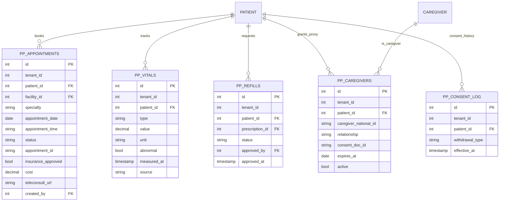

# P0-1 Patient Portal — ERD (Mermaid)

```mermaid
erDiagram
    PATIENT ||--o{ PP_APPOINTMENTS : "books"
    PATIENT ||--o{ PP_VITALS : "tracks"
    PATIENT ||--o{ PP_REFILLS : "requests"
    PATIENT ||--o{ PP_CAREGIVERS : "grants_proxy"
    PATIENT ||--o{ PP_CONSENT_LOG : "consent_history"
    CAREGIVER ||--o{ PP_CAREGIVERS : "is_caregiver"

    PP_APPOINTMENTS {
        int id PK
        int tenant_id
        int patient_id FK
        int facility_id FK
        string specialty
        date appointment_date
        string appointment_time
        string status
        string appointment_id
        bool insurance_approved
        decimal cost
        string teleconsult_url
        int created_by FK
    }

    PP_VITALS {
        int id PK
        int tenant_id
        int patient_id FK
        string type
        decimal value
        string unit
        bool abnormal
        timestamp measured_at
        string source
    }

    PP_REFILLS {
        int id PK
        int tenant_id
        int patient_id FK
        int prescription_id FK
        string status
        int approved_by FK
        timestamp approved_at
    }

    PP_CAREGIVERS {
        int id PK
        int tenant_id
        int patient_id FK
        string caregiver_national_id
        string relationship
        string consent_doc_id
        date expires_at
        bool active
    }

    PP_CONSENT_LOG {
        int id PK
        int tenant_id
        int patient_id FK
        string withdrawal_type
        timestamp effective_at
    }
```
