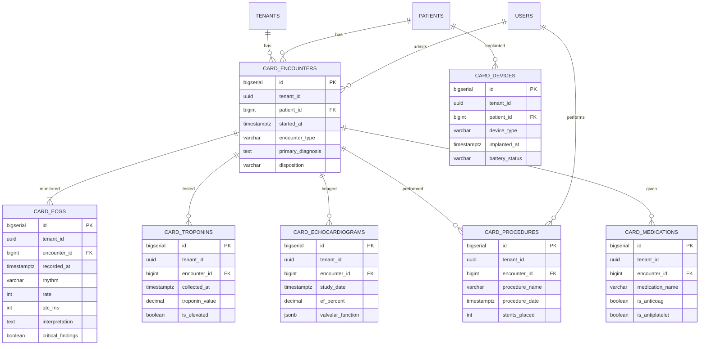

# CARD-001 — ERD Diagram

## Indexes
- (tenant_id, started_at) on card_encounters
- (encounter_id, recorded_at) on card_ecgs
- (encounter_id, collected_at) on card_troponins
- (patient_id) on card_devices
- HNSW on vector columns

## RLS
- FORCE_RLS = ON
- Tenant isolation
