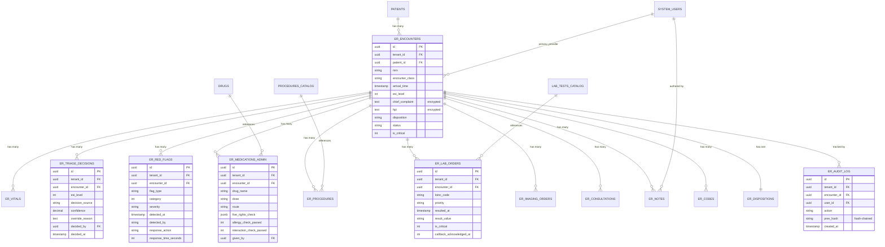

# ER-001 Data Flow + ERD Diagram

## Data Flow — End-to-End

```
┌──────────────────────────────────────────────────────────────────────────────┐
│                          ED PATIENT JOURNEY                                  │
└──────────────────────────────────────────────────────────────────────────────┘

   [Arrival]                  [Triage]                  [Treatment]             [Disposition]
       │                          │                          │                       │
       ▼                          ▼                          ▼                       ▼
   ┌────────┐               ┌──────────┐              ┌──────────┐           ┌──────────┐
   │Reception│              │Triage RN │              │ED MD/RN  │           │MD (final)│
   │(reg)   │               │(ESI 1-5) │              │(treatment)│           │(decision)│
   └───┬────┘               └────┬─────┘              └─────┬────┘           └─────┬────┘
       │                        │                         │                       │
       │  registration          │  vitals + ESI          │  orders                │  disposition
       │                        │  + red flags           │  + meds                │  + admit/disch
       ▼                        ▼                         ▼                       ▼
   ┌──────────────────────────────────────────────────────────────────────────────────┐
   │                          PostgreSQL (tenant-scoped)                              │
   │                                                                                  │
   │  er_encounters  ─┬─>  er_vitals                                                  │
   │                  ├─>  er_triage_decisions                                        │
   │                  ├─>  er_red_flags (auto-detected)                               │
   │                  ├─>  er_medications_admin  (5-rights check)                     │
   │                  ├─>  er_procedures (CPR, intubation, etc.)                      │
   │                  ├─>  er_lab_orders ──> lab_engine (LIS) ──> critical callback    │
   │                  ├─>  er_imaging_orders ──> pacs (PACS)                           │
   │                  ├─>  er_consultations (specialist)                              │
   │                  ├─>  er_notes (encrypted)                                       │
   │                  ├─>  er_codes (blue/stemi/stroke/trauma)                        │
   │                  └─>  er_dispositions                                            │
   │                                                                                  │
   │  er_audit_log  (hash-chained, append-only)                                       │
   └──────────────────────────────────────────────────────────────────────────────────┘
                                       │
                                       │  external integrations
                                       ▼
   ┌──────────────────────────────────────────────────────────────────────────────────┐
   │                          External Systems                                       │
   │                                                                                  │
   │  • NPHIES (KSA insurance eligibility + claim)                                   │
   │  • ZATCA (e-invoicing, when CSID available)                                     │
   │  • LLM Providers (OpenAI, Anthropic — PII-redacted)                             │
   │  • Vector DB (Pinecone, Qdrant — RAG retrieval)                                 │
   │  • PACS (Orthanc, Mirth)                                                        │
   │  • SMS/Paging (TigerConnect, Vocera)                                            │
   │  • Pharmacy (drug interactions, dispensing)                                      │
   └──────────────────────────────────────────────────────────────────────────────────┘
```

## ERD (Mermaid)



## Storage Estimates (per 1,000 encounters/day, per facility)

| Table | Records/day | KB/record | MB/day | GB/year |
|-------|-------------|-----------|--------|---------|
| er_encounters | 1,000 | 5 | 5 | 1.8 |
| er_vitals | 5,000 (5 sets/encounter) | 1 | 5 | 1.8 |
| er_triage_decisions | 1,000 | 2 | 2 | 0.7 |
| er_red_flags | 2,000 | 1.5 | 3 | 1 |
| er_medications_admin | 3,000 (3 meds/encounter) | 3 | 9 | 3.3 |
| er_procedures | 500 | 2 | 1 | 0.4 |
| er_lab_orders | 8,000 (8 tests/encounter) | 2 | 16 | 5.8 |
| er_imaging_orders | 1,500 (1.5 studies/encounter) | 2 | 3 | 1.1 |
| er_consultations | 800 | 1 | 0.8 | 0.3 |
| er_notes | 1,000 (1 note/encounter) | 30 | 30 | 11 |
| er_codes | 100 (10% of encounters) | 5 | 0.5 | 0.2 |
| er_dispositions | 1,000 | 3 | 3 | 1.1 |
| er_audit_log | 10,000 (10 events/encounter) | 2 | 20 | 7.3 |
| **TOTAL** | | | **~98 MB/day** | **~36 GB/year** |

Plus indexes: ~2x storage overhead

## Partitioning Strategy
- `er_encounters`, `er_vitals`, `er_audit_log` partitioned by `arrival_time` / `recorded_at` / `created_at` (monthly partitions)
- Old partitions: archived to cold storage after 1 year
- 10 years retention (clinical)

## Indexes (Performance Critical)
- `(tenant_id, arrival_time)` — for queue queries
- `(tenant_id, esi_level, status)` — for triage routing
- `(tenant_id, is_critical, status)` — for critical care
- `(tenant_id, encounter_id, recorded_at)` — for vital signs timeline
- `GIN(to_tsvector('english', chief_complaint))` — for symptom search (within tenant scope)

## Backup & Recovery
- Continuous WAL archiving (point-in-time recovery)
- Daily full backup (compressed + encrypted)
- Retention: 10 years (clinical)
- DR: cross-region replication, RPO <1h, RTO <4h
- Test restore quarterly (DR drill)

---
*Section 03.f of ER-001. Owner: SA. L4 validated.*
