# ER-001 ERD Diagram (Mermaid)

```mermaid
erDiagram
    TENANTS ||--o{ ER_ENCOUNTERS : "owns"
    FACILITIES ||--o{ ER_ENCOUNTERS : "located at"
    PATIENTS ||--o{ ER_ENCOUNTERS : "visits"
    ER_ENCOUNTERS ||--o{ ER_VITALS : "tracks"
    ER_ENCOUNTERS ||--|| ER_TRIAGE_DECISIONS : "has"
    ER_ENCOUNTERS ||--o{ ER_RED_FLAGS : "triggers"
    ER_ENCOUNTERS ||--o{ ER_MEDICATIONS_ADMIN : "receives"
    ER_ENCOUNTERS ||--o{ ER_PROCEDURES : "undergoes"
    ER_ENCOUNTERS ||--o{ ER_LAB_ORDERS : "ordered"
    ER_ENCOUNTERS ||--o{ ER_IMAGING_ORDERS : "ordered"
    ER_ENCOUNTERS ||--o{ ER_CONSULTATIONS : "requests"
    ER_ENCOUNTERS ||--o{ ER_NOTES : "documents"
    ER_ENCOUNTERS ||--o{ ER_CODES : "activates"
    ER_ENCOUNTERS ||--|| ER_DISPOSITIONS : "ends with"
    ER_ENCOUNTERS ||--o{ ER_AUDIT_LOG : "audited"
    SYSTEM_USERS ||--o{ ER_ENCOUNTERS : "providers"
    SYSTEM_USERS ||--o{ ER_TRIAGE_DECISIONS : "decides"
    SYSTEM_USERS ||--o{ ER_NOTES : "authors"
    SYSTEM_USERS ||--o{ ER_RED_FLAGS : "responds"
    SYSTEM_USERS ||--o{ ER_CODES : "activates"

    TENANTS {
        uuid id PK
        string name
        string name_ar
    }
    PATIENTS {
        uuid id PK
        uuid tenant_id FK
        string mrn
        text first_name_encrypted
        text last_name_encrypted
        date dob
        string sex
    }
    SYSTEM_USERS {
        uuid id PK
        uuid tenant_id FK
        string username
        string role
        string sub_role
    }
    ER_ENCOUNTERS {
        uuid id PK
        uuid tenant_id FK
        uuid facility_id FK
        uuid patient_id FK
        string mrn
        timestamp arrival_time
        timestamp triage_time
        timestamp provider_first_seen_time
        timestamp disposition_time
        int esi_level
        text chief_complaint
        text hpi
        string disposition
        uuid primary_provider_id FK
        uuid triage_rn_id FK
        string status
        int is_critical
    }
    ER_VITALS {
        uuid id PK
        uuid encounter_id FK
        timestamp recorded_at
        int bp_systolic
        int bp_diastolic
        int heart_rate
        int respiratory_rate
        int spo2
        decimal temperature_c
        int pain_score
        int gcs_total
        uuid recorded_by FK
    }
    ER_TRIAGE_DECISIONS {
        uuid id PK
        uuid encounter_id FK
        int esi_level
        string decision_source
        decimal confidence
        text override_reason
        uuid decided_by FK
        timestamp decided_at
        uuid supervisor_cosign_id FK
    }
    ER_RED_FLAGS {
        uuid id PK
        uuid encounter_id FK
        string flag_type
        int category
        string severity
        timestamp detected_at
        string detected_by
        string response_action
        int response_time_seconds
        uuid acknowledged_by FK
    }
    ER_MEDICATIONS_ADMIN {
        uuid id PK
        uuid encounter_id FK
        string drug_name
        string dose
        string route
        int allergy_check_passed
        int interaction_check_passed
        int renal_dose_checked
        int pregnancy_checked
        uuid given_by FK
        timestamp given_at
    }
    ER_PROCEDURES {
        uuid id PK
        uuid encounter_id FK
        string cpt_code
        string snomed_code
        timestamp performed_at
        uuid performed_by FK
    }
    ER_LAB_ORDERS {
        uuid id PK
        uuid encounter_id FK
        string loinc_code
        string priority
        timestamp resulted_at
        string result_value
        int is_critical
        timestamp callback_acknowledged_at
    }
    ER_IMAGING_ORDERS {
        uuid id PK
        uuid encounter_id FK
        string modality
        string priority
        int contrast_used
        int pregnancy_check_done
        int critical_finding
    }
    ER_CONSULTATIONS {
        uuid id PK
        uuid encounter_id FK
        string specialty
        int urgent
        timestamp requested_at
        timestamp responded_at
        uuid consultant_id FK
    }
    ER_NOTES {
        uuid id PK
        uuid encounter_id FK
        string note_type
        text content
        uuid author_id FK
        timestamp created_at
    }
    ER_CODES {
        uuid id PK
        uuid encounter_id FK
        string code_type
        timestamp activated_at
        uuid activated_by FK
        jsonb outcomes
    }
    ER_DISPOSITIONS {
        uuid id PK
        uuid encounter_id FK
        string disposition_type
        string destination
        timestamp time_completed
        uuid decided_by FK
    }
    ER_AUDIT_LOG {
        uuid id PK
        uuid encounter_id FK
        uuid user_id FK
        string action
        string prev_hash
        timestamp created_at
    }
```



## Index Strategy (per table)

```sql
-- Critical indexes for ER performance
CREATE INDEX idx_er_encounters_active ON er_encounters (tenant_id, status, esi_level, arrival_time) 
  WHERE status = 'open' AND soft_deleted = 0;
CREATE INDEX idx_er_encounters_critical ON er_encounters (tenant_id, is_critical, arrival_time) 
  WHERE is_critical = 1;
CREATE INDEX idx_er_vitals_recent ON er_vitals (encounter_id, recorded_at DESC);
CREATE INDEX idx_er_red_flags_unack ON er_red_flags (encounter_id, detected_at) 
  WHERE acknowledged_at IS NULL;
CREATE INDEX idx_er_lab_critical_pending ON er_lab_orders (tenant_id, is_critical, resulted_at) 
  WHERE is_critical = 1 AND callback_acknowledged_at IS NULL;
CREATE INDEX idx_er_codes_active ON er_codes (encounter_id, code_type) 
  WHERE completed_at IS NULL;
CREATE INDEX idx_er_audit_chain ON er_audit_log (tenant_id, prev_hash, created_at);
```

## Tenant Isolation
- All tables: `tenant_id` NOT NULL
- RLS: `ENABLE ROW LEVEL SECURITY` + `FORCE ROW LEVEL SECURITY`
- Policy: `USING (tenant_id = current_setting('app.tenant_id')::UUID)`
- Source: `current_setting('app.tenant_id')` set by `tenant_context.js` from session

---
*Section 03.g of ER-001. Owner: SA + DSL. L4 validated.*
