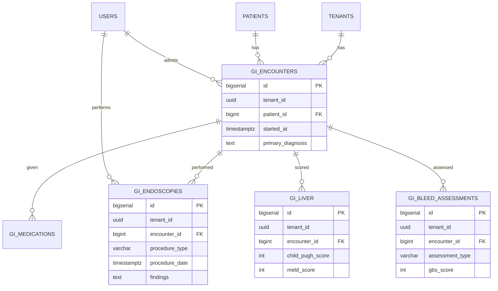

# GI-001 — ERD

```mermaid
erDiagram
    TENANTS ||--o{ GI_ENCOUNTERS : has
    PATIENTS ||--o{ GI_ENCOUNTERS : has
    GI_ENCOUNTERS ||--o{ GI_ENDOSCOPIES : performed
    GI_ENCOUNTERS ||--o{ GI_MEDICATIONS : given
    GI_ENCOUNTERS ||--o{ GI_LIVER : scored
    GI_ENCOUNTERS ||--o{ GI_BLEED_ASSESSMENTS : assessed
    USERS ||--o{ GI_ENCOUNTERS : admits
    USERS ||--o{ GI_ENDOSCOPIES : performs

    GI_ENCOUNTERS {
        bigserial id PK
        uuid tenant_id
        bigint patient_id FK
        timestamptz started_at
        text primary_diagnosis
    }
    GI_ENDOSCOPIES {
        bigserial id PK
        uuid tenant_id
        bigint encounter_id FK
        varchar procedure_type
        timestamptz procedure_date
        text findings
    }
    GI_LIVER {
        bigserial id PK
        uuid tenant_id
        bigint encounter_id FK
        int child_pugh_score
        int meld_score
    }
    GI_BLEED_ASSESSMENTS {
        bigserial id PK
        uuid tenant_id
        bigint encounter_id FK
        varchar assessment_type
        int gbs_score
    }
```

## Indexes
- (tenant_id, started_at)
- (encounter_id)
- HNSW on vector
## RLS: FORCE_RLS = ON
