# MICU — ERD Diagram

```mermaid
erDiagram
    TENANTS ||--o{ ICU_ADMISSIONS : has
    PATIENTS ||--o{ ICU_ADMISSIONS : admitted
    ENCOUNTERS ||--o| ICU_ADMISSIONS : context
    ICU_ADMISSIONS ||--|{ ICU_VITALS : monitored
    ICU_ADMISSIONS ||--o{ ICU_SCORES : calculated
    ICU_ADMISSIONS ||--o{ ICU_VENTILATOR : on
    ICU_ADMISSIONS ||--o{ ICU_VASOACTIVE_DRIPS : receives
    ICU_ADMISSIONS ||--o{ ICU_MEDICATIONS : given
    ICU_ADMISSIONS ||--o{ ICU_LABS : ordered
    ICU_ADMISSIONS ||--o{ ICU_PROCEDURES : performed
    ICU_ADMISSIONS ||--|| ICU_SEPSIS_BUNDLE : tracked
    ICU_ADMISSIONS ||--o{ ICU_CODE_STATUS : changed
    ICU_ADMISSIONS ||--o{ ICU_DELIRIUM_ASSESSMENTS : screened
    ICU_ADMISSIONS ||--o{ ICU_DAILY_ROUNDS : documented
    ICU_ADMISSIONS ||--o{ ICU_ISOLATION_ORDERS : isolation
    ICU_ADMISSIONS ||--o{ ICU_LINES_DRAINS : devices
    USERS ||--o{ ICU_ADMISSIONS : admits
    USERS ||--o{ ICU_VASOACTIVE_DRIPS : orders
    USERS ||--o{ ICU_DAILY_ROUNDS : rounds
    MEDICATIONS ||--o{ ICU_MEDICATIONS : references

    ICU_ADMISSIONS {
        bigserial id PK
        uuid tenant_id
        bigint patient_id FK
        bigint encounter_id FK
        timestamptz admitted_at
        timestamptz discharged_at
        text primary_diagnosis
        int apache_ii_score
        int sofa_score
        varchar code_status
        boolean isolation_required
    }
    ICU_VITALS {
        bigserial id PK
        uuid tenant_id
        bigint admission_id FK
        timestamptz recorded_at
        int heart_rate
        int map
        int spo2
        int gcs_total
        int urine_output_ml
    }
    ICU_SCORES {
        bigserial id PK
        uuid tenant_id
        bigint admission_id FK
        varchar score_type
        decimal score_value
        jsonb subscores
    }
    ICU_VENTILATOR {
        bigserial id PK
        uuid tenant_id
        bigint admission_id FK
        varchar mode
        int tidal_volume_exhaled
        int peep
        decimal fio2
        int plateau_pressure
        boolean proning
    }
    ICU_VASOACTIVE_DRIPS {
        bigserial id PK
        uuid tenant_id
        bigint admission_id FK
        varchar drug_name
        decimal dose_mcg_kg_min
    }
    ICU_SEPSIS_BUNDLE {
        bigserial id PK
        uuid tenant_id
        bigint admission_id FK
        timestamptz bundle_started_at
        timestamptz abx_started_at
        timestamptz vasopressor_started_at
        varchar compliance_status
    }
    ICU_CODE_STATUS {
        bigserial id PK
        uuid tenant_id
        bigint admission_id FK
        varchar status
        timestamptz effective_at
    }
    ICU_DAILY_ROUNDS {
        bigserial id PK
        uuid tenant_id
        bigint admission_id FK
        timestamptz rounded_at
        jsonb problem_list
        jsonb plan_by_problem
    }
```

## Indexes
- `idx_icu_tenant_admit` on (tenant_id, admitted_at) in icu_admissions
- `idx_vitals_admission_time` on (admission_id, recorded_at) in icu_vitals
- `idx_vent_admission_time` on (admission_id, started_at) in icu_ventilator
- HNSW on vector columns

## RLS Policies
- All tables: `USING (tenant_id = current_setting('app.tenant_id')::uuid)`
- FORCE_RLS = ON
- Bypass: only `nama_medical_owner` role

## Storage Estimates
- icu_admissions: 100/yr/tenant × 10 yrs = 1K rows → 200 KB
- icu_vitals: 50K/yr/tenant (q1h × 24h × avg 5 days) × 10 = 500K → 80 MB
- icu_scores: 500/yr/tenant × 10 = 5K → 1 MB
- icu_ventilator: 200/yr/tenant × 10 = 2K → 500 KB
- icu_vasoactive_drips: 1K/yr/tenant × 10 = 10K → 2 MB
- **Total per tenant: ~85 MB / 10 years**
