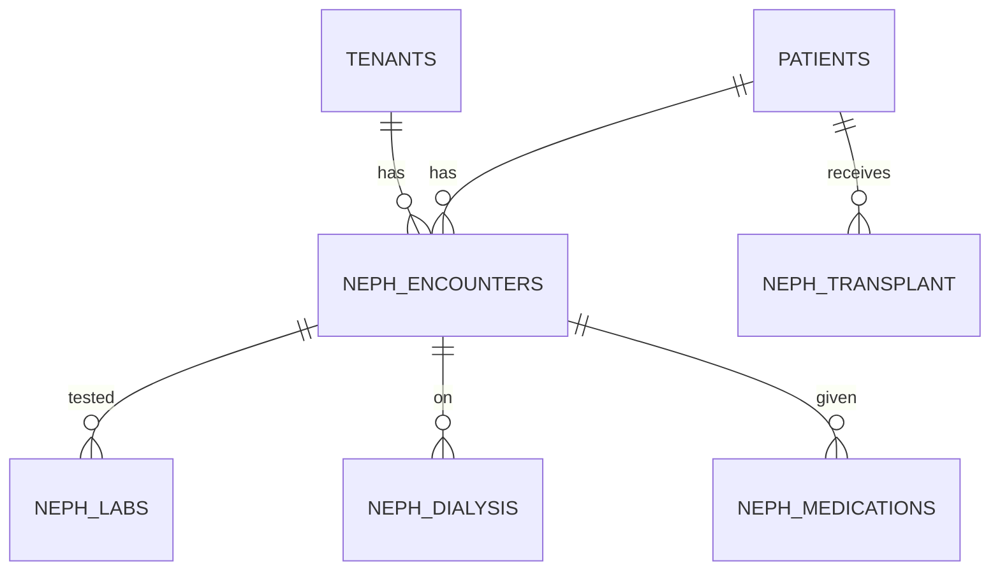

# NEPH-001 — Vector + ERD + Stitch

## Vector Indexes
1. aki_protocols_idx — 100
2. ckd_protocols_idx — 200
3. dialysis_protocols_idx — 150
4. transplant_idx — 100
5. electrolyte_idx — 100
6. glomerulonephritis_idx — 50

## ERD


## Stitch Layout
- Nephrology board
- CKD follow-up timeline
- Dialysis session tracker
- Lab trends
- AKI workup

## Schema
```sql
CREATE TABLE neph_vector_index (
  id BIGSERIAL PRIMARY KEY, tenant_id UUID NOT NULL,
  module_id VARCHAR(20) DEFAULT 'NEPH-001',
  embedding VECTOR(768)
);
CREATE INDEX idx_neph_vector_hnsw ON neph_vector_index
  USING hnsw (embedding vector_cosine_ops) WITH (m=16, ef_construction=64);
```
