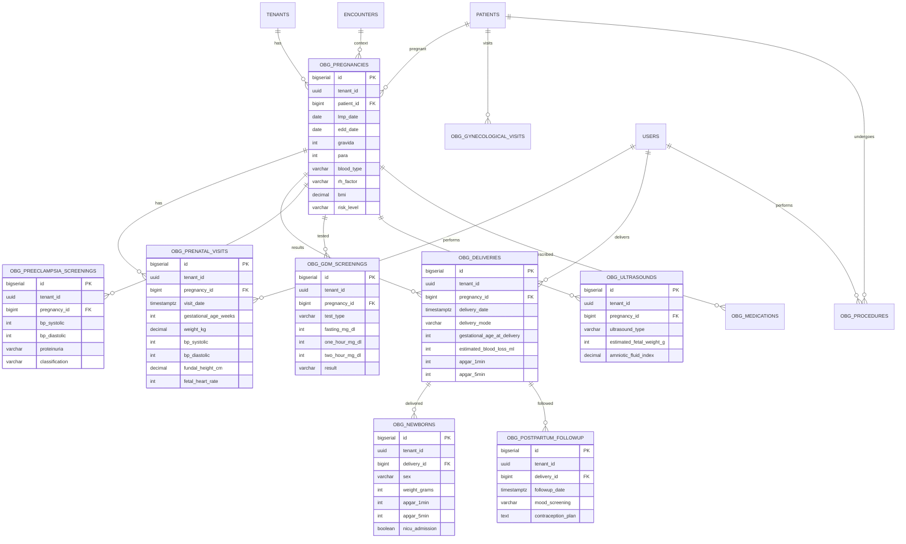

# OBG-001 — ERD Diagram

## Indexes
- (tenant_id, patient_id) on obg_pregnancies
- (pregnancy_id, visit_date) on obg_prenatal_visits
- (delivery_date) on obg_deliveries
- (pregnancy_id, screening_date) on obg_preeclampsia_screenings
- HNSW on vector columns

## RLS
- All tables: FORCE_RLS = ON
- Tenant isolation: USING (tenant_id = current_setting('app.tenant_id')::uuid)

## Storage Estimates
- obg_pregnancies: 1K/yr/tenant × 10 = 10K rows → 2 MB
- obg_prenatal_visits: 10K/yr/tenant × 10 = 100K → 15 MB
- obg_deliveries: 1K/yr/tenant × 10 = 10K → 2 MB
- obg_newborns: 1K/yr/tenant × 10 = 10K → 1 MB
- obg_ultrasounds: 3K/yr/tenant × 10 = 30K → 5 MB
- **Total per tenant: ~25 MB / 10 years**
