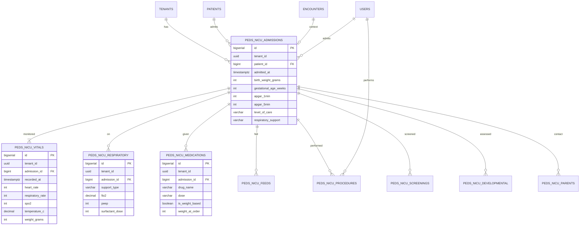

# PEDS-002 — ERD Diagram

## Indexes
- (tenant_id, admitted_at) on peds_nicu_admissions
- (admission_id, recorded_at) on peds_nicu_vitals
- HNSW on vector columns

## RLS
- All tables: FORCE_RLS = ON
- Tenant isolation: USING (tenant_id = current_setting('app.tenant_id')::uuid)
