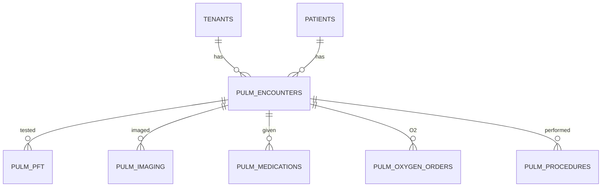

# PULM-001 — ERD

```mermaid
erDiagram
    TENANTS ||--o{ PULM_ENCOUNTERS : has
    PATIENTS ||--o{ PULM_ENCOUNTERS : has
    PULM_ENCOUNTERS ||--o{ PULM_PFT : tested
    PULM_ENCOUNTERS ||--o{ PULM_IMAGING : imaged
    PULM_ENCOUNTERS ||--o{ PULM_MEDICATIONS : given
    PULM_ENCOUNTERS ||--o{ PULM_OXYGEN_ORDERS : O2
    PULM_ENCOUNTERS ||--o{ PULM_PROCEDURES : performed
```

## RLS: FORCE_RLS = ON
## Storage: ~50 MB / 10yr / tenant
