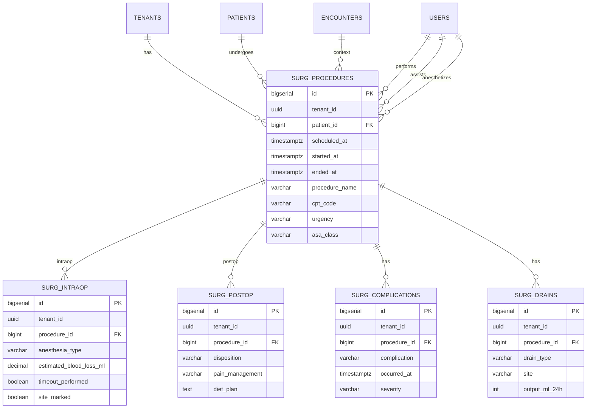

# SURG-001 — ERD Diagram

```mermaid
erDiagram
    TENANTS ||--o{ SURG_PROCEDURES : has
    PATIENTS ||--o{ SURG_PROCEDURES : undergoes
    ENCOUNTERS ||--o{ SURG_PROCEDURES : context
    SURG_PROCEDURES ||--o{ SURG_INTRAOP : intraop
    SURG_PROCEDURES ||--o{ SURG_POSTOP : postop
    SURG_PROCEDURES ||--o{ SURG_COMPLICATIONS : has
    SURG_PROCEDURES ||--o{ SURG_DRAINS : has
    USERS ||--o{ SURG_PROCEDURES : performs
    USERS ||--o{ SURG_PROCEDURES : assists
    USERS ||--o{ SURG_PROCEDURES : anesthetizes

    SURG_PROCEDURES {
        bigserial id PK
        uuid tenant_id
        bigint patient_id FK
        timestamptz scheduled_at
        timestamptz started_at
        timestamptz ended_at
        varchar procedure_name
        varchar cpt_code
        varchar urgency
        varchar asa_class
    }
    SURG_INTRAOP {
        bigserial id PK
        uuid tenant_id
        bigint procedure_id FK
        varchar anesthesia_type
        decimal estimated_blood_loss_ml
        boolean timeout_performed
        boolean site_marked
    }
    SURG_POSTOP {
        bigserial id PK
        uuid tenant_id
        bigint procedure_id FK
        varchar disposition
        varchar pain_management
        text diet_plan
    }
    SURG_COMPLICATIONS {
        bigserial id PK
        uuid tenant_id
        bigint procedure_id FK
        varchar complication
        timestamptz occurred_at
        varchar severity
    }
    SURG_DRAINS {
        bigserial id PK
        uuid tenant_id
        bigint procedure_id FK
        varchar drain_type
        varchar site
        int output_ml_24h
    }
```
