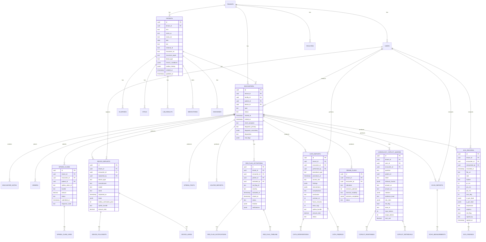

# 18 — ERD Diagram (CARD-001)

> Owner: SA · Tier 1

## Key indexes

- `encounters(tenant_id, patient_id, started_at DESC)` — patient timeline
- `encounters(tenant_id, doctor_id, started_at DESC)` — doctor workload
- `ecg_records(tenant_id, patient_id, recorded_at DESC)` — ECG history
- `ecg_records(red_flag=true, signed_at IS NULL)` — unsigned red-flag ECG
- `cath_reports(tenant_id, encounter_id)` — per-encounter cath
- `device_implants(tenant_id, patient_id, implanted_at DESC)` — device history
- `red_flag_activations(tenant_id, status, activated_at DESC)` — active red flags
- `cardiology_copilot_queries(tenant_id, encounter_id, created_at DESC)` — copilot history
- `nphies_claims(tenant_id, status, submitted_at DESC)` — claim status

## PHI columns (encrypted via crypto_envelope)

- `patients.national_id` (when present)
- `patients.insurance_no`
- `ecg_records.file_uri` (DICOM/PNG path → phi_vault)
- `echo_reports.file_uri`
- `cath_reports.fluoro_video_uri`
- `device_implants.serial`
