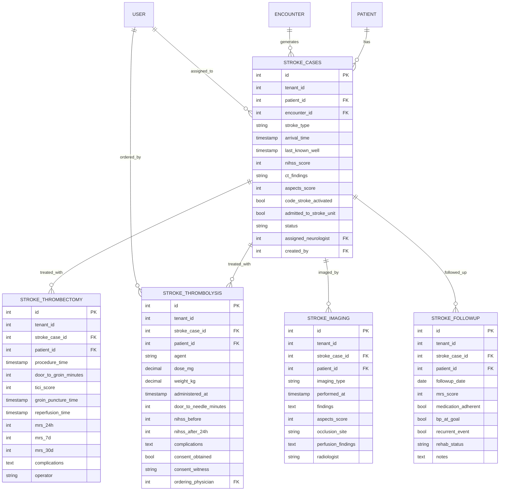

# CARD-301_STROKE — ERD (Mermaid)

## Cardinality
- 1 patient → N stroke cases
- 1 stroke case → 1 thrombolysis (if eligible)
- 1 stroke case → 1 thrombectomy (if LVO)
- 1 stroke case → N imaging studies
- 1 stroke case → N followups (30d, 90d, 1y)

## Indexes
- `stroke_cases`: (tenant_id, patient_id), (arrival_time DESC)
- `stroke_thrombolysis`: (tenant_id, administered_at DESC), (door_to_needle_minutes)
- `stroke_thrombectomy`: (tenant_id, mrs_30d)
- `stroke_imaging`: (tenant_id, patient_id)
- `stroke_followup`: (tenant_id, followup_date DESC)
