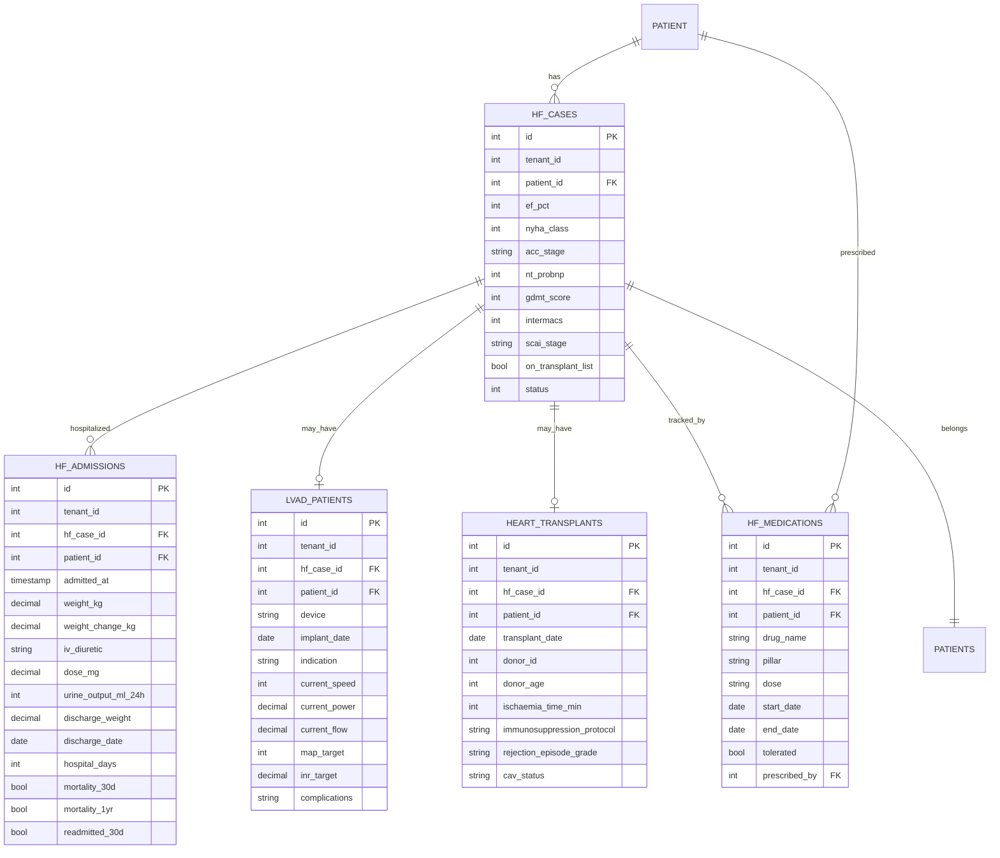

# CARD-302_ADHF — ERD (Mermaid)

```mermaid
erDiagram
    PATIENT ||--o{ HF_CASES : has
    HF_CASES ||--o{ HF_ADMISSIONS : hospitalized
    HF_CASES ||--O| LVAD_PATIENTS : "may_have"
    HF_CASES ||--O| HEART_TRANSPLANTS : "may_have"
    HF_CASES ||--o{ HF_MEDICATIONS : "tracked_by"
    PATIENT ||--o{ HF_MEDICATIONS : prescribed
    HF_CASES ||--|| PATIENTS : belongs

    HF_CASES {
        int id PK
        int tenant_id
        int patient_id FK
        int ef_pct
        int nyha_class
        string acc_stage
        int nt_probnp
        int gdmt_score
        int intermacs
        string scai_stage
        bool on_transplant_list
        int status
    }

    HF_ADMISSIONS {
        int id PK
        int tenant_id
        int hf_case_id FK
        int patient_id FK
        timestamp admitted_at
        decimal weight_kg
        decimal weight_change_kg
        string iv_diuretic
        decimal dose_mg
        int urine_output_ml_24h
        decimal discharge_weight
        date discharge_date
        int hospital_days
        bool mortality_30d
        bool mortality_1yr
        bool readmitted_30d
    }

    LVAD_PATIENTS {
        int id PK
        int tenant_id
        int hf_case_id FK
        int patient_id FK
        string device
        date implant_date
        string indication
        int current_speed
        decimal current_power
        decimal current_flow
        int map_target
        decimal inr_target
        string complications
    }

    HEART_TRANSPLANTS {
        int id PK
        int tenant_id
        int hf_case_id FK
        int patient_id FK
        date transplant_date
        int donor_id
        int donor_age
        int ischaemia_time_min
        string immunosuppression_protocol
        string rejection_episode_grade
        string cav_status
    }

    HF_MEDICATIONS {
        int id PK
        int tenant_id
        int hf_case_id FK
        int patient_id FK
        string drug_name
        string pillar
        string dose
        date start_date
        date end_date
        bool tolerated
        int prescribed_by FK
    }
```
