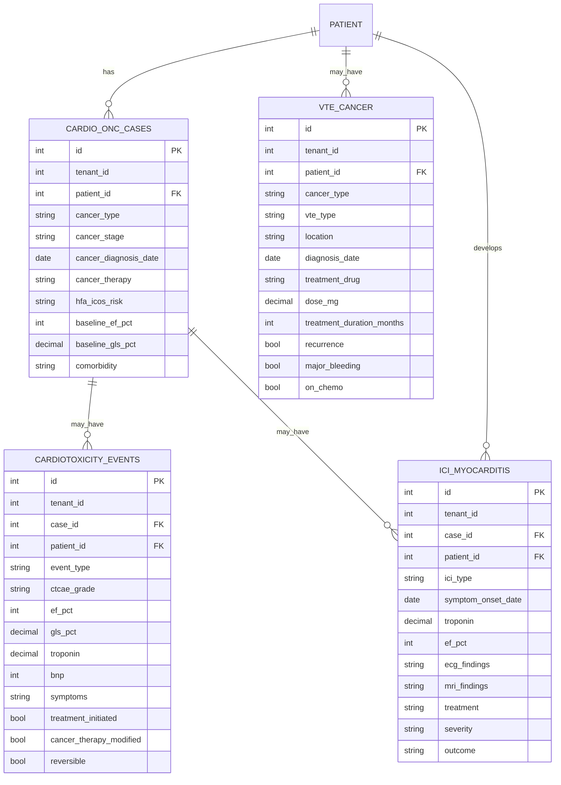

# CARD-303_ONCO — ERD (Mermaid)

```mermaid
erDiagram
    PATIENT ||--o{ CARDIO_ONC_CASES : has
    CARDIO_ONC_CASES ||--o{ CARDIOTOXICITY_EVENTS : "may_have"
    CARDIO_ONC_CASES ||--O{ ICI_MYOCARDITIS : "may_have"
    PATIENT ||--o{ ICI_MYOCARDITIS : develops
    PATIENT ||--o{ VTE_CANCER : "may_have"

    CARDIO_ONC_CASES {
        int id PK
        int tenant_id
        int patient_id FK
        string cancer_type
        string cancer_stage
        date cancer_diagnosis_date
        string cancer_therapy
        string hfa_icos_risk
        int baseline_ef_pct
        decimal baseline_gls_pct
        string comorbidity
    }

    CARDIOTOXICITY_EVENTS {
        int id PK
        int tenant_id
        int case_id FK
        int patient_id FK
        string event_type
        string ctcae_grade
        int ef_pct
        decimal gls_pct
        decimal troponin
        int bnp
        string symptoms
        bool treatment_initiated
        bool cancer_therapy_modified
        bool reversible
    }

    ICI_MYOCARDITIS {
        int id PK
        int tenant_id
        int case_id FK
        int patient_id FK
        string ici_type
        date symptom_onset_date
        decimal troponin
        int ef_pct
        string ecg_findings
        string mri_findings
        string treatment
        string severity
        string outcome
    }

    VTE_CANCER {
        int id PK
        int tenant_id
        int patient_id FK
        string cancer_type
        string vte_type
        string location
        date diagnosis_date
        string treatment_drug
        decimal dose_mg
        int treatment_duration_months
        bool recurrence
        bool major_bleeding
        bool on_chemo
    }
```
