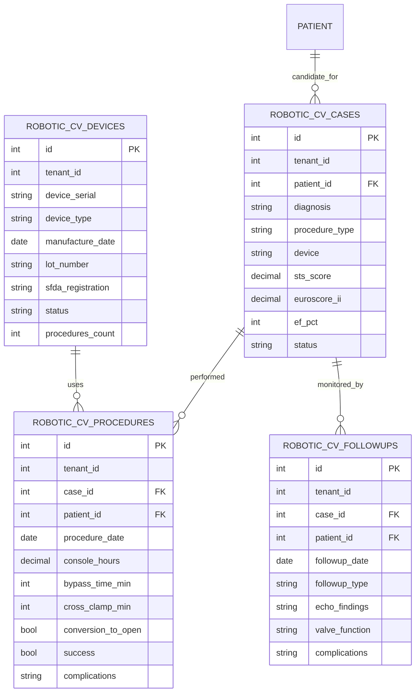

# CARD-304_ROBOTIC — ERD (Mermaid)

```mermaid
erDiagram
    PATIENT ||--o{ ROBOTIC_CV_CASES : "candidate_for"
    ROBOTIC_CV_CASES ||--o{ ROBOTIC_CV_PROCEDURES : "performed"
    ROBOTIC_CV_CASES ||--o{ ROBOTIC_CV_FOLLOWUPS : "monitored_by"
    ROBOTIC_CV_DEVICES ||--o{ ROBOTIC_CV_PROCEDURES : "uses"

    ROBOTIC_CV_CASES {
        int id PK
        int tenant_id
        int patient_id FK
        string diagnosis
        string procedure_type
        string device
        decimal sts_score
        decimal euroscore_ii
        int ef_pct
        string status
    }

    ROBOTIC_CV_PROCEDURES {
        int id PK
        int tenant_id
        int case_id FK
        int patient_id FK
        date procedure_date
        decimal console_hours
        int bypass_time_min
        int cross_clamp_min
        bool conversion_to_open
        bool success
        string complications
    }

    ROBOTIC_CV_FOLLOWUPS {
        int id PK
        int tenant_id
        int case_id FK
        int patient_id FK
        date followup_date
        string followup_type
        string echo_findings
        string valve_function
        string complications
    }

    ROBOTIC_CV_DEVICES {
        int id PK
        int tenant_id
        string device_serial
        string device_type
        date manufacture_date
        string lot_number
        string sfda_registration
        string status
        int procedures_count
    }
```
