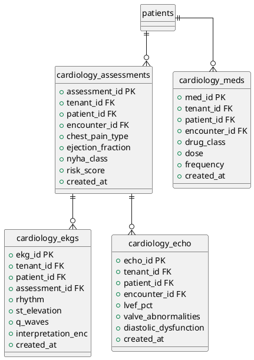

# ERD — Clinical Subspecialty (Cardiology Example)

> Pattern repeats for each of 60 departments.

## Subspecialty Tables (60 departments)

| Specialty | Primary Tables |
|---|---|
| Cardiology | assessments, ekg, echo, meds |
| Nephrology | dialysis_sessions, kt_v_urea, access_type |
| OB/GYN | prenatal_visits, ultrasound, deliveries |
| Oncology | tumor_board, regimens, cycles |
| Surgery | pre_op_assessments, procedures, post_op |
| Pediatrics | growth_charts, immunization, milestones |
| Emergency | triage, vitals, disposition |
| ICU | vents, scoring, fluids_io |
| ... | (60 total) |
