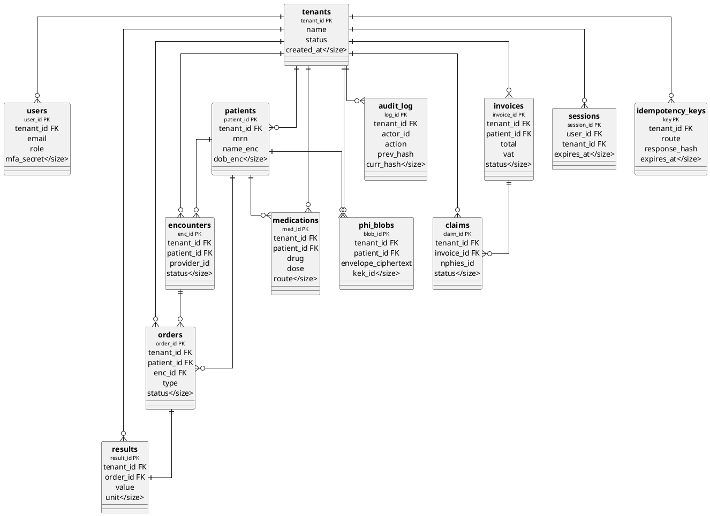

# ERD — NamaMedical Multi-Tenant Core

> Visual representation of the 13 safety-rail-mandated core tables.
> Render with: https://www.plantuml.com/plantuml/uml/

## Defense-in-Depth Layers

| Layer | Mechanism | Failure Mode |
|---|---|---|
| **App middleware** | `requireTenantScope` on every protected route | Logs warning, returns 403 |
| **DB RLS** | `FORCE RLS` + `tenant_id = current_setting('app.tenant_id')` policy | DB rejects query |
| **Idempotency** | `idempotency_keys` table (4 money routes only) | Returns cached response |
| **Audit chain** | `audit_log.prev_hash → curr_hash` (SHA-256) | Tamper breaks verification |
| **PHI envelope** | `phi_blobs.envelope_ciphertext` + DEK wrapped by KEK | KEK rotation invalidates old DEKs |
