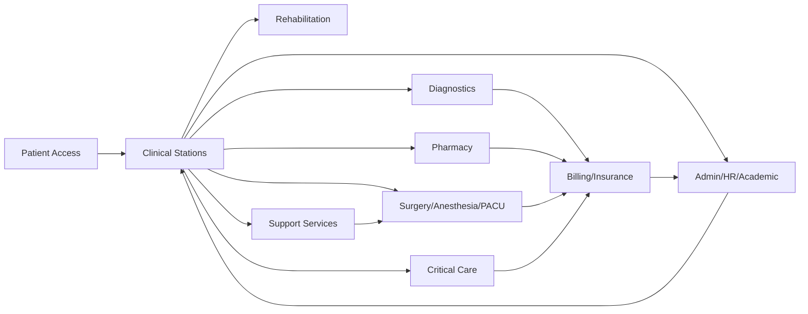

:no-copilot
# سيناريوهات العمل وفلو البيانات حسب المجموعة

> **الهدف**: توثيق سيناريوهات العمل الرئيسية وفلو البيانات لكل مجموعة أقسام في `.ai-brain`.  
> **آخر تحديث**: 2026-07-22

---

## 1. Internal Medicine Suite

### سيناريو 1.1: زيارة مريض بسكري وضغط في العيادة الباطنية
1. **الوصول**: تسجيل المريض في الاستقبال → موعد في العيادة الباطنية.
2. **الكشف**: الطبيب يرى السجل المرضي المزمن (chronic disease registry) وآخر قياسات السكر والضغط.
3. **الأوامر**: يطلب HbA1c، creatinine/eGFR، ECG، ويعدل الأدوية عبر CPOE.
4. **النتائج**: المختبر يرسل النتائج تلقائياً؛ النظام يحسب eGFR ويحدد مرحلة CKD.
5. **المتابعة**: يُحدد موعد المتابعة ويُرسى تنبيه إذا تأخر المريض.
6. **الإحالة**: إذا ظهرت أعراض قلبية، يُحال إلى قسم القلبية.

### فلو البيانات
```
Reception → Appointments → Doctor Station (CPOE) → LIS/RIS → Results back to Doctor Station
                                    ↓
                         Chronic Disease Registry → Alerts → Follow-up
                                    ↓
                         Referral to Cardiology (if indicated)
```

---

## 2. Surgical Suite

### سيناريو 2.1: جراحة استئصال المرارة
1. **الاستشارة**: الجراح يوثق التشخيص ويخطط للعملية.
2. **الحجز**: يُحجز موعد العملية في OR بعد التأكد من توفر التخدير والغرفة والأدوات.
3. **ما قبل العملية**: تقييم ASA، موافقة المريض، فحوصات ما قبل العملية.
4. **قائمة السلامة**: Time-out في OR قبل الشق الجراحي.
5. **أثناء العملية**: تسجيل الأدوية والأحداث الحيوية؛ تتبع الزرع/الشبكات.
6. **الإفاقة**: نقل المريض إلى PACU؛ Aldrete score كل 15 دقيقة.
7. **الخروج**: Aldrete ≥ 9 أو موافقة طبيب التخدير → نقل إلى التنويم أو المنزل.

### فلو البيانات
```
Surgical Consultation → OR Booking → Pre-op Assessment → Anesthesia Pre-op
                                              ↓
                    OR Safety Checklist → Surgery → Implant Log
                                              ↓
                    PACU (Aldrete) → Ward/Discharge → Billing
```

---

## 3. OB/GYN & Pediatrics Suite

### سيناريو 3.1: متابعة حمل عالي الخطورة
1. **التسجيل**: تأكيد الحمل وحساب عمر الحمل وتاريخ الولادة المتوقع.
2. **الزيارات البانتينالية**: تسجيل الضغط والوزن ونبض الجنين في كل زيارة.
3. **التشخيص**: اكتشاف تسمم الحمل → علامة حمراء وإحالة إلى MFM/NICU.
4. **المخاض**: دخول المخاض → Partogram → مراقبة مستمرة.
5. **الولادة**: تسجيل mode of delivery وAPGAR.
6. **ما بعد الولادة**: متابعة الأم والرضيع؛ مطابقة هوية الأم-طفل قبل الخروج.

### فلو البيانات
```
Pregnancy Confirmation → Antenatal Visits → Risk Stratification
                                    ↓
                    High-risk flag → MFM/NICU consult
                                    ↓
                    Labor Admission → Partogram → Delivery → APGAR
                                    ↓
                    Postpartum/NICU → Mother-Baby Match → Discharge
```

---

## 4. Diagnostics Suite

### سيناريو 4.1: طلب تحليل دم حرج
1. **الطلب**: الطبيب يطلب CBC من CPOE.
2. **الجمع**: التقنية تجمع العينة وتسجّلها في LIS.
3. **التحليل**: الجهاز يرسل النتيجة إلى LIS.
4. **التحقق**: التقنية/الأخصائي يتحقق من النتيجة.
5. **القيمة الحرجة**: إذا كانت Hb < 7 g/dL، ينطلق تنبيه حرج يتطلب تأكيد قراءة.
6. **التقارير**: النتيجة تظهر في محطة الطبيب وتُربط بالفاتورة.

### فلو البيانات
```
CPOE Order → Specimen Collection → Analyzer → LIS Result
                                              ↓
                    Critical Value Alert → Acknowledgment → Doctor Station
                                              ↓
                    Billing/Insurance (NPHIES/ZATCA)
```

---

## 5. Critical Care & Emergency Suite

### سيناريو 5.1: مريض septic shock في الطوارئ
1. **الوصول**: المريض يصل ER؛ التمريض يحسب ESI level 1.
2. **الفرز**: إحالة فورية إلى غرفة الإنعاش.
3. **حزمة الإنتان**: قياس lactate، أخذ مزارع، إعطاء مضادات حيوية واسعة الطيف، سوائل.
4. **النقل**: إذا استقر/تدهور، يُنقل إلى ICU.
5. **العناية المركزة**: مراقبة MAP، vasopressors، ventilator إذا لزم.
6. **المتابعة**: daily goals، sepsis bundle compliance، weaning عند التحسن.

### فلو البيانات
```
ER Arrival → ESI Triage → Resuscitation Bay
                              ↓
                    Sepsis Bundle (lactate, cultures, antibiotics, fluids)
                              ↓
                    ICU Admission → Hemodynamics/Ventilator → Daily Goals
                              ↓
                    Weaning/Extubation → Ward/Discharge
```

---

## 6. Rehabilitation Suite

### سيناريو 6.1: إعادة تأهيل بعد استبدال مفصل الركبة
1. **الإحالة**: الجراح يُحيل المريض إلى العلاج الطبيعي بعد العملية.
2. **التقييم**: الفيزيائي يقيس ROM، قوة العضلات، ويحدد الأهداف.
3. **الخطة**: جلسات علاج طبيعي، تمارين منزلية، أهداف وظيفية.
4. **الجلسات**: تسجيل كل جلسة مع التقدم.
5. **إعادة التقييم**: كل أسبوعين؛ تحديث الأهداف.
6. **الخروج**: تحقيق الأهداف → خطة منزلية/متابعة.

### فلو البيانات
```
Surgery → Referral to Rehab → Assessment → Goal Setting
                                          ↓
                    Therapy Sessions → Functional Scores (FIM/Barthel)
                                          ↓
                    Re-assessment → Discharge Plan/Home Program
```

---

## 7. Support Services & Operations

### سيناريو 7.1: طلب تعقيم أدوات جراحية
1. **الطلب**: OR يطلب set جراحي معين.
2. **CSSD**: استلام الأدوات المستخدمة → غسيل → تعقيم → تخزين.
3. **الإفراج**: بعد اكتمال الدورة، يُفرج عن الـset.
4. **الربط**: OR يرى توفر الـset قبل الحجز.
5. **التتبع**: كل set له رقم تتبع يربطه بالمريض والعملية.

### فلو البيانات
```
OR Request → CSSD Pickup → Wash → Sterilization Cycle → Release
                                              ↓
                    OR Booking checks set availability
                                              ↓
                    Surgery → Implant/Set Traceability → Audit
```

---

## 8. Admin, HR & Academic Affairs

### سيناريو 8.1: تجديد رخصة طبيب
1. **التنبيه**: النظام يرسل تنبيهاً 90/60/30 يوماً قبل انتهاء الرخصة.
2. **CME**: الطبيب يسجل نشاط CME ويحصل على credits.
3. **التحقق**: HR يتحقق من credits ويحدث الرخصة.
4. **الجدولة**: إذا كانت الرخصة سارية، يستمر في الجدولة؛ إذا انتهت، يُمنع من الجدولة.
5. **التدقيق**: كل التغييرات مسجلة في سجل التدقيق.

### فلو البيانات
```
License Expiry Alert → CME Activity → Credit Award
                                          ↓
                    HR Verification → License Renewal
                                          ↓
                    Scheduling System (block if invalid)
                                          ↓
                    Audit Log
```

---

## 9. Oncology Therapeutics

### سيناريو 9.1: دورة كيميائية
1. **الطلب**: الأورام يطلب دورة كيميائية حسب بروتوكول NCCN.
2. **التحقق**: الصيدلانية السريرية تتحقق من الجرعة حسب BSA ووظائف الكبد/الكلى.
3. **الموافقة**: طبيب الأورام يوافق على الجرعة.
4. **التحضير**: الصيدلية تحضر الأدوية.
5. **الحقن**: ممرضة العلاج الكيميائي تبدأ التسريب وتسجل الأحداث.
6. **المراقبة**: تسجيل السمية (CTCAE) والتفاعلات.
7. **التخطيط للدورة التالية**: بناءً على السمية والمؤشرات الحيوية.

### فلو البيانات
```
Oncologist Order → Protocol Verification → Dose Check (BSA + organ function)
                                          ↓
                    Pharmacy Verification → Infusion Log
                                          ↓
                    Toxicity Documentation → Next Cycle Planning
```

---

## 10. Integrative Medicine

### سيناريو 10.1: إضافة علاج عشبي لمريض سكري
1. **التقييم**: الطبيب التكاملي يراجع الأدوية التقليدية والحساسية.
2. **فحص التداخلات**: النظام يفحص تداخلات الأعشاب مع الأدوية.
3. **الخطة**: إضافة العلاج العشبي مع جرعة ومدة.
4. **الموافقة**: الطبيب الباطني يوافق على الخطة.
5. **المتابعة**: تسجيل النتائج والآثار الجانبية.

### فلو البيانات
```
Integrative Assessment → Drug-Herb Interaction Check
                                          ↓
                    Integrative Plan → Physician Approval
                                          ↓
                    Sessions → Outcomes → Conventional Care Sync
```

---

## 11. ملخص فلو البيانات العام



---

## 12. قواعد عامة عبر كل السيناريوهات

- **Tenant Isolation**: كل البيانات مرتبطة بـ `tenant_id` ومحمية بـ RLS.
- **Golden Access Rule**: Owner/Admin وصول كامل؛ الأطباء/الموظفون حسب التخصص.
- **PHI Vault**: الصور والموجات والفيديوهات والتقارير الحساسة في `phi_vault/`.
- **Audit Trail**: كل وصول إلى PHI، أوامر سريرية، إعطاء أدوية، ومعاملات مالية مسجلة.
- **Safety-Gate Pattern**: الإجراءات الحرجة تُمنع حتى اكتمال قائمة التحقق.
