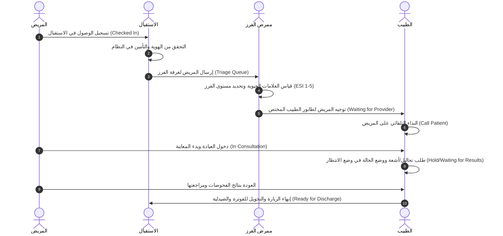
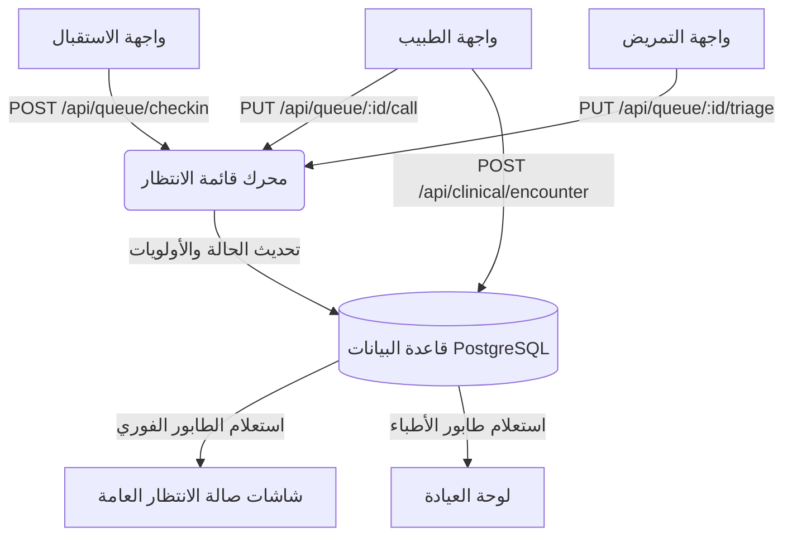

# وثيقة التصميم المعماري الشاملة لقائمة الانتظار (NamaMedical Waiting Queue Blueprint)

تحلل هذه الوثيقة متطلبات "قائمة الانتظار" بنظرة معمارية مقارنة بأفضل الأنظمة العالمية (مثل **Epic Systems** و **Cerner Millennium**)، لتقديم تصميم متكامل لقواعد البيانات، الواجهات، تدفق البيانات، وسيناريوهات التشغيل الطبي.

---

## 1. فحص الأنظمة العالمية والمقارنة المعيارية (HIS/EMR Benchmarking)

في الأنظمة العالمية، لا تُدار قائمة الانتظار كقائمة انتظار زمنية بسيطة (First-In, First-Out)، بل تُدار كمنظومة ذكية لتوجيه المرضى وتدفق العمل السريري (Patient Flow & Logistics).

| الميزة | قائمة الانتظار البسيطة (الحالية) | قائمة الانتظار العالمية (Epic / Cerner) | المقترح لتطبيقه في NamaMedical |
| :--- | :--- | :--- | :--- |
| **الفرز وتحديد الأولويات** | ترتيب زمني حسب وقت الدخول. | الفرز الطبي بناءً على مقياس حدة الإصابة (ESI 1-5) أو الفرز التمريضي. | ترتيب الطابور ديناميكياً حسب **درجة الفرز الطبي (Acuity Level)** ووقت الانتظار الفعلي لمنع تدهور الحالات الحرجة. |
| **Triage & Status** | `Waiting` أو `With Doctor`. | تتبع دقيق للمراحل: `Arrived` -> `Triage` -> `Waiting for Room` -> `In Room (Exam)` -> `Waiting for Lab/Rad` -> `Ready for Discharge`. | توسيع حقل الحالة ليشمل مراحل دورة حياة المريض التشغيلية بالكامل للعيادات والطوارئ. |
| **الغرف والموارد** | لا يوجد تحديد للغرفة. | ربط المريض بالعيادة الفعلية (Exam Room) والجهاز الطبي (Asset Mapping). | ربط المريض برقم العيادة أو الغرفة (Exam Room ID) والربط مع الممرض المسؤول. |
| **التحكم بالاستدعاء** | لا يوجد مناداة صوتية/مرئية. | شاشات عرض عامة (Public Boards) بنظام النداء الصوتي والرمز اللفظي. | دمج واجهة للنداء الصوتي والمرئي للعيادات (Patient Calling System) مع شاشات العرض التلفزيونية في صالات الانتظار. |

---

## 2. هيكلية الجداول المقترحة في قاعدة البيانات (Database Schema Design)

لتغطية متطلبات الفرز والأولويات والغرف، سنقوم بتحديث وتوسيع الجداول البرمجية:

```sql
-- 1. جدول قائمة الانتظار الموسع (Waiting Queue)
CREATE TABLE IF NOT EXISTS waiting_queue (
    id SERIAL PRIMARY KEY,
    tenant_id INTEGER NOT NULL REFERENCES tenants(id),
    facility_id INTEGER REFERENCES facilities(id),
    patient_id INTEGER NOT NULL REFERENCES patients(id) ON DELETE CASCADE,
    encounter_id INTEGER, -- يربط بزيارة المريض الحالية
    
    -- المعلومات السريرية للفرز
    triage_level INTEGER DEFAULT 5, -- مستوى الفرز من 1 (حرج جداً) إلى 5 (غير عاجل)
    acuity_notes TEXT, -- ملاحظات حالة الفرز
    
    -- التوجيه والموارد
    assigned_doctor_id INTEGER REFERENCES employees(id), -- الطبيب المعالج
    assigned_department_id INTEGER REFERENCES clinical_departments(id), -- القسم الطبي
    exam_room_id VARCHAR(50), -- رقم عيادة الفحص أو السرير
    
    -- تتبع الحالات والأوقات
    status VARCHAR(30) DEFAULT 'CheckedIn'
        CHECK (status IN ('CheckedIn', 'Triage', 'WaitingForProvider', 'InConsultation', 'WaitingForResults', 'ReadyForDischarge', 'NoShow')),
    
    check_in_time TIMESTAMP NOT NULL DEFAULT CURRENT_TIMESTAMP,
    triage_time TIMESTAMP,
    consultation_start_time TIMESTAMP,
    consultation_end_time TIMESTAMP,
    
    created_at TIMESTAMP DEFAULT CURRENT_TIMESTAMP,
    updated_at TIMESTAMP DEFAULT CURRENT_TIMESTAMP
);

-- 2. جدول سجل حركة الطابور والتحليلات (Queue Transition Logs)
CREATE TABLE IF NOT EXISTS queue_logs (
    id SERIAL PRIMARY KEY,
    tenant_id INTEGER NOT NULL REFERENCES tenants(id),
    queue_id INTEGER REFERENCES waiting_queue(id) ON DELETE CASCADE,
    previous_status VARCHAR(30),
    new_status VARCHAR(30),
    changed_by INTEGER REFERENCES system_users(id),
    transition_time TIMESTAMP DEFAULT CURRENT_TIMESTAMP,
    duration_seconds INTEGER -- الوقت المستغرق في الحالة السابقة (لحساب KPIs)
);

-- فهارس تحسين الأداء والتصفية السريعة للأطباء والاستقبال
CREATE INDEX IF NOT EXISTS idx_waiting_queue_tenant_status ON waiting_queue (tenant_id, status);
CREATE INDEX IF NOT EXISTS idx_waiting_queue_doctor ON waiting_queue (assigned_doctor_id, status) WHERE status != 'ReadyForDischarge';
```

---

## 3. الواجهات والإطارات وهيكلية شاشات العرض (UI/UX Design Wireframes)

### أ. لوحة تحكم الاستقبال والتمريض (Receptionist/Nurse Entry Console)
* **الفلترة والبحث**: شريط علوي للبحث بالاسم أو رقم الملف الطبي (MRN)، وقائمة منسدلة للتصفية حسب (العيادة، الطبيب، مستوى الفرز).
* **إطار الجدول (Data Table)**:
  * عمود رقم الانتظار (رمز ملون يرمز لمستوى الفرز ESI: أحمر للحرج، برتقالي للمستعجل، أخضر للعادي).
  * اسم المريض، وقت الانتظار المنقضي (Elapsed Time - يحسب بالدقائق ويتغير لونه للأحمر إذا تجاوز الحدود القياسية 30 دقيقة).
  * العيادة والطبيب الموجه إليه.
* **الأزرار والتفاعلات**:
  * زر **[تعديل فرز طبي (Triage)]**: يفتح شاشة منبثقة لتسجيل المؤشرات الحيوية وتعديل درجة الفرز.
  * زر **[تغيير العيادة/الطبيب (Re-route)]**: لتحويل المريض لطبيب آخر عند الازدحام.

### ب. لوحة تحكم الطبيب داخل العيادة (Physician Clinic Queue Board)
* **المريض النشط (Active Patient Frame)**: بطاقة علوية مميزة تظهر المريض المتواجد حالياً داخل غرفة الكشف مع عداد تنازلي لوقت الاستشارة.
* **المرضى في الانتظار (Waiting Frame)**: قائمة مرتبة تنازلياً حسب مستوى الفرز الطبي ووقت الوصول.
* **الأزرار السريرية**:
  * زر **[نداء المريض (Call Patient)]**: يرسل إشارة صوتية مرئية لشاشة الانتظار العامة وينطق اسم المريض عبر مكبر الصوت.
  * زر **[بدء المعاينة (Start Encounter)]**: يفتح الملف الطبي الإلكتروني للمريض مباشرة ويسجل وقت الدخول.
  * زر **[تعليق مؤقت (Hold)]**: عند إرسال المريض للمختبر أو الأشعة بانتظار النتائج، مع الحفاظ على موقعه في الطابور.

---

## 4. سيناريو العمل التشغيلي (Operational Workflow Scenario)



---

## 5. مخطط تدفق البيانات البرمجي (Data Flow Diagram - DFD)



---

## 6. البرومبت الهندسي الجاهز لتوليد الكود برمجياً (AI Code Generation Prompt)

يمكن استخدام هذا البرومبت لتوجيه أي نظام ذكاء اصطناعي لبناء الميزة برمجياً في الكود:

```text
Act as an Expert Full-Stack Developer to implement an Acuity-Based Waiting Queue system for NamaMedical ERP.

Context & Standards:
- Tech Stack: Node.js/Express Backend, PostgreSQL Database, Vanilla JS/CSS Frontend.
- Database: Update PostgreSQL. Create table `waiting_queue` with fields: id (SERIAL PK), tenant_id (INT), patient_id (INT REFERENCES patients), triage_level (INT 1-5), assigned_doctor_id (INT), status (CheckedIn, Triage, WaitingForProvider, InConsultation, WaitingForResults, ReadyForDischarge), check_in_time (TIMESTAMP), exam_room_id (VARCHAR).
- Ensure RLS (Row Level Security) is enabled on all new tables with policy: `waiting_queue_tenant_isolation` (WHERE tenant_id = current_setting('app.tenant_id')).
- Frontend: Build a dashboard divided into: 
  1. Reception console (Filters, list of patients, button to edit triage and check-in patient).
  2. Physician console (Button to Call Patient [triggering simulated audio call], button to Start Consultation [routing to page 3 - Doctor Station], and Put on Hold [Waiting for Results]).
- Auto-refresh: Enable WebSockets or a 15-second pooling mechanism to sync the queue.
- Language: RTL/LTR support (Arabic and English translation).

Generate clean, decoupled, and idempotent code (Express routes in `server.js`, frontend components in `public/js/app.js`, and database migration SQL scripts). Write unit tests verifying queue sorting by triage_level (highest priority first) then check_in_time (FIFO).
```
