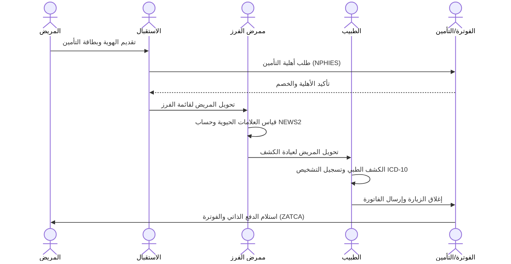

# 🔁 سيناريوهات سير العمل وتدفق البيانات (Workflows & Data Flow Scenarios)

**التاريخ**: 2026-07-06 | **الحالة**: معتمد (GATE 11) | **المرجع التشغيلي**: رحلة المريض والكوادر داخل المنشأة الطبية

---

## 1. سيناريو المريض من الدخول وحتى التخريج (Admission to Discharge - ADT)



### خطوات تفصيلية للسيناريو:
1. **الاستقبال والتسجيل**:
   - يتحقق موظف الاستقبال من هوية المريض ويستعلم لحظياً عن أهلية التأمين عبر NPHIES.
   - في حال وجود تغطية، يتم إنشاء زيارة مريض وتخصيص رقم ملف موحد (MPI).
2. **الفرز وقياس العلامات**:
   - يتم توجيه المريض لقسم التمريض، حيث تُقاس المؤشرات الحيوية ويُحسب تلقائياً مؤشر NEWS2 ومستوى ESI.
3. **الكشف الطبي (Doctor Encounter)**:
   - يرى الطبيب المريض ويستعرض علاماته الحيوية المسجلة.
   - يقوم الطبيب بكتابة الشكوى والتشخيص وطلب الفحوصات والوصفات (CPOE).
4. **الفوترة والخروج (Discharge & Billing)**:
   - يغلق الطبيب الزيارة. يحسب النظام الفاتورة تلقائياً بناءً على أكواد الخدمات والخصومات والتحمل التأميني.
   - يدفع المريض الجزء المشترك المترتب عليه وتُرحل الفاتورة لـ ZATCA ويُصرح بخروج المريض.

---

## 2. سيناريو العمليات الجراحية والتخدير والإفاقة (Surgical Patient Flow)

```
[جدولة العملية] ──> [تقييم التخدير ASA] ──> [checklist الأمان WHO] ──> [العملية الجراحية] ──> [PACU الإفاقة Aldrete Score] ──> [التنويم أو المنزل]
```

### بوابات الأمان في تدفق بيانات العمليات:
- **تحقق ما قبل العملية**: يجب أن يتوفر إقرار موقع (`Consent signed`) للمريض وجاهزية فصيلة الدم بالبنك في حال تطلب الأمر.
- **في غرفة العمليات**: يتم إطلاق عملية **Time-Out** اللفظية وتوثيقها لتأكيد هوية المريض، مكان العملية الجراحية، ومطابقة الأدوات المعقمة.
- **أثناء التخدير**: يتم توثيق المؤشرات الحيوية للتخدير وسجل جرعات الغازات/العقاقير كل 5 دقائق.
- **بعد العملية (PACU)**: مراقبة مستمرة للمريض حتى تحقيق Aldrete Score >= 9 قبل نقله للجناح العام أو العناية.

---

## 3. سيناريو الوصفة الدوائية من الطلب وحتى الصرف والإعطاء (Medication Loop)

1. **كتابة الوصفة (CPOE)**:
   - يصف الطبيب الدواء مع تحديد الجرعة، التكرار، والمسار.
   - يقوم النظام بالتحقق التلقائي من الحساسيات والتداخلات الدوائية.
2. **المراجعة والصرف (Pharmacy Dispense)**:
   - تظهر الوصفة في لوحة الصيدلي السريري للتحقق السريري واعتمادها.
   - يقوم صيدلي الصرف بتأكيد وجود الدواء، الخصم من المخزون، وطباعة ملصق الدواء بـ Barcode فريد.
3. **التحقق والإعطاء (eMAR)**:
   - تستلم الممرضة الدواء في الجناح، وتقوم بمسح Barcode سوار المريض و Barcode علبة الدواء للتحقق من القواعد الخمس (Five Rights).
   - توثيق الإعطاء مع الوقت في eMAR تلقائياً.
