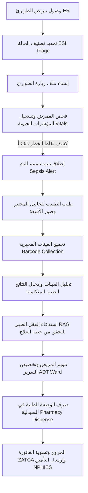

# التحديث النهائي لمراحل الاستيعاب والهيكلية الشاملة (The Absolute Ingestion Map)
## منصة جمانة ميديكال لإدارة المستشفيات والمدن الطبية (jumanaMedical ERP)

تعتبر هذه الوثيقة المرجعية الرسمية والدستور التقني الشامل لتفاصيل المنصة الإدارية والسريرية لجمانة ميديكال، وهي تغطي الهياكل البرمجية، العلاقات، الذكاء الاصطناعي، الأمن السيبراني، وسيناريوهات التشغيل الطبي.

---

## 1. المرحلة الأولى: الصورة الكبيرة والهيكلية (The Big Picture)

### 1.1 الرؤية والأهداف
* **الرؤية**: تقديم نظام طبي وإداري متكامل (ERP/EMR) متعدد المستأجرين (Multi-Tenant) مصمم خصيصاً لتلبية متطلبات القطاع الصحي في المملكة العربية السعودية والشرق الأوسط، بما يضمن الامتثال التام لهيئات الرقابة (مثل هيئة الزكاة والضريبة والجمارك ZATCA المرحلة الثانية، ونظام التأمين الموحد NPHIES، ومعايير CBAHI للرقابة وجودة المستشفيات، وأنظمة حماية البيانات الشخصية PDPL).
* **الأهداف التشغيلية**:
  - تمكين عزل البيانات بشكل صارم بين مختلف المستشفيات والمستوصفات المشتركة في الخدمة.
  - أتمتة الدورة المالية الطبية والسريرية من نقطة دخول المريض وحتى الفوترة والتحصيل والتأمين.
  - دعم الأطباء بمحرك قرارات ذكاء اصطناعي فوري وآمن (RAG) مستند إلى بروتوكولات سريرية رسمية.

### 1.2 ترابط النظام وهيكلية المكونات
ترتبط المنصة بهيكل طبقي مقسم كما يلي:
1. **الواجهة الأمامية (Frontend - Vanilla JS SPA & CSS)**:
   - واجهة مستخدم سريعة التحميل وخفيفة الوزن وخالية من الأطر المعقدة، مصممة بلغة JavaScript الصرفة والتصميم المتجاوب الصديق للأجهزة اللوحية والمحمولة استناداً لمبادئ STITCH وتنسيق RTL للعربية و LTR للإنجليزية.
2. **الخادم الخلفي (Backend - Express Server & Node.js)**:
   - محرك مركزي لإدارة الجلسات، التحقق من الصلاحيات، معالجة طلبات التأمين (NPHIES)، الفوترة (ZATCA)، والتحليلات السريرية.
3. **قاعدة البيانات (PostgreSQL Database with PG Pool)**:
   - نظام متطور متعدد المستأجرين يعتمد على عزل البيانات في مستوى السجل (**Row Level Security - RLS**) لضمان أمان البيانات المطلق.
4. **العقل الطبي والذكاء الاصطناعي (RAG Engine)**:
   - ربط الأجهزة المساعدة بالملفات الطبية والبروتوكولات السريرية المخزنة كمتجهات لمعالجة الأسئلة الطبية.

---

## 2. المرحلة الثانية: قلب البيانات (The Data Heart)

### 2.1 الجداول والعلاقات الهيكلية
تحتوي قاعدة البيانات على أكثر من 80 جدولاً تغطي كافة مناحي المنصة. وتترابط الجداول بـ UUIDs ورموز تسلسلية كالتالي:
* **بيانات الأساس المستأجر**: جدول `tenants` يمثل المظلة العليا لعزل كافة البيانات، ويرتبط بجدول `facilities` (المنشآت) الذي يرتبط بدوره بـ `clinical_departments` (الأقسام الطبية).
* **الملف الطبي الفعال**: يرتبط جدول `patients` بجدول `appointments` (المواعيد) وجدول `visit_lifecycle` (الزيارات) و `medical_records` (السجلات السريرية).
* **الطلبات والنتائج**: يرتبط جدول `lab_radiology_orders` بكل من `lab_results` (النتائج المخبرية)، `lab_samples` (العينات)، و `rad_reports` (تقارير الأشعة).
* **المالية والفوترة**: ترتبط السجلات السريرية والزيارات بـ `invoices` (الفواتير) و `insurance_claims` (المطالبات التأمينية) والقيود الحسابية العامة في دفتر الأستاذ `finance_journal_entries`.

### 2.2 الهجرات الـ 81 (81 Migrations Series)
تم بناء هيكلية البيانات بالتدريج عبر 81 هجرة برمجية مقسمة إلى عائلات:
* `e0_*`: تأسيس المنشآت والـ wizard الترحيبي وإعدادات المستأجرين.
* `e1_*` إلى `e9_*`: إعداد ملفات الطوارئ، التمريض، المختبرات، الأشعة، ودورات العمل الطبية الأساسية.
* `e10_*` و `e11_*`: الدورة المالية لـ ZATCA ونظام التأمين السعودي الموحد NPHIES.
* `e20_*` إلى `e81_*`: التخصصات الطبية والأقسام الفرعية الـ 44 والمطابقة لمعايير الاستيعاب الطبي للمدن الطبية الكبرى.

### 2.3 نظام الـ RLS وعزل البيانات برمجياً
* **آلية التفعيل**: يتم تشغيل `ALTER TABLE <table_name> ENABLE ROW LEVEL SECURITY; ALTER TABLE <table_name> FORCE ROW LEVEL SECURITY;` على الجداول الحساسة (أكثر من 150 جدولاً).
* **آلية الفلترة**: يتم فحص طلب الطبيب أو المستخدم على مستوى الاتصال عبر تعيين سياق الجلسة:
  ```sql
  SET app.tenant_id = '1';
  ```
  وتمنع السياسات المبرمجة استرجاع أو تعديل أي سجل لا يطابق سياق الجلسة:
  ```sql
  CREATE POLICY rls_table_tenant_isolation ON table_name
      FOR ALL
      USING (tenant_id = NULLIF(current_setting('app.tenant_id', true), '')::integer)
      WITH CHECK (tenant_id = NULLIF(current_setting('app.tenant_id', true), '')::integer);
  ```

---

## 3. المرحلة الثالثة: المحرك الإدراكي (The AI & RAG)

### 3.1 بنية وتخزين متجهات المعرفة الطبية (Vector Database)
* لتفادي تعقيدات المتطلبات الخارجية، تستخدم المنصة تخزيناً للمتجهات كـ `REAL[]` مع استعلامات حساب تشابه جيب التمام (**Cosine Similarity**) متطورة مدمجة بداخل قاعدة البيانات نفسها، مما يوفر أداءً فائق السرعة ومستقلاً تماماً عن الامتدادات الخارجية.
* **جدول المتجهات**: `clinical_knowledge_vectors` والذي يحمل أعمدة `tenant_id` و `department_id` و `content_chunk` و `embedding` (مصفوفة المتجهات).

### 3.2 كيفية عمل محرك البحث واسترجاع المعلومات
عندما يطرح الطبيب سؤالاً أو يتم إطلاق تنبيه سريري:
1. يتم حساب التضمين (Embedding) للطلب عبر OpenAI API.
2. يتم تشغيل استعلام التشابه المتجهي المعزول لكل مستأجر:
   ```sql
   SELECT v.id, v.content_chunk, v.metadata,
          (SELECT SUM(a * b) 
           FROM unnest(v.embedding) WITH ORDINALITY x(a, i) 
           JOIN unnest($1::real[]) WITH ORDINALITY y(b, j) ON x.i = y.j) AS similarity
   FROM clinical_knowledge_vectors v
   WHERE v.tenant_id = $2
   ORDER BY similarity DESC LIMIT 2;
   ```
3. يقوم النظام باسترجاع أفضل القطع السريرية المطابقة وصياغة إجابة مقترحة للطبيب مدعومة بالمصادر مثل (Surviving Sepsis Campaign 2021) مع رقم الصفحة ورابط ملف الـ PDF.

---

## 4. المرحلة الرابعة: تجربة المستخدم والسيناريوهات السريرية (UX & Clinical Scenarios)

### 4.1 رحلة البيانات للمريض (The Patient Journey Scenario)
تبدأ رحلة البيانات من الطوارئ وتنتقل بسلاسة عبر المنصة كالتالي:


### 4.2 تدفق العمل الطبي في الحالات الحرجة مقابل الروتينية
* **الحالات الروتينية**: يتبع الفحص العادي تدفقاً خطياً (حجز موعد $\rightarrow$ فحص سريري $\rightarrow$ وصفة طبية وصرف $\rightarrow$ فوترة ودفع).
* **الحالات الحرجة (Critical Cases)**:
  - عند قيام الممرض بإدخال قراءات حيوية خطيرة (مثل انخفاض ضغط الدم الانقباضي عن 90 وتسرع التنفس)، يقوم **محرك التنبيه السريري (EWS)** بحساب النتيجة فوراً وإطلاق نافذة تنبيه للممرض والطبيب.
  - يتم تفعيل مسار الفحوصات الفورية وتخطي طلب الموافقات المسبقة مؤقتاً لإنقاذ حياة المريض (بما يتطابق مع نظام التأمين المفتوح الفشل للحالات الطارئة).

### 4.3 تطبيق فلسفة STITCH وتوافق الواجهات
* تستخدم المنصة هيكلية واجهات تفاعلية مريحة للعين وخالية من التشتيت مع استخدام نظام الألوان المهدئة والخطوط الواضحة (مثل Outfit و Inter).
* توافق كامل مع الشاشات اللوحية والمحمولة لتمكين الأطباء والممرضين من إدخال البيانات مباشرة بجانب سرير المريض، مع دعم كامل للغة العربية والاتجاه من اليمين لليسار (RTL) دون أي إزاحة في الواجهة.

---

## 5. المرحلة الخامسة: الطبقة التشغيلية والأمان (Ops & Security)

### 5.1 عملية النشر التلقائية والآمنة (SSH & Deploy)
تتم عملية النشر وتحديث الكود الفعال على سيرفر الإنتاج `jumanasoft.com` عبر سكريبت آمن يعمل كالتالي:
1. ضغط الملفات البرمجية محلياً مع استثناء `node_modules` وملفات الـ Git.
2. نقل الأرشيف عبر الـ SCP باستخدام مفتاح الوصول المعتمد والمؤمن `nama_medical_key`.
3. فك الضغط على مسار الخادم `/var/www/namaweb/`.
4. تثبيت حزم الاعتماديات بالكامل لتسجيل حزمة `tailwindcss` وتجميع الـ CSS النهائي للموقع بنجاح.
5. تشغيل هجرات قاعدة البيانات المتسلسلة لضمان مطابقة الهياكل.
6. إعادة تشغيل خادم PM2 `pm2 restart nama-medical-erp --update-env` لحقن المتغيرات البيئية الجديدة.

### 5.2 معايير الأمان والتدقيق النهائي
* **منع تسريب PHI**: الحفاظ التام على تشفير البيانات الحساسة وتخزين صور الأشعة الطبية خارج مسار الويب في مجلد `/phi_vault/` الآمن والمحمي.
* **عزل المستأجرين الحازم**: تطبيق RLS بشكل مركزي يمنع كتابة أي كود برمجي بدون توفر التحقق من هوية المستأجر وصلاحية المستخدم المتصل (مستوى الخدمة والتحقق من التخويل RBAC).
* **مراقبة الصحة المستمرة**: فحص وتأكيد جاهزية النظام تلقائياً عبر مراقبة مسار الصحة المشفر `https://jumanasoft.com/api/health` والذي يؤكد جاهزية الخادم وقاعدة البيانات بنجاح مستمر.
