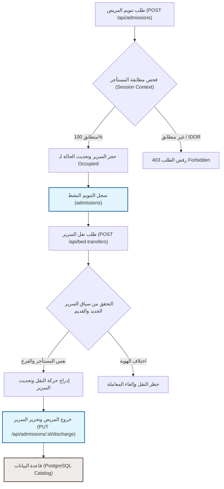

# خريطة مسارات العمل السريري والتشغيلي لـ ADT - الدفعة الثانية (Clinical ADT Workflow Map)
## نظام نما الطبي (NamaMedical) - بيئة Staging

توثيق لمسارات العمل السريرية والتشغيلية الخاصة بحركات المرضى (تنويم، نقل، خروج) وعلاقتها بضوابط عزل المستأجرين (Tenant Isolation).

---

### 1. دورة حياة المريض المنوّم (Inpatient Life Cycle)
تمر عملية التنويم الداخلي والأسرة بالمسارات التالية:
1. **القبول والتنويم (Admission)**:
   - يبدأ الطلب من العيادة أو الطوارئ، ويتم اختيار جناح وسرير متاحين.
   - **ضابط الأمان**: يتحقق النظام من تبعية المريض والسرير والجناح لنفس المستأجر النشط لمنع حجز سرير يتبع جهة أخرى.
2. **التحويل الداخلي للسرير (Bed Transfer)**:
   - يتم نقل المريض من سرير/جناح إلى آخر بناءً على التغير الطبي في حالته (مثل نقله إلى العناية المركزة أو الجناح العام).
   - **ضابط الأمان**: يمنع التحويل إلى جناح أو سرير يقع في فرع آخر أو مستأجر آخر، ويتم التحقق من سياق الطلب.
3. **الجولات اليومية للأطباء (Daily Rounds)**:
   - يسجل الأطباء الملاحظات والبيانات السريرية للمريض المنوم بشكل يومي.
   - **ضابط الأمان**: تُعزل الجولات وتُربط تلقائياً بـ `tenant_id` للتنويم المعني.
4. **خروج المريض (Discharge)**:
   - يتم إخلاء المريض وتحرير السرير وتحديث حالته لـ "Available".
   - **ضابط الأمان**: تتم العملية بالكامل تحت مظلة معرّف المستأجر لمنع إنهاء تنويم مريض مستأجر آخر.

### 2. تمثيل مرئي لمسار البيانات (Workflows & RLS Implications)

### 3. تأثير RLS على عمليات ADT (Row-Level Security Impact)
- عند تفعيل RLS مستقبلاً، لن يتمكن أي مستخدم (طبيب، ممرض، أو موظف استقبال) من تصفح أو قراءة أي سجل تنويم أو حركة نقل أسرة ما لم يكن السجل مملوكاً لنفس المستأجر التابع له الموظف.
- يمنع هذا العزل الهيكلي ثغرات IDOR البرمجية حتى في حال حدوث خطأ برمجيات الوساطة (Middleware) في خادم التطبيق، مما يوفر نظام دفاع ثنائي الأبعاد لحماية خصوصية بيانات المرضى.
