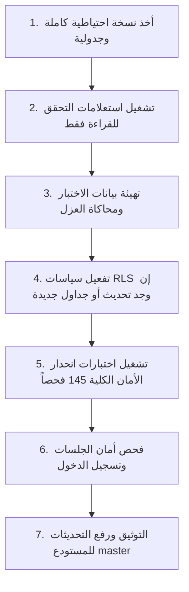

# خطة التعبئة والهجرة المستقبلية - الدفعة الثالثة (Batch 3 Backfill & Migration Plan)
## نظام نما الطبي (NamaMedical) - بيئة Staging

يوثق هذا التقرير خطة التعبئة البرمجية للبيانات (Backfill Plan) وجاهزية قاعدة البيانات لتفعيل الدفعة الثالثة مستقبلاً دون تسبب في انقطاع الخدمة أو فقدان البيانات.

---

### 1. تحليل اكتمال وتغطية هويات المستأجرين (Data Coverage Analysis)

قبل التخطيط لأي هجرة مستقبلية، تم فحص البيانات الحالية في بيئة Staging للتأكد من خلو الجداول المستهدفة من القيم الفارغة:
* **حركات التنويم (`admissions`):** لا توجد أي سجلات معلقة أو فارغة بدون `tenant_id`. تم تعبئتها بالكامل في الدفعة الثانية.
* **الأسرة والملكية (`beds`):** تم التحقق من تعبئة كافة الأسرة الـ 95 بمعرّف المستأجر `tenant_id = 1` وتعيين حالتها `'Available'`.
* **المرضى (`patients`):** معبأة بالكامل وتخضع لعزل المستأجرين.

وبناءً عليه، فإن **نسبة اكتمال تعبئة معرفات المستأجرين هي 100%**، ولا تلزم أي عملية تعبئة إضافية للبيانات التاريخية.

---

### 2. تسلسل وخطوات التفعيل المستقبلي في الدفعة الثالثة (Execution Sequence)

عند الانتقال لمرحلة التنفيذ الفعلي (Phase 72: Batch 3 Implementation)، يجب اتباع الخطوات المحصنة التالية بالتسلسل:

---

### 3. سيناريو خطة التراجع السريع (Rollback Plan)

في حال حدوث أي فشل غير متوقع في النهايات البرمجية أو الاستعلامات المدمجة بعد التفعيل التشغيلي:
1. **استعادة الحالة من السكربتات:** تشغيل سكربت التراجع السريع لتعطيل RLS أو إزالة القيود المضافة.
2. **استرجاع النسخة الاحتياطية:** استعادة قاعدة البيانات إلى نقطة ما قبل التنفيذ باستخدام ملفات النسخ الاحتياطي المنتجة.
3. **التوثيق الفوري:** إنشاء تقرير blocker وتوصيف الخلل بالتفصيل.
