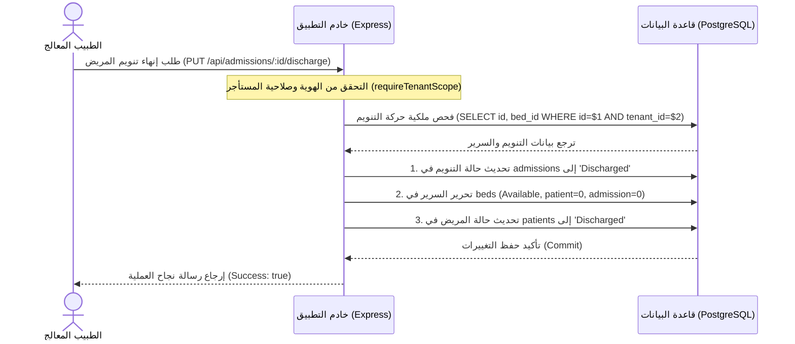

# خارطة طريق وإجراءات خروج المرضى - الدفعة الثالثة (Batch 3 Discharge Workflow Map)
## نظام نما الطبي (NamaMedical) - بيئة Staging

يوثق هذا التقرير التفاصيل التشغيلية والأمنية لكيفية إدارة وإنهاء خروج المرضى المنومين (Discharge Lifecycle) وتكاملها مع نظام عزل المستأجرين لضمان عدم حدوث تسريب أو تداخل للبيانات بين المنشآت الطبية المختلفة.

---

### 1. دورة العمل التشغيلية لعملية الخروج (Discharge Lifecycle)

تتم عملية خروج المريض المنوم عبر الخطوات المتتابعة التالية:

---

### 2. تدابير الحماية وعزل العمليات (Multi-Tenant Security Guards)

لتأمين عملية الخروج ومنع ثغرات الوصول غير المصرح (IDOR) وتداخل العمليات:

1. **التحقق من سياق المستأجر (Tenant Context Check):**
   * يعتمد النظام على `tenantId` المستخرج من الجلسة المحمية (`req.session.user`)، ويحظر الاعتماد على أي معرّف مرسل من المتصفح مباشرة.
2. **عزل فلاتر الاستعلامات:**
   * يتم استعلام تفاصيل التنويم أولاً للتحقق من تطابق المستأجر:
     `SELECT id, bed_id, patient_id FROM admissions WHERE id = $1 AND tenant_id = $2`
3. **حماية التعديل المتقاطع (Cross-Tenant Update Block):**
   * عند تحديث حقول الخروج في `admissions` والسرير في `beds` والمريض في `patients` يتم تضمين شرط الـ `tenant_id` كحارس ثنائي مع سياسة RLS النشطة.

---

### 3. سيناريو إلغاء الخروج وتراجع الحالة (Discharge Reversal / Cancellation)

في حال تم خروج المريض بالخطأ ورغب الفريق الطبي في التراجع عن العملية (Reversal Workflow):
* **المشكلة التشغيلية:** بمجرد الخروج، يتم تحرير السرير فوراً ليصبح `Available`. قد يتم حجز السرير لمريض آخر قبل تراجع الحالة الأولى.
* **الضوابط المصممة للتراجع:**
  1. **فحص جاهزية السرير:** التحقق أولاً من أن السرير لا يزال متوفراً ولم يتم شغله (`status = 'Available'`).
  2. **حظر شغله من مستأجر آخر:** تضمن سياسة RLS للأسرة عدم إمكانية رؤية أو شغل السرير من مستأجر آخر أثناء عملية التحقق.
  3. **استعادة الحالة المشتركة:** يتم إعادة حالة التنويم إلى `'Active'` وشغل السرير (`'Occupied'`) وتحديث هويات المريض والزيارة تحت نفس حماية الجلسة.
  4. **إدارة Blocker التعارض:** إذا أصبح السرير مشغولاً بالفعل، يمنع النظام التراجع التلقائي ويطلب من الطبيب تحديد سرير جديد للمريض لإعادة تنويمه.
