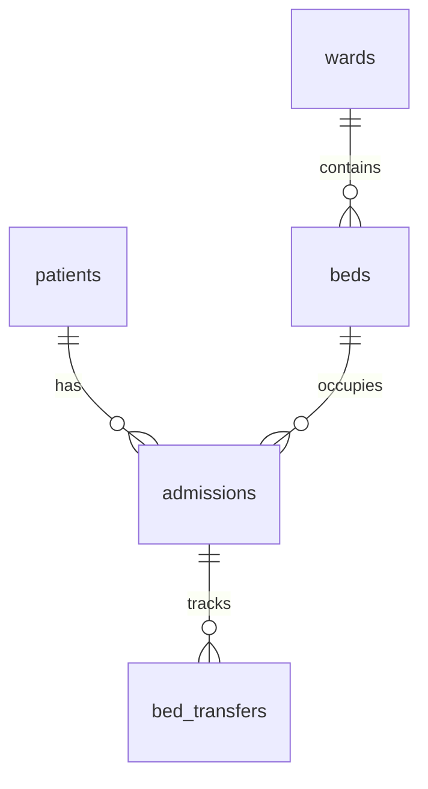

# تقرير تدقيق الهيكل الإنشائي لقاعدة البيانات - الدفعة الثالثة (Batch 3 Schema Audit Report)
## نظام نما الطبي (NamaMedical) - بيئة Staging

يوثق هذا التقرير التدقيق الشامل للبنية الإنشائية لقاعدة البيانات (Schema Audit) المتعلقة بجدولي الخروج وإشغال الأسرة (`Discharge & Occupancy`) للدفعة الثالثة. يهدف هذا الفحص إلى توثيق العلاقات والأعمدة وتأكيد عدم الحاجة لإضافة جداول أو أعمدة جديدة.

---

### 1. تحليل الجداول الحالية والتبعية (Table Schemas)

بناءً على الفحص المخبري لقاعدة البيانات، لا توجد جداول مستقلة باسم `discharge` أو `occupancy`. تعتمد هذه العمليات بالكامل على العلاقات التشغيلية المتبادلة بين الجداول التالية:

#### أ. جدول حركات التنويم (`admissions`)
* **المفتاح الأساسي:** `id` (SERIAL PRIMARY KEY)
* **أعمدة التنويم الأساسية:** `patient_id` (INTEGER), `ward_id` (INTEGER), `bed_id` (INTEGER), `status` (TEXT - قيمها الافتراضية `'Active'`).
* **أعمدة الخروج المدمجة:**
  * `discharge_date` (TEXT)
  * `discharge_type` (TEXT - مثل `'Regular'`, `'Against Medical Advice'`)
  * `discharge_summary` (TEXT)
  * `discharge_instructions` (TEXT)
  * `discharge_medications` (TEXT)
  * `followup_date` (TEXT)
  * `followup_doctor` (TEXT)
* **أعمدة عزل المستأجرين (الموجودة مسبقاً):**
  * `tenant_id` (INTEGER)
  * `facility_id` (INTEGER)

#### ب. جدول الأسرة (`beds`)
* **المفتاح الأساسي:** `id` (SERIAL PRIMARY KEY)
* **أعمدة التتبع التشغيلي:** `ward_id` (INTEGER), `bed_number` (TEXT), `status` (TEXT - قيمها `'Available'`, `'Occupied'`), `current_patient_id` (INTEGER), `current_admission_id` (INTEGER).
* **أعمدة عزل المستأجرين (الموجودة مسبقاً):**
  * `tenant_id` (INTEGER)

---

### 2. مصفوفة العلاقات والتبعية (Entity-Relationship Alignment)

* **التناسق السياقي للمستأجرين:**
  * ترتبط حركة التنويم (`admissions`) بـ `patient_id` و `bed_id`.
  * تفرض سياسات RLS الحالية تطابق الـ `tenant_id` بين المريض والسرير وحركة التنويم لمنع ربط عناصر من مستأجرين مختلفين.

---

### 3. تقييم التغيير البنائي وقرار المخطط (Schema Change Classification)

* **تعديل مخطط الجداول (TABLE_COLUMN_SCHEMA_CHANGED):** `NO`
  * الأعمدة اللازمة لعزل المستأجرين وعزل الفروع (`tenant_id`, `facility_id`/`branch_id`) معبأة وموجودة مسبقاً في جدولي `admissions` و `beds` و `patients`.
  * لا توجد حاجة إطلاقاً لإنشاء جداول جديدة أو إضافة أعمدة جديدة للدفعة الثالثة.
* **تعديل الصلاحيات والأمان (DATABASE_SECURITY_DDL_CHANGED):** `NO` (في هذه المرحلة التصميمية فقط).
* **الحاجة للتوقف الطارئ (Blockers):** لا توجد أي عيوب أو حقول مفقودة في البنية الحالية، مما يسمح بالانتقال لتصميم منطق دورة العمل التشغيلية.
