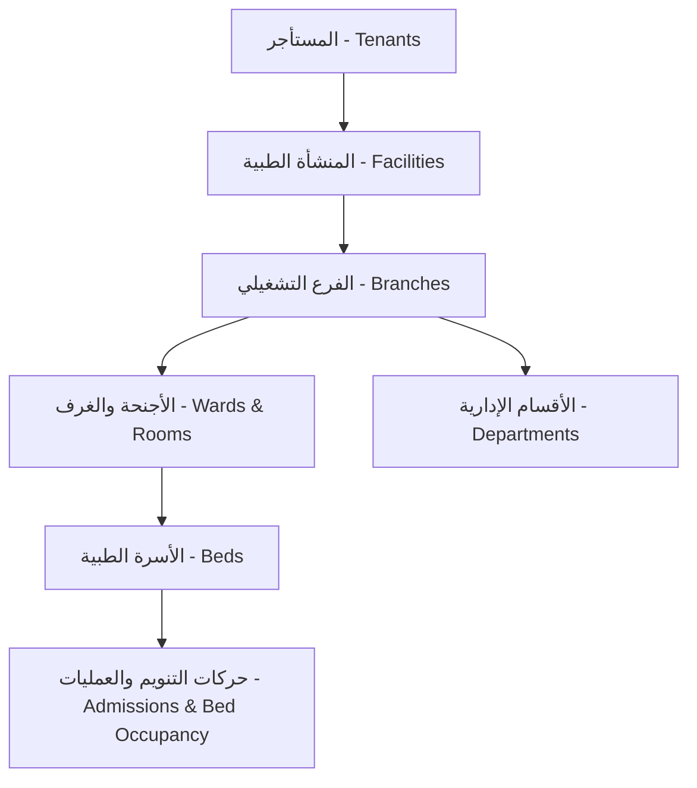

# نموذج ملكية الأسرة والأجنحة للمستأجرين والمنشآت (Tenant & Facility Bed Ownership Model)
## نظام نما الطبي (NamaMedical) - بيئة Staging

يوثق هذا المستند الهيكل التنظيمي المقترح لملكية الموارد الطبية وكيفية تدقيق وضبط العلاقات لمنع أي تداخل بين الكيانات في النظام.

---

### 1. الهيكل التنظيمي للموارد والملكية (Organizational Resource Hierarchy)

يعتمد النموذج المقترح على التسلسل الهرمي التالي لضمان توزيع الموارد الطبية بكفاءة وأمان:



#### أ. مستويات الهيكل:
1. **المستأجر (`tenants`)**: يمثل الكيان السحابي الأعلى (المستشفى أو مجموعة العيادات).
2. **المنشأة (`facilities`)**: تمثل المنشأة الطبية القانونية التابعة للمستأجر.
3. **الفرع (`branches`)**: يمثل الفرع الجغرافي أو المستشفى الفعلي التابع للمنشأة.
4. **الجناح (`wards`)**: يمثل الجناح الطبي (مثل جناح الباطنية أو الطوارئ) والمنسوب لفرع تشغيلي واحد.
5. **السرير (`beds`)**: السرير المادي الفعلي، ويتبع مباشرة لجناح تشغيلي واحد.

---

### 2. قواعد التحقق وتطابق السياق (Context Validation & Enforcement Rules)

لضمان سلامة عزل البيانات، يجب تطبيق القيود التالية في كافة مستويات المعاملات (API & DB Constraints):

#### أولاً: عند إجراء تنوّيم جديد (POST /api/admissions)
يجب التحقق أمنياً من أن:
$$\text{patient.tenant\_id} = \text{bed.tenant\_id} = \text{user.tenant\_id}$$
يتم رفض المعاملة بـ `403 Forbidden` في حال عدم تطابق معرّفات المستأجر للمريض والسرير المطلوبين مع سياق جلسة المستخدم الحالي.

#### ثانياً: عند نقل المريض (POST /api/bed-transfers)
يجب التأكد من أن السرير المصدر والسرير المستهدف يتبعان نفس مستأجر المريض الحالي المنوم:
$$\text{admission.tenant\_id} = \text{from\_bed.tenant\_id} = \text{to\_bed.tenant\_id} = \text{user.tenant\_id}$$
يمنع النقل المتقاطع عبر الفروع أو المستأجرين الآخرين بالكامل.

#### ثالثاً: عزل الإشغال والإحصائيات (Occupancy & Census Isolation)
تستعلم لوحة التحكم فقط الأسرة المرتبطة بالـ `tenant_id` النشط في الجلسة:
```sql
SELECT b.*, w.ward_name 
FROM beds b
JOIN wards w ON b.ward_id = w.id
WHERE b.tenant_id = $1;
```

---

### 3. التوصيات الفنية للتطبيق الآمن (Implementation Recommendations)
- **قيود التحقق في قاعدة البيانات (CHECK Constraints)**: يوصى بإنشاء قيود تحقق على جداول العمليات للتأكد من عدم تمرير قيم متناقضة لـ `tenant_id` و `branch_id`.
- **الاعتماد الكلي على سياق الجلسة**: تلتزم نهايات الـ API باستخراج `tenantId` من الجلسة الآمنة `req.session.user` وتمريرها للاستعلامات ولا يتم السماح بتعديلها أو تمريرها من الواجهة مباشرة لمنع هجمات التلاعب بالمعاملات (Request Tampering).
