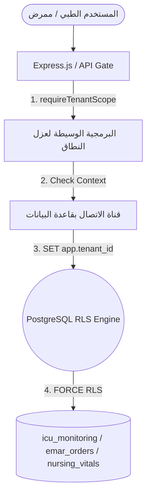

# خريطة مسارات العمل السريرية لعزل العناية والتمريض - الدفعة الرابعة (ICU & Nursing Workflow Map)
## نظام نما الطبي (NamaMedical) - بيئة Staging

يوثق هذا المستند خريطة العمل السريرية وتدفق البيانات لمرضى العناية المركزة وأنشطة التمريض، مع تحديد نقاط الحماية والتحقق لكل مسار لمنع الوصول المتقاطع للمستأجرين.

---

### 1. خريطة المسارات السريرية ونقاط الحماية (Workflow Map & Enforcement Points)

#### أ. مسار الدخول والتحويل للعناية المركزة (ICU Admission & Bed Assignment)
* **الوصف السريري**: يتم تنويم المريض أو تحويله من جناح عام أو قسم الطوارئ إلى سرير في العناية المركزة (`ICU/NICU/CCU`).
* **نقاط الحماية والتحقق**:
  - **مستوى الـ API**: التحقق من أن السرير المستهدف والجناح المستهدف يتبعان نفس مستأجر المريض ومستأجر المستخدم المتصل.
  - **مستوى قاعدة البيانات**: تمنع سياسات RLS على جدولي `admissions` و `bed_transfers` إدراج سجل تنويم متقاطع.

#### ب. مسار الإشغال والعدادات اليومية (ICU Occupancy & Census)
* **الوصف السريري**: يعرض مركز القيادة إحصائيات الأسرة المشغولة والمتاحة ومعدل إشغال أجنحة العناية المركزة بالزمن الفعلي.
* **نقاط الحماية والتحقق**:
  - **مستوى الـ API**: تصفية الاستعلامات في `GET /api/icu/patients` بـ `tenant_id` المشتق من الجلسة.
  - **التحليل الحسابي**: يتم الربط (`JOIN`) حصرياً بين الأسرة المفلترة بـ RLS والأجنحة المفلترة بـ RLS لضمان عدم تسريب العدادات.

#### ج. مسار العلامات الحيوية والتقييمات للتمريض (Nursing Vitals & Assessments)
* **الوصف السريري**: يقوم كادر التمريض بتسجيل العلامات الحيوية للمريض (ضغظ الدم، الأوكسجين، الحرارة) وحساب مقاييس التقييم (مثل تقييم خطر السقوط Morse Fall، وسلامة الجلد Braden، وغيبوبة غلاسكو GCS).
* **نقاط الحماية والتحقق**:
  - **مستوى الـ API**: التحقق من ملكية المريض للمستأجر الفعلي قبل تسجيل أو جلب العلامات الحيوية.
  - **مستوى قاعدة البيانات**: تطبيق سياسة RLS مع قيد `FORCE RLS` على جدولي `nursing_vitals` و `nursing_assessments`.

#### د. مسار خطط الرعاية وصرف الأدوية (Care Plans & eMAR Administrations)
* **الوصف السريري**: كتابة خطة رعاية تمريضية ومتابعة وتنفيذ وصفات الأدوية المعتمدة عبر نظام سجل إعطاء الدواء الإلكتروني (eMAR).
* **نقاط الحماية والتحقق**:
  - **مستوى الـ API**: حظر تسجيل تنفيذ جرعة دواء (`emar_administrations`) ما لم يكن أمر الوصفة الأصلي يخص نفس مستأجر المنشأة الطبية.
  - **سجل التدقيق (Audit Log)**: استدعاء `logAudit` لتسجيل كل عملية إعطاء دواء مع كود الطبيب/الممرض وعنوان الـ IP.

---

### 2. مستويات وهيكلية التحصين (Enforcement Architecture)

---

### 3. ضوابط حظر تجاوز الصلاحيات (IDOR Prevention Matrix)

- **منع التعديل المتقاطع**: لا يُسمح بتعديل سجلات التمريض أو العناية المركزة إلا بعد التأكد من مطابقة `tenant_id` الخاص بالمريض مع المستخدم الحالي.
- **التشفير الضمني للطلبات**: نهايات الـ API لا تقبل معرّف المستأجر (`tenant_id`) من جسم الطلب (Request Body)، بل يتم استخلاصه قسرياً من الجلسة الآمنة وخادم الويب.
- **حماية التقارير**: يتم حساب عدادات العناية المركزة بشكل مفرز حسابياً عند جلب التقارير الطبية دون تخزين إحصائيات مشتركة.
