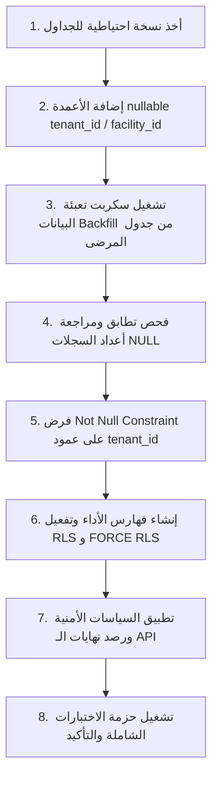

# تقرير خطة وتصميم تعديل هيكل قاعدة البيانات - موديول التقييمات التمريضية (Schema Change Design Plan)
## نظام نما الطبي (NamaMedical) - بيئة Staging

يوثق هذا التقرير الخطة الهيكلية المقترحة لتعديل جدول `nursing_assessments` بقاعدة البيانات، وتعبئة البيانات التراكمية، وتهيئة الجدول لاستقبال سياسات الـ RLS بالكامل عند بدء مرحلة التنفيذ المستقبلية.

---

### 1. توصيف الحقول والعلاقات المضافة (Proposed Schema Modifications)

عند تفعيل مرحلة التنفيذ، سيتم تطبيق الأوامر الهيكلية التالية على قاعدة البيانات:

```sql
-- 1. إضافة الأعمدة كأعمدة تقبل الـ NULL مؤقتاً لتفادي فشل النظام أثناء التطبيق
ALTER TABLE nursing_assessments 
  ADD COLUMN tenant_id integer,
  ADD COLUMN facility_id integer;

-- 2. إنشاء فهرس الأداء لضمان تسريع عمليات الفلترة والاستعلام المعزول
CREATE INDEX idx_nursing_assessments_tenant_facility 
  ON nursing_assessments (tenant_id, facility_id);
```

---

### 2. الترتيب الزمني المقترح لعمليات التنفيذ (Execution Steps Blueprint)

يجب الالتزام بالترتيب الدقيق التالي لضمان أمان البيانات المريضية:



1. **النسخ الاحتياطي (Backup)**: أخذ نسخة كاملة للجداول الطبية باستخدام `pg_dump.exe`.
2. **إضافة الحقول (Add Columns)**: إدراج الأعمدة كـ `nullable`.
3. **تعبئة البيانات (Backfill)**: ربط التقييمات الحالية بجدول المرضى وتوطين الـ `tenant_id` و `facility_id` المقابل لكل تقييم.
4. **فرض القيود (Constraints)**: تعديل خصائص الأعمدة لتصبح `NOT NULL` إجبارياً لمنع إدخال سجلات غير منتمية لأي مستأجر مستقبلاً.
5. **تفعيل الـ RLS (Enable RLS)**: تفعيل وحشد قوة RLS على مستوى المحرك.
6. **تقوية الـ API واختبارات الجودة**: تحديث الكود في `server.js` لتصفية الجدول بالعمود الجديد مباشرة وإجراء الفحوصات.

---

### 3. تقييم المخاطر وجاهزية بيئة الإنتاج (Risk & Compliance Analysis)

* **خطر فقدان البيانات (Data Loss Risk)**: منخفض جداً نظراً لأن الجدول فارغ حالياً من أي سجلات في بيئة Staging. أما في بيئة الإنتاج الفعلي، فيجب عمل هجرة آمنة بداخل transaction آمن للـ Backfill لتجنب أي حالات تعارض.
* **حالة الجاهزية**: **DESIGN_ONLY** (التنفيذ الفعلي معلق للحصول على موافقة المرحلة القادمة).

**حالة البوابة 5**: **PASS**
