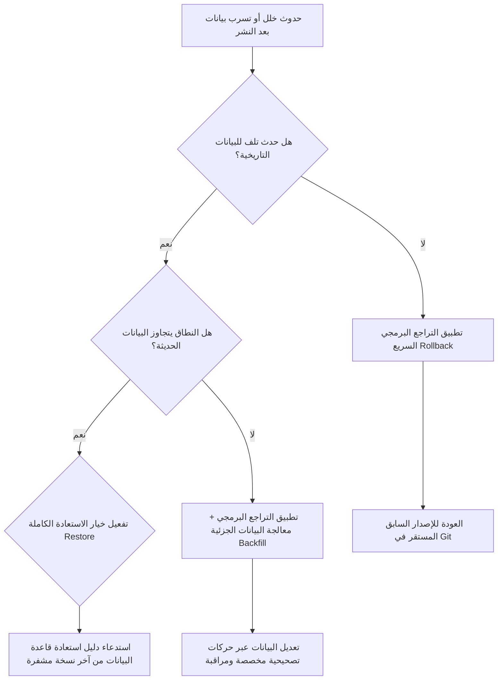

# تصميم استراتيجية النسخ الاحتياطي والاستعادة من الكوارث (Backup, Restore & Disaster Recovery Design)
## نظام نما الطبي (NamaMedical) - خطة الجاهزية للإنتاج

توثق هذه الخطة المعايير الهندسية والتصميمية لعمليات النسخ الاحتياطي، وحفظ السجلات الطبية الحساسة، وسياسات الاستعادة واختباراتها الدورية لضمان استمرارية الأعمال وحماية البيانات السريرية في حال حدوث كوارث فنية أو أمنية.

---

## 1. أهداف التعافي الفنية (RPO & RTO Targets)

لضمان توافق النظام مع متطلبات الامتثال للمنشآت الصحية والجهات التنظيمية (مثل الهيئة السعودية للتخصصات الصحية والجهات الرقابية):

* **هدف نقطة التعافي (Recovery Point Objective - RPO)**: **أقل من 1 ساعة**.
  * يعني هذا أنه في حال حدوث تلف في البيانات، لا يُسمح بفقدان أكثر من بيانات ساعة واحدة من المعاملات السريرية والمالية.
* **هدف وقت التعافي (Recovery Time Objective - RTO)**: **أقل من 4 ساعات**.
  * يمثل هذا الوقت الأقصى المسموح به لاستعادة تشغيل النظام بالكامل وعودة الخدمات للمرضى والتمريض والعيادات.

---

## 2. استراتيجية وجدول النسخ الاحتياطي (Backup Strategy & Frequencies)

يعتمد النظام على نهج نسخ احتياطي متعدد الطبقات يجمع بين النسخ الهيكلي وقواعد البيانات والملفات التشغيلية:

### 2.1 جدول عمليات النسخ الاحتياطي (Backup Schedule)
1. **النسخ الاحتياطي الكامل لقاعدة البيانات (Full Database Backup)**:
   * **الوتيرة**: مرة واحدة يومياً (الساعة 02:00 صباحاً بتوقيت مكة المكرمة).
   * **الأداة**: أداة `pg_dump` بصيغة custom format (`-Fc`).
2. **النسخ الاحتياطي للتغييرات والملفات السجلية (Write-Ahead Logging - WAL)**:
   * **الوتيرة**: مستمر كل 15 دقيقة (أرشفة WAL لتمكين PITR).
3. **نسخ ملفات التكوينات وتصاميم النظام**:
   * **الوتيرة**: أسبوعياً أو عند حدوث تغيير في البنية التحتية.

### 2.2 سياسة الاحتفاظ بالنسخ (Retention Policy)
* يتم الاحتفاظ بالنسخ الاحتياطية اليومية لمدة **30 يوماً**.
* يتم الاحتفاظ بنسخة نهاية كل أسبوع لمدة **12 أسبوعاً**.
* يتم الاحتفاظ بنسخة نهاية كل شهر لمدة **12 شهراً**.
* يتم الاحتفاظ بالنسخ السنوية لمدة **5 سنوات** لأغراض التدقيق القانوني والطبي المعتمد.

---

## 3. تأمين وتشفير النسخ وتخزينها الخارجي (Encrypted & Offsite Storage)

### 3.1 تشفير البيانات أثناء السكون (Encryption at Rest)
* تُشفر كافة ملفات النسخ الاحتياطي مباشرة بعد إنشائها باستخدام تشفير متماثل قوي (AES-256).
* يتم حفظ وتدوير مفاتيح التشفير بشكل مستقل عن قاعدة البيانات وخادم الويب عبر نظام آمن لإدارة المفاتيح (Key Management Service).

### 3.2 النسخ الاحتياطي الخارجي (Offsite Backup)
* يتم إرسال النسخ الاحتياطية المشفرة تلقائياً عبر قنوات آمنة ومحمية (SSL/TLS) إلى وحدة تخزين سحابية معزولة جغرافياً (بين منطقتين مختلفتين لضمان البقاء في حال سقوط مركز البيانات الرئيسي).
* يُفعل خيار "حماية النسخ من الحذف والتعديل" (Object Lock / WORM) لمنع هجمات برامج الفدية (Ransomware) من تدمير النسخ الاحتياطية التاريخية.

---

## 4. تصميم محاكاة الاستعادة الدورية (Restore Drill Design)

لا يُعتبر النسخ الاحتياطي مكتملاً أو ناجحاً إلا إذا تم التحقق من إمكانية استعادته بنجاح.

### 4.1 خطوات محاكاة الاستعادة (Restore Drill Procedure)
يتم تنفيذ محاكاة عملية كل **90 يوماً** في بيئة معزولة تماماً (Staging/Sandboxed DB Server) باستخدام الخطوات التالية:

1. **تحميل النسخة الاحتياطية المشفرة المستهدفة وفك تشفيرها**:
   ```bash
   gpg --decrypt --output /tmp/nama_restore.sql /var/backups/nama-medical/backup_target.sql.gpg
   ```
2. **إنشاء قاعدة بيانات مؤقتة معزولة**:
   ```bash
   createdb -h localhost -p 5432 -U postgres nama_medical_restore_drill
   ```
3. **استعادة البيانات الهيكلية والسريرية**:
   ```bash
   pg_restore -h localhost -p 5432 -U postgres -d nama_medical_restore_drill /tmp/nama_restore.sql
   ```
4. **تشغيل الفحص والتحقق من سلامة البنية والـ RLS**:
   تحقق من تواجد الجداول الـ 148 وتفعيل الـ RLS وعمل السياسات:
   ```bash
   # تشغيل السكربتات الموضعية للتأكد من خلو الجداول من nulls
   psql -h localhost -p 5432 -U postgres -d nama_medical_restore_drill -f docs/sql/surgery_or_rls_validate.sql
   ```
5. **تدمير قاعدة البيانات التجريبية وتنظيف البيئة بعد إعداد التقرير أوتوماتيكياً**.

---

## 5. قواعد عدم تتبع النسخ في Git وحماية المسارات (Hygiene and Paths Policy)

* **حظر إدخال النسخ في Git**:
  * يُمنع منعاً باتاً تحت أي ظرف تتبع أو رفع ملفات بامتداد `.sql` تحتوي على نسخ من البيانات أو المخطط الفعلي داخل مستودع Git العام.
  * تم تدعيم ملف `.gitignore` بالصيغ التالية لضمان الحماية التلقائية:
    ```
    *.sql
    *.sql.gz
    *.sql.gpg
    local_backups/
    ```
* **المسارات المحلية المحمية**:
  * تُحفظ النسخ محلياً ومؤقتاً داخل المجلد المعزول `local_backups/` على الخادم، وهو خاضع للصلاحيات `700` (الوصول فقط لمدير النظام `root`).

---

## 6. شجرة قرارات التراجع والاستعادة (Recovery vs Rollback Decision Tree)

توضح شجرة القرارات متى يجب تفعيل استعادة قاعدة البيانات بالكامل ومتى يُكتفى بالتراجع البرمجي السريع:



### 6.1 تدفقات الموافقات المعتمدة (Production Restore Approval Flow)
نظراً لأن عملية استعادة قاعدة البيانات في الإنتاج قد تؤثر على العمليات الحالية للعيادات:
1. **طلب الموافقة**: يتم طلب إذن استعادة من المدير الطبي (Medical Director) ومدير التقنية (CTO).
2. **النسخ المؤقت**: أخذ لقطة فورية للحالة الحالية قبل البدء بالاستعادة لمنع فقدان البيانات المدخلة حديثاً.
3. **تطبيق الاستعادة**: تنفيذ الاستعادة خارج أوقات الذروة الطبية (إن أمكن).
4. **توقيع الجودة**: تشغيل اختبار الدخان والتحقق من أن النظام والـ RLS في وضع تشغيل آمن بنسبة 100%.
