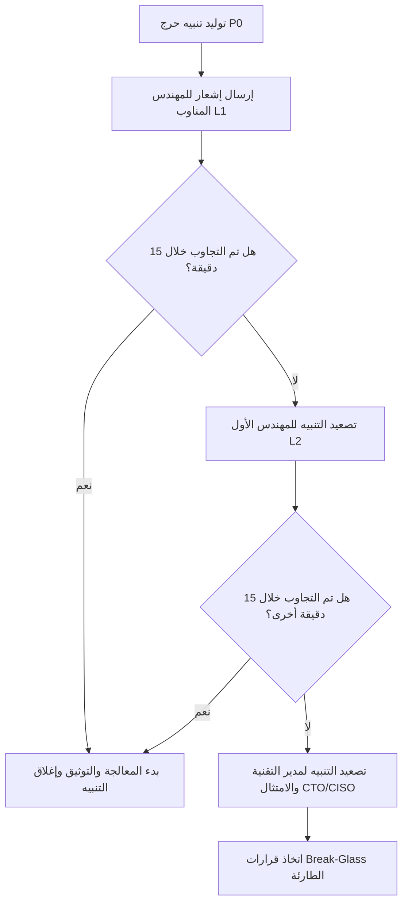

# تصميم نظام المراقبة والتنبيه المبكر للإنتاج (Production Monitoring & Alerting Design)
## نظام نما الطبي (NamaMedical) - خطة الجاهزية للإنتاج

يوثق هذا التصميم البنية الهندسية المقترحة لمراقبة أداء النظام وموارد الخوادم، وتتبع الانتهاكات الأمنية، وإرسال التنبيهات الفورية لفرق التشغيل والامتثال لضمان استقرار الخدمة الطبية واستمرارية عزل المستأجرين.

---

## 1. محاور المراقبة الرئيسية (Monitoring Pillars)

تتوزع استراتيجية المراقبة على ثلاث طبقات أساسية لضمان التغطية الكاملة:

### 1.1 مراقبة البنية التحتية والشبكة (Infrastructure Metrics)
* **موارد الخادم (CPU & RAM)**:
  * التنبيه عند تجاوز استهلاك المعالج **80%** لمدة تزيد عن 5 دقائق متواصلة.
  * التنبيه عند انخفاض الذاكرة العشوائية الحرة عن **15%**.
* **مساحة القرص الصلب (Disk Space)**:
  * التنبيه عند وصول نسبة امتلاء القرص إلى **85%** لضمان عدم توقف سجلات النظام وقاعدة البيانات.
* **توافر الخدمة (Uptime Monitoring)**:
  * فحص مستمر كل 60 ثانية خارجي (Ping/HTTP GET) للمسار الرئيسي واستجابة منفذ الويب.

### 1.2 مراقبة قاعدة البيانات والاستعلامات (PostgreSQL Observability)
* **استقرار الاتصال (Connection Failures)**:
  * تتبع فشل الاتصال بقاعدة البيانات من خادم الويب ورصد أخطاء connection pool.
* **الاستعلامات البطيئة (Slow Queries)**:
  * رصد وتسجيل الاستعلامات التي تستغرق أكثر من **200ms** لتشخيص مشاكل الفهارس وتحسين أداء RLS.
* **فشل العمليات التشغيلية**:
  * التنبيه المباشر عند فشل مهام النسخ الاحتياطي اليومية أو إخفاق عملية الاستعادة التجريبية (Restore Drill).

### 1.3 مراقبة التطبيق والأحداث الأمنية (Application & Security Metrics)
* **أخطاء الخادم (HTTP 5xx Errors)**:
  * التنبيه الفوري عند تكرار حدوث أخطاء خادم داخلية بمعدل يتجاوز 5 أخطاء في الدقيقة.
* **فشل تسجيل الدخول (Authentication Failures)**:
  * مراقبة محاولات الدخول الخاطئة للكشف المبكر عن هجمات التخمين (Brute-Force Attacks).
* **انتهاكات عزل المستأجرين (Tenant Context Gaps & Cross-Tenant Access)**:
  * رصد محاولات استدعاء واجهات التطبيق بدون سياق مستأجر فعال.
  * التنبيه الفوري والأحمر لفرق الأمن عند حدوث محاولة قراءة أو تعديل بيانات مستأجر آخر (Cross-Tenant Attempts) وهو ما يمثل انتهاكاً لسياسة الـ RLS.

---

## 2. مستويات الخطورة والتنبيهات (Alerting Levels & Thresholds)

تُقسم التنبيهات وفق خطورتها لضمان استجابة سريعة للتهديدات الأمنية والتقنية:

| مستوى التنبيه | توصيف الحالة | قنوات الإرسال | وقت الاستجابة المستهدف (SLA) |
| :--- | :--- | :--- | :---: |
| **CRITICAL (P0)** | انتهاك RLS، تسريب بيانات، توقف خادم DB، فشل النسخ الاحتياطي | SMS للطاقم الأمني + Slack Alarm + PagerDuty | **فوري (خلال 15 دقيقة)** |
| **WARNING (P1)** | استهلاك CPU > 85%، بطء استجابة الاستعلامات، أخطاء 5xx متكررة | Slack Channel + Email | **خلال 2 ساعة** |
| **INFO (P2)** | تسجيل دخول ناجح لأدمن المستأجر، تحديث الكتالوجات، انتهاء صيانة | Slack Log Channel | **غير محدد (للمراجعة الدورية)** |

---

## 3. مصفوفة التصعيد للتعامل مع التنبيهات (Escalation Matrix)

في حال حدوث تنبيه من المستوى الحرج (CRITICAL) ولم يتم التفاعل معه أو إغلاقه:

1. **الطبقة الأولى (L1 Support - المهندس المناوب)**:
   * يستقبل التنبيه الفوري ويبدأ بتشخيص السجلات والتحقق من دليل التشغيل (Runbook).
2. **الطبقة الثانية (L2 Support - المهندس الأول/خبير الأمن)**:
   * يتم التصعيد له تلقائياً بعد مرور 15 دقيقة دون استجابة L1 للبدء في عزل الخوادم وتعديل جدار الحماية UFW.
3. **الطبقة الثالثة (CTO / CISO - الإدارة العليا والامتثال)**:
   * يتم التصعيد للإدارة العليا لاتخاذ قرارات التراجع الكامل أو إيقاف الخدمة الطبي والامتثال للجهات التنظيمية.

---

## 4. قنوات التنبيه ووسائل المراقبة المقترحة

* **مراقبة السجلات والخوادم**: الاستعانة بأداة `PM2 Logrotate` وأدوات مراقبة الخادم المركزية (مثل Prometheus & Grafana).
* **إشعارات الأمان الفورية**: إعداد تكامل بريد إلكتروني مؤمن وربط إشعارات Slack عبر Webhooks آمنة ومرنة وخارج مستودع Git العام.
* **مراقبة البيانات السريرية**: إرسال كافة سجلات انتهاك عزل المستأجرين لجدول `audit_trail` الداخلي بشكل متوازي لضمان وجود مرجع غير قابل للتعديل أو الحذف من المستأجر.
