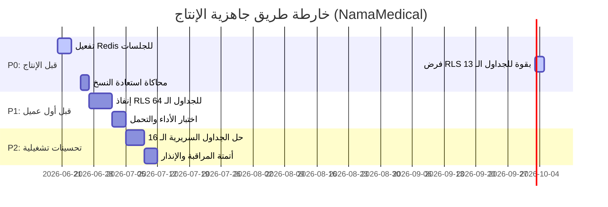

# خارطة طريق جاهزية الإنتاج والـ RLS (Production Readiness & RLS Roadmap)
## نظام نما الطبي (NamaMedical) - خطة الجاهزية للإنتاج

توثق هذه الوثيقة خطة العمل والمراحل الزمنية الموصى بها لمعالجة الفجوات المتبقية وترقية النظام تدريجياً ليكون مؤهلاً للإنتاج الكامل بأعلى معايير الأمان وعزل البيانات.

---

## 1. تصنيف أولويات العمل (Milestone Categorization)

تم توزيع المهام المتبقية بناءً على مدى خطورتها وأهميتها لاستقرار وحماية البيانات الطبية:

---

### 1.1 أولويات P0: متطلبات حتمية قبل نشر الإنتاج (Blocking Production)
يجب تنفيذ هذه المهام وحلها بالكامل قبل التفكير في الترقية لبيئة الإنتاج الفعلي:

1. **الانتقال إلى متجر جلسات Redis (Redis Session Store)**:
   * **الهدف**: ترقية خادم Express لاستخدام Redis كمتجر جلسات موزع خارج ذاكرة الخادم المحلية لمنع فقدان الجلسات ودعم التوسع.
2. **فرض الـ RLS قسرياً (`FORCE ROW LEVEL SECURITY`) للجداول الـ 13**:
   * **الهدف**: تطبيق الـ RLS بقوة على حساب مالك قاعدة البيانات (`postgres`) لضمان عزل البيانات للمرضى والزيارات والفواتير والعمليات.
   * **الجداول المستهدفة**: `patients`, `appointments`, `invoices`, `prescriptions`, `lab_results`, `pharmacy_sales`, إلخ.
3. **تطبيق اختبار محاكاة استعادة قاعدة البيانات (Restore Drill)**:
   * **الهدف**: إثبات إمكانية استعادة البيانات بالكامل والوفاء بمؤشرات RTO/RPO محلياً أو على خادم معزول.
4. **تأمين بيئة الاتصال وتفعيل HTTPS بالكامل**:
   * **الهدف**: منع هجمات التنصت وتشفير الكوكيز بخصائص `Secure` و `HttpOnly`.

---

### 1.2 أولويات P1: متطلبات قبل تشغيل أول عميل حقيقي (First Live Customer)
مهام يتم حلها مباشرة بعد النشر للإنتاج ولكن قبل استقبال مرضى حقيقيين على النظام:

1. **تفعيل سياسات RLS للجداول الإدارية والمالية الـ 64 (API_ONLY_TEMPORARY)**:
   * **الهدف**: إخضاع كافة جداول حركة الأموال، الموظفين، والمخازن للـ RLS بقاعدة البيانات بدلاً من الاكتفاء بعزلها برمجياً في الواجهات.
   * **الجداول المستهدفة**: `finance_journal_entries`, `hr_employees`, `inventory_items`, `zatca_invoices`, إلخ.
2. **إجراء اختبار أداء واستقرار RLS تحت الضغط (Load Testing Rehearsal)**:
   * **الهدف**: تشغيل كود k6 للتحميل والتحقق من بقاء زمن استجابة الاستعلامات الطبية أقل من 200ms تحت الضغط المتزامن.

---

### 1.3 أولويات P2: تحسينات تشغيلية وامتثال إداري (Operational Governance)
تحسينات تُنفذ خلال الـ 90 يوماً الأولى من التشغيل لضمان استقرار العمليات الطبية:

1. **حل وتجهيز جداول البيانات السريرية الـ 16 المتبقية (Lacking tenant_id)**:
   * **الهدف**: تعديل مخطط قاعدة البيانات لإضافة معرف المستأجر وتعبئة الحقول التاريخية وتفعيل سياسات RLS.
   * **الجداول المستهدفة**: `approvals`, `blood_bank_*`, `rehab_*`, `diet_*`, `portal_users`.
2. **أتمتة لوحات المراقبة وقنوات التنبيه المبكر (Alerting Integration)**:
   * **الهدف**: تفعيل قنوات إرسال تنبيهات Slack و SMS للمخالفات الأمنية ومحاولات الاختراق.

---

### 1.4 أولويات P3: ممارسات تحسين لاحقة (Continuous Enhancements)
* إجراء مراجعة دورية لسياسات الأمان وتحديث أدلة التشغيل (Runbooks) بناءً على تقارير معالجة الحوادث السابقة.
* تنظيم عمليات تدوير دورية للأسرار واعتمادات الاتصال وتخزين مفاتيح التشفير بشكل مركزي آمن.

---

## 2. جدول فرز ومتابعة الجداول الـ 93 (Reconciliation Plan for 93 Tables)

لمعالجة الجداول التي تم تحديدها في المراجعة النهائية بأنها تحتاج متابعة:

1. **الدورة الأولى**: معالجة الجداول الـ 13 (RLS_ENABLED_NOT_FORCED) عبر تشغيل أمر `FORCE ROW LEVEL SECURITY` في مستودع الهجرة القادم.
2. **الدورة الثانية**: إعداد وتحليل الجداول الـ 16 التي تحتاج معرف مستأجر لتصميم حقول `tenant_id` و `facility_id` كأعمدة nullable لتجنب كسر العلاقات وتعبئتها بسكربت Backfill.
3. **الدورة الثالثة**: تفعيل الـ RLS تدريجياً لـ 64 جدولاً إدارياً ومالياً بعد التأكد من دمج المتغيرات البرمجية بالكامل.
