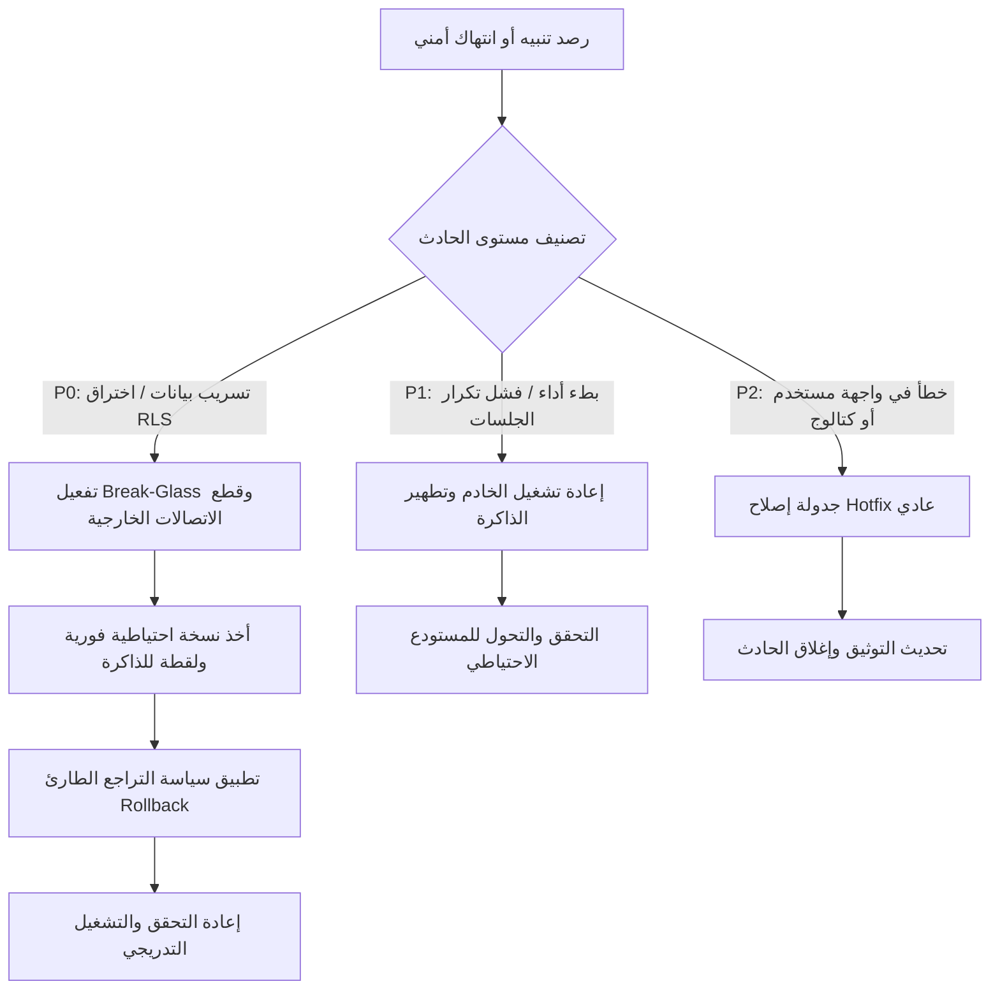

# دليل التشغيل وإدارة الحوادث للإنتاج (Production Operational & Incident Runbooks)
## نظام نما الطبي (NamaMedical) - وثيقة تشغيلية معتمدة

يوفر هذا الدليل الخطوات والإرشادات التشغيلية التفصيلية لإدارة وصيانة نظام نما الطبي في بيئة الإنتاج. تم تصميمه لضمان استقرار الخادم وقاعدة البيانات، والحفاظ على عزل المستأجرين (Tenant Isolation)، والتعامل الفوري مع أي حوادث أمنية أو تقنية.

---

## 1. العمليات اليومية وفحوصات السلامة (Daily Operations & Health Checks)

### 1.1 فحص السلامة اليومي (Daily Health Check)
يتم تنفيذ الفحص التالي كل صباح (الساعة 06:00 صباحاً بتوقيت مكة المكرمة) للتأكد من استقرار الخوادم:

1. **فحص حالة خادم الويب (Node.js/Express) عبر PM2**:
   ```bash
   pm2 status
   pm2 show nama-web
   ```
   * *معيار النجاح*: أن تكون الحالة `online` ونسبة استهلاك الذاكرة والمعالج مستقرة.

2. **فحص حالة منفذ الويب واستجابة Nginx**:
   ```bash
   curl -I http://localhost:3000
   systemctl status nginx
   ```
   * *معيار النجاح*: استلام الرمز `200 OK` أو `302 Found` للحماية، وحالة Nginx هي `active (running)`.

3. **فحص حالة اتصال قاعدة البيانات PostgreSQL**:
   ```bash
   pg_isready -h localhost -p 5432 -U postgres
   ```
   * *معيار النجاح*: ظهور رسالة `accepting connections`.

---

### 1.2 التحقق من عزل المستأجرين (Tenant Isolation Validation)
لمنع تسرب البيانات، يتم تشغيل الفحوصات التالية للتأكد من أن سياق المستأجر يتم تمريره بشكل سليم:

1. **تشغيل اختبارات العزل التلقائية (Cross-Tenant Smoke Test)**:
   ```bash
   # تشغيل اختبارات الدفعات الطبية السابقة
   node namaweb/cross_tenant_nursing_assessments_test.js
   node namaweb/cross_tenant_surgery_or_test.js
   ```
   * *معيار النجاح*: نجاح 100% لكافة الاختبارات وعدم رصد أي وصول متقاطع.

2. **التحقق من سجلات الأخطاء لقيم المستأجر المفقودة**:
   ```bash
   grep -i "missing tenant context" /var/log/nama-medical/error.log
   ```
   * *معيار النجاح*: عدم وجود أي نتائج.

---

### 1.3 التحقق اليومي من سياسات الـ RLS في قاعدة البيانات (RLS Validation Routine)
لمطابقة سلامة تفعيل RLS على الجداول الـ 35 وجداول النظام:

1. **تشغيل استعلام فحص السياسات النشطة**:
   يتم الاتصال بقاعدة البيانات وتشغيل الاستعلام التالي للتأكد من عدم وجود جداول مفعّل عليها RLS دون فرضها بقوة:
   ```sql
   SELECT c.relname AS table_name, 
          c.relrowsecurity AS rls_enabled, 
          c.relforcerowsecurity AS rls_forced
   FROM pg_class c
   JOIN pg_namespace n ON n.oid = c.relnamespace
   WHERE n.nspname = 'public' 
     AND c.relkind = 'r'
     AND c.relrowsecurity = 't'
     AND c.relforcerowsecurity = 'f';
   ```
   * *معيار النجاح*: النتيجة يجب أن تكون 0 صفوف (جميع جداول RLS النشطة يجب أن تكون `rls_forced = 't'`).

---

### 1.4 اختبار الدخان للواجهات البرمجية (API Smoke Routine)
يتم تنفيذ الفحص للتحقق من نهايات API الحساسة:

1. **تشغيل سكربت اختبار الدخان**:
   ```bash
   npm run test:smoke
   ```
   * *معيار النجاح*: اجتياز اختبار الدخول والخروج واللوحة الطبية بنسبة 100%.

2. **فحص حالة جلسات الدخول للتمريض والاستقبال**:
   التحقق من أن كوكيز الجلسة يتم إرسالها مشفرة مع خيار `HttpOnly`:
   ```bash
   curl -i -c cookies.txt http://localhost:3000/api/auth/login -d "username=admin&password=your_secure_password"
   # ثم فحص محتوى cookies.txt للتأكد من وجود HttpOnly و Secure flag (في بيئة HTTPS)
   ```

---

### 1.5 التحقق اليومي من النسخ الاحتياطية (Backup Integrity Check)
1. **التحقق من وجود ملفات النسخ الاحتياطي في المجلد المحلي الآمن وحجمها**:
   ```bash
   ls -lh /var/backups/nama-medical/
   ```
   * *معيار النجاح*: وجود ملف النسخ لليوم الحالي بحجم متوافق مع النمو اليومي للمستودع (لا يقل عن الحجم السابق).

2. **التحقق من نجاح إرسال النسخ للمستودع الخارجي (Offsite Backup)**:
   ```bash
   grep -i "backup upload" /var/log/nama-medical/backup.log
   ```
   * *معيار النجاح*: إشارة نجاح الرفع `Upload completed successfully`.

---

## 2. دليل معالجة الحوادث الأمنية والتقنية (Incident Triage & Response)



### 2.1 فرز وتشخيص الحوادث (Incident Triage)
عند رصد أي سلوك غير طبيعي أو استلام تنبيه، يتم تصنيف الحادث وفق التالي:
* **مستوى P0 (كارثة أمنية / عزل مستأجر مخترق)**: أي محاولة معلنة للوصول لبيانات مريض من مستأجر آخر أو فشل الـ RLS في تصفية البيانات.
* **مستوى P1 (فشل في استقرار الخدمة)**: توقف خادم PostgreSQL أو فقدان متتابع لجلسات المستخدمين نتيجة امتلاء الذاكرة.
* **مستوى P2 (مشاكل تشغيلية محدودة)**: خطأ في واجهة فرعية أو كتالوج فرعي لا يؤثر على عزل البيانات.

---

### 2.2 إجراءات معالجة انتهاك عزل المستأجرين (P0 Incident Response)
إذا تم رصد محاولة وصول متقاطعة (Cross-Tenant Access Attempt) في السجلات:

1. **الخطوة الأولى: عزل الخادم وحجبه مؤقتاً**:
   تفعيل جدار الحماية UFW لقصر الدخول على الطاقم الأمني فقط:
   ```bash
   sudo ufw deny proto tcp from any to any port 80,443
   ```
2. **الخطوة الثانية: أخذ لقطة فورية من قاعدة البيانات للسجلات والتحقيق**:
   ```bash
   pg_dump -U postgres -d nama_medical_web -f /var/backups/nama-medical/incident_backup_$(date +%F_%H%M).sql
   ```
3. **الخطوة الثالثة: تشخيص مكان التسريب**:
   البحث في سجل الاستدعاءات وسجلات النظير لمعرفة المسار البرمجي المسبب:
   ```bash
   grep -B 5 -A 5 "Forbidden cross-tenant" /var/log/nama-medical/error.log
   ```
4. **الخطوة الرابعة: سد الثغرة فوراً وإعادة الفحص**:
   تطبيق الإصلاح السريع واختبار العزل محلياً قبل فتح المنافذ الخارجية مجدداً.

---

### 2.3 دليل التراجع الطارئ (Emergency Rollback Runbook)
في حال تم نشر إصدار جديد وحدث خطأ كارثي أو تسريب للبيانات:

1. **إيقاف خادم التطبيق فوراً**:
   ```bash
   pm2 stop nama-web
   ```
2. **التراجع عن تغييرات قاعدة البيانات (إذا شمل التحديث DDL)**:
   استدعاء سكربت التراجع الخاص بتلك الدفعة (مثال: nursing_assessments_down.sql):
   ```bash
   psql -U postgres -d nama_medical_web -f docs/sql/nursing_assessments_tenant_isolation_down.sql
   ```
3. **التراجع عن كود التطبيق في Git**:
   ```bash
   git reset --hard HEAD~1
   git submodule update --recursive
   ```
4. **إعادة بناء وتشغيل التطبيق**:
   ```bash
   npm run build:css
   pm2 start nama-web
   ```
5. **تشغيل اختبارات الانحدار للتحقق**:
   ```bash
   npm test
   ```

---

## 3. أدلة الصيانة والتهيئة (Maintenance & Operations Checklists)

### 3.1 دليل تدوير الأسرار والمفاتيح (Secret Rotation Checklist)
يجب تنفيذ الخطوات التالية كل 90 يوماً أو فور حدوث اشتباه بتسريب المفاتيح:

1. **تحديث كلمة مرور مستخدم PostgreSQL المخصص للتطبيق**:
   ```sql
   ALTER USER nama_app_user WITH PASSWORD 'new_random_ultra_secure_password';
   ```
2. **تحديث الجلسات ومفاتيح التوقيع في ملف البيئة (خارج المستودع)**:
   تعديل قيمة `SESSION_SECRET` في ملف `.env` على السيرفر بقيمة عشوائية جديدة بطول 64 حرفاً.
3. **إعادة تشغيل تطبيق Express لتطبيق المفاتيح الجديدة وتطهير الجلسات القديمة**:
   ```bash
   pm2 restart nama-web
   ```

---

### 3.2 دليل إدراج مستأجر جديد (Tenant Onboarding Checklist)
لتهيئة مستأجر طبي (مستشفى أو مركز صحي) جديد في النظام بأمان:

1. **إنشاء سجل المستأجر الجديد في جدول المستأجرين**:
   ```sql
   INSERT INTO tenants (name, domain, status) 
   VALUES ('مركز نما التخصصي', 'nama-specialty.com', 'active') 
   RETURNING id;
   ```
2. **إنشاء الفروع والعيادات المرتبطة بالمستأجر الجديد**:
   ```sql
   INSERT INTO facilities (tenant_id, name, type) 
   VALUES (new_tenant_id, 'فرع الرياض الرئيسي', 'hospital');
   ```
3. **تهيئة الكتالوجات الافتراضية والخدمات الطبية للمستأجر الجديد**:
   تفعيل سياسة نسخ الخدمات الأساسية للمستأجر لضمان وجود الكتالوج الخاص به دون تداخل مع مستأجرين آخرين.
4. **تشغيل اختبار عزل أولي للمستأجر الجديد**:
   محاكاة طلب بيانات المريض التابع للمستأجر الجديد عبر مستأجر آخر والتأكد من إرجاع `403 Forbidden`.

---

### 3.3 دليل إيقاف/تجميد مستأجر (Tenant Suspension/Deactivation)
في حال رغبة الإدارة في تجميد حساب مستشفى أو لانتهاء الاشتراك:

1. **تحديث حالة المستأجر في قاعدة البيانات**:
   ```sql
   UPDATE tenants SET status = 'suspended' WHERE id = target_tenant_id;
   ```
2. **تطهير الجلسات النشطة للمستأجر**:
   إذا كان يتم استخدام Redis للجلسات، يتم البحث عن مفاتيح الجلسات المرتبطة بالمستأجر المستهدف وحذفها فوراً لإلغاء صلاحية الوصول الحالية لجميع مستخدميه.
3. **التحقق من حظر الدخول**:
   محاولة تسجيل دخول مستخدم تابع للمستأجر المجمد والتأكد من ظهور رسالة الحظر: `Account suspended. Contact support.`
