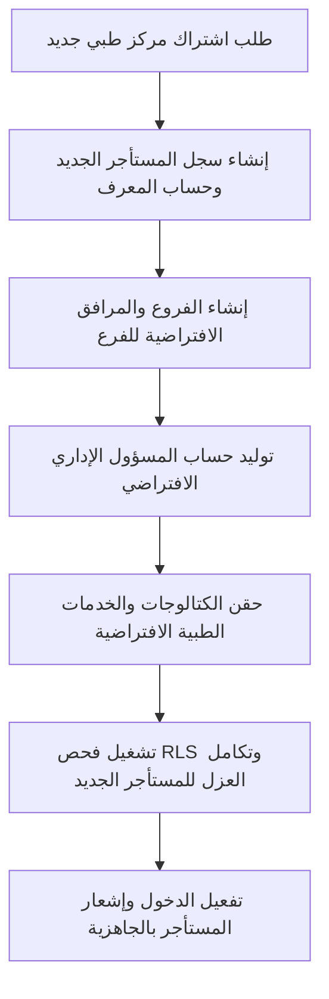

# دليل حوكمة وإدراج المستأجرين للإنتاج (Tenant Provisioning & Operational Governance)
## نظام نما الطبي (NamaMedical) - خطة الجاهزية للإنتاج

يوثق هذا الدليل السياسات الأمنية والخطوات الفنية المعتمدة لتهيئة المستأجرين الطبيين الجدد (Tenant Provisioning)، وإدارة الفروع، وتخصيص الصلاحيات والكتالوجات، وتحديد سياسات الوصول الاستثنائي لدعم النظام.

---

## 1. مسار أتمتة تهيئة المستأجرين الجدد (Provisioning Workflow)

لضمان عزل البيانات وحمايتها من التداخل منذ اللحظة الأولى لإنشاء الحساب، يتبع إدراج المستأجر الطبي الخطوات التالية بالتسلسل:



### 1.1 إنشاء المستأجر والمرفق (Tenant & Facility Creation)
يتم توليد معرف مستأجر فريد (UUID) لضمان عدم قابليته للتخمين أو التداخل:
```sql
-- 1. إنشاء المستأجر الرئيسي
INSERT INTO tenants (id, name, status, created_at)
VALUES (gen_random_uuid(), 'مستشفى الشفاء التخصصي', 'active', NOW())
RETURNING id;

-- 2. ربط الفروع والمرافق الافتراضية للمستأجر
INSERT INTO facilities (tenant_id, name, type, status)
VALUES (new_tenant_uuid, 'الفرع الرئيسي - الرياض', 'hospital', 'active');
```

### 1.2 إنشاء المسؤول الإداري (Tenant Admin Provisioning)
يتم إنشاء الحساب الإداري الأول للمستأجر مع إعطائه صلاحية `tenant_admin` لتوليد الكوادر الأخرى:
```sql
INSERT INTO users (tenant_id, facility_id, username, password_hash, role, display_name)
VALUES (new_tenant_uuid, new_facility_id, ' شفاء_ادمن', 'hashed_secure_password_value', 'tenant_admin', 'مسؤول مستشفى الشفاء');
```

---

## 2. تهيئة وتخصيص الكتالوجات (Default Catalogs & Overrides)

يوفر النظام كتالوجات افتراضية للخدمات الطبية والأدوية والفحوصات، ويتم تزويد المستأجر بها مع إمكانية التعديل الخاص به دون المساس بالبيانات المشتركة:

* **حقن الخدمات الافتراضية (Default Catalog Setup)**:
  * عند تهيئة المستأجر، يتم نسخ كتالوج الخدمات الأساسية وإضافته لجدول كتالوجات المستأجر الجديد مع ختمه بـ `tenant_id` الخاص به.
* **كتالوجات مخصصة وأسعار محددة (Catalog Overrides)**:
  * يمتلك كل مستأجر صلاحية تعديل أسعار الخدمات الطبية، التحاليل المخبرية، والأشعة في الكتالوج المخصص له. تمنع سياسات RLS أي مستأجر آخر من رؤية أو تعديل تسعيرة مستأجر مغاير.

---

## 3. التحقق الأمني بعد التهيئة (Post-Provisioning Verification)

مباشرة بعد استكمال البناء البرمجي للمستأجر، يتم تشغيل سكربت الفحص الصامت التلقائي:

1. **التحقق من عدم وجود قيم فارغة**:
   التأكد من أن جميع السجلات التي تم إنشاؤها تحتوي على `tenant_id` و `facility_id` بشكل سليم.
2. **اختبار عزل الواجهة**:
   محاولة جلب بيانات كتالوج المستأجر الجديد باستخدام رمز وصول لمستأجر قائم والتأكد من إرجاع خطأ الحظر `403 Forbidden`.

---

## 4. سياسات الوصول التشغيلي والدعم الفني (Operational Governance)

### 4.1 الوصول لأغراض الدعم الفني (Support Access Policy)
* **الحظر المطلق للوصول التلقائي**: لا يمتلك مهندسو التطوير أو موظفو الدعم الفني أي صلاحية دخول افتراضية لقاعدة بيانات أو واجهة أي مستأجر طبي.
* **الوصول المشروط**: يتم تشغيل سياق دعم مؤقت بعد موافقة العميل الإدارية المكتوبة، ويوثق ذلك في سجلات الامتثال والأمان.

### 4.2 سياسة تصاريح الطوارئ (Break-Glass Access Policy)
في الحالات الطارئة والكوارث الفنية التي تستدعي تدخل مهندس الأنظمة مباشرة على قاعدة البيانات:

1. **تسجيل الطلب**: يتم تقديم طلب "Break-Glass" موثق يوضح سبب التدخل والوقت المستهدف والمعرفات المطلوب مراجعتها.
2. **الموافقة الإدارية**: تتطلب موافقة ثنائية من مدير الأمان (CISO) والمدير الطبي.
3. **توليد حساب مؤقت**: يتم توليد صلاحية وصول تنتهي تلقائياً بعد مرور ساعتين.
4. **التدقيق والمراجعة**: يتم تسجيل كافة الاستعلامات التي تم تشغيلها أثناء نافذة الصيانة الطارئة ومراجعة سجلات جدول `audit_trail` بالكامل للتأكد من عدم حدوث تجاوزات أمنية أو تسريب للبيانات.
