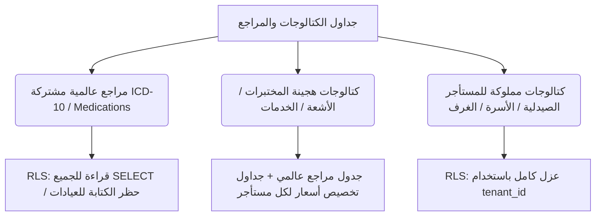

# تصميم عزل وتخصيص كتالوجات النظام الطبية (Tenant Catalog Override Design)
## نظام نما الطبي (NamaMedical)

يوثق هذا التقرير التصميم الأمني والمعماري لكيفية التعامل مع كتالوجات وجداول المراجع الطبية في النظام قبل تفعيل سياسات Row-Level Security (RLS) عليها. يهدف هذا التصميم إلى تحقيق العزل التام لأسعار وعناصر الكتالوجات بين المستأجرين دون تكرار البيانات الأساسية أو إحداث خلل في عمل التطبيق.

---

## 1. ملخص المرحلة (Phase Summary)
* **اسم المرحلة المطلوبة**: `TENANT_CATALOG_OVERRIDE_DESIGN`
* **الوضع الأمني الحالي**: تم تفعيل RLS بنجاح لـ 14 جدولاً عملياتياً وعيادياً (Batch 1-6).
* **الهدف الحالي**: إيجاد بنية متكاملة للكتالوجات الطبية التي تشكل مرجعاً مشتركاً (مثل الأكواد الطبية والأدوية العامة وفحوصات المختبر والأشعة) مع إتاحة التخصيص المستقل (Custom Prices / Custom Templates) لكل مستأجر (عيادة أو مستشفى) بشكل معزول تماماً.

---

## 2. مبررات عدم تفعيل RLS بشكل مباشر أو عشوائي على الكتالوجات
إن تفعيل RLS بشكل تلقائي ومباشر على الكتالوجات الطبية دون مراجعة معمارية يؤدي إلى مخاطر جسيمة:
1. **فقدان مرونة الأسعار (Pricing Conflict)**:
   إذا كان جدول الفحوصات `lab_tests_catalog` مشتركاً وعالمياً بدون RLS، فإن أي تعديل في السعر من عيادة (مستأجر أ) سيغير السعر لدى العيادة (مستأجر ب)، وهو ما يخرق خصوصية وتنافسية المستأجرين.
2. **شح البيانات عند فلترة RLS بـ tenant_id**:
   إذا قمنا بفرض سياسة عزل صارمة بناءً على `tenant_id` على جداول مراجع مثل `icd10_codes` أو `medications` التي لا تحتوي على عمود المستأجر، ستفشل الاستعلامات وتظهر فارغة تماماً للعيادات، مما يعطل كتابة التشخيصات والوصفات الطبية.
3. **غياب البنية الإنشائية (Missing Columns)**:
   جداول مثل `medications` و`lab_tests_catalog` و`radiology_catalog` و`medical_services` لا تحتوي حالياً على عمود `tenant_id` في قاعدة البيانات.

---

## 3. تصميم نموذج التخصيص والهجين (Tenant Catalog Override Model)

لحل هذه المعضلة، تم تصميم ثلاثة أنماط رئيسية للتعامل مع الكتالوجات:



### أولاً: الكتالوجات الهجينة (Hybrid Global + Tenant Override)
* **الجداول المستهدفة**: `lab_tests_catalog`, `radiology_catalog`, `medical_services`
* **الفكرة المعمارية**:
  - يبقى الجدول الأصلي (مثل `lab_tests_catalog`) مشتركاً وعالمياً ويحتوي على الفحوصات القياسية وأسعارها الافتراضية.
  - يتم إنشاء جدول إضافي للتخصيص باسم `tenant_lab_test_overrides` يحتوي على:
    * `tenant_id` (معرف المستأجر)
    * `test_id` (المفتاح الأجنبي للفحص العالمي)
    * `custom_price` (السعر المخصص للمستأجر)
    * `is_active` (حالة الفحص لدى هذا المستأجر)
  - عند قيام التطبيق بعرض الخدمات أو الفحوصات لحساب الفواتير أو الطلبات الطبية، يتم دمج الجدولين بربط خارجي أيسر (LEFT JOIN):
    ```sql
    SELECT 
        lt.id, 
        lt.test_name, 
        COALESCE(o.custom_price, lt.price) AS price, 
        COALESCE(o.is_active, 1) AS is_active
    FROM lab_tests_catalog lt
    LEFT JOIN tenant_lab_test_overrides o 
      ON lt.id = o.test_id AND o.tenant_id = :tenant_id;
    ```
  - **سياسة RLS**: يُفعل RLS على جدول التخصيص `tenant_lab_test_overrides` ليكون معزولاً بالكامل لكل مستأجر، بينما يبقى الكتالوج الرئيسي `lab_tests_catalog` مقروءاً للجميع.

### ثانياً: المراجع العالمية المشتركة (Global Shared Catalog)
* **الجداول المستهدفة**: `icd10_codes` و `medications` (كمرجع للأدوية العامة المصدرية).
* **سياسة RLS**:
  - يسمح بالقراءة المفتوحة لجميع المستخدمين الذين لديهم جلسة نشطة (`USING (true)`).
  - يمنع منعاً باتاً الإدخال أو التحديث أو الحذف من قبل المستأجرين العاديين لحماية سلامة الكود التشخيصي الدولي.

### ثالثاً: الكتالوجات والموارد المملوكة بالكامل (Tenant Owned Catalog)
* **الجداول المستهدفة**: `pharmacy_drug_catalog`, `wards`, `beds`, `operating_rooms`
* **سياسة RLS**: عزل تام ومباشر بناءً على قيمة سياق الجلسة `app.tenant_id` حيث يملك كل مستأجر بياناته بالكامل ولا توجد أسطر مشتركة.

---

## 4. المخاطر والتهديدات الأمنية والتقنية
1. **تسريب الأسعار المخصصة (Cross-Tenant Price Leak)**:
   إذا لم يتم تأمين جداول التخصيص `overrides` باستخدام RLS بشكل صارم، فقد يتمكن مستأجر من معرفة أسعار وعقود مستأجر آخر عبر استعلامات مخصصة.
2. **كسر التوافق البرمجي (App Breakage)**:
   تعديل الاستعلامات الحالية في التطبيق التي تعتمد على `SELECT * FROM lab_tests_catalog` مباشرة دون عمل `LEFT JOIN` مع جداول التخصيص سيؤدي لظهور الأسعار الافتراضية فقط وتجاهل الأسعار المخصصة للعيادة.
3. **أداء الاستعلامات (Performance Overhead)**:
   عمليات الـ JOIN المتكررة بين جداول الكتالوجات وجداول التخصيص تحتاج لمؤشرات (Indexes) مركبة على `(tenant_id, test_id)` لضمان سرعة الاستجابة تحت الضغط العالي.

---

## 5. القرارات والتوصيات
1. **اعتماد النموذج الهجين للأسعار**: رفض تكرار كامل كتالوج الفحوصات (455 فحصاً) والأشعة (305 إجراء) لكل مستأجر، واعتماد جداول التخصيص (Overrides) كخيار أمثل للمساحة والأداء.
2. **تجهيز المخطط الإنشائي للـ Overrides**: إعداد سكربتات إنشاء جداول التخصيص دون تشغيلها في هذه المرحلة (التزاماً بـ `SCHEMA_CHANGED: NO`).
3. **فصل الصيدلية بالكامل**: تأكيد بقاء `pharmacy_drug_catalog` كجدول مملوك للمستأجر بالكامل منفصل عن جدول `medications` المرجعي العام.
4. **تأجيل تفعيل RLS على الكتالوجات**: يمنع تفعيل RLS على الكتالوجات المشتركة إلا بعد تنفيذ النموذج الهجين في كود التطبيق وتعديل الاستعلامات لمنع كسر النظام.
