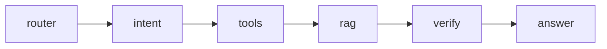

# Per-Department Spec Template
> انسخ هذا الملف لكل قسم تحت `docs/groups/{{NN_dept_key}}.md` واستبدل `{{...}}` بالقيم الفعلية.

## 0) Meta
```yaml
dept_key:         "{{dept_key}}"          # snake_case, e.g. "cardiology"
dept_name_en:     "{{Cardiology}}"
dept_name_ar:     "{{طب القلب}}"
group_id:         "G{{NN}}"
parent_group:     "{{Internal Medicine}}"
status:           "draft|active|deprecated"
owner:            "{{lead_name}}"
last_review:      "2026-05-13"
clinical_lead:    "{{Dr. ___}}"
tech_lead:        "{{___}}"
```

---

## 1) Prompt Engineering

### 1.1 System Prompt
```text
You are NamaMedical-{{dept_key}} Assistant…
ROLE: …
ALLOWED ACTIONS: …
CONSTRAINTS: …
STYLE: …
```

### 1.2 Context (yaml injected per request)
```yaml
patient: { mrn, age, sex, allergies[], active_problems[], current_meds[] }
visit:   { id, type, doctor_id }
dept:    { key, subspecialty, ward_id }
top_k_rag: 5
```

### 1.3 Few-shot Examples (≤3)
```
Q: …  A: …
```

### 1.4 Self-critique checklist
- [ ] Drug dose adjusted for renal/hepatic function?
- [ ] Allergies checked?
- [ ] Pregnancy category (if female 15-50)?

---

## 2) Workflow & Orchestration

### 2.1 LangGraph state machine
```python
class State(TypedDict):
    intent: str
    patient_id: str
    plan: list[Action]
    rag_chunks: list[str]
    answer: str
    requires_human: bool
```

### 2.2 Chaining diagram (mermaid)


### 2.3 VectorMine extraction config
- Entities: ICD10, SNOMED, LOINC, RxNorm, custom-{{dept_key}}
- Regex fallbacks للجرعات والوحدات

---

## 3) Backend / API
### 3.1 OpenAPI summary
| Path | Method | Auth | Purpose |
|------|--------|------|---------|
| `/api/v1/{{dept_key}}/orders` | POST | doctor | place order |
| `/api/v1/{{dept_key}}/results` | GET | doctor,nurse | view results |
| `/api/v1/{{dept_key}}/ai/ask` | POST | any | AI co-pilot |

### 3.2 Events (publish)
- `{{dept_key}}.order.created`
- `{{dept_key}}.result.ready`
- `{{dept_key}}.handover.completed`

---

## 4) Data & Storage
### 4.1 New tables
```sql
CREATE TABLE {{dept_key}}_orders (
  id UUID PK,
  patient_id UUID FK,
  visit_id UUID FK,
  type TEXT,
  priority TEXT CHECK(priority IN ('routine','urgent','stat')),
  status TEXT,
  ordered_by UUID FK system_users,
  ordered_at TIMESTAMPTZ,
  fulfilled_at TIMESTAMPTZ
);

CREATE TABLE {{dept_key}}_results (…);
CREATE TABLE {{dept_key}}_notes (…);
```

### 4.2 Vector collections
- `kb_guidelines_{{dept_key}}`
- `kb_local_sop_{{dept_key}}`

### 4.3 RAG ingestion
- Sources: list PDFs / URLs / textbook chapters
- Chunk size: 800 / overlap: 80
- Refresh cadence: monthly

---

## 5) Frontend / UI-UX
### 5.1 Screens
1. `Dashboard`
2. `OrderEntry`
3. `ResultsViewer`
4. `Notes/SOAP`
5. `Handover`

### 5.2 Components reused
- `<PatientHeader>`, `<OrderSheet>`, `<AINotePad>`

### 5.3 Imagery (Shutterstock IDs to use)
- Hero: …
- Iconography: …

---

## 6) Infrastructure / DevOps
- Container: `ghcr.io/nama/{{dept_key}}-api`
- Helm chart: `charts/{{dept_key}}/`
- Deploy: GitHub Actions → k3s (staging) → tag → prod

---

## 7) Testing & QA
### 7.1 Unit tests targets
- API handlers, db repos, AI tool wrappers, RAG retriever
- Coverage ≥ 75%

### 7.2 Integration tests
- Scenario: order → result → bill → audit
- Golden snapshots for AI answers (≥ 0.92 cosine)

### 7.3 E2E (Playwright)
- Login → place order → see result on dashboard

---

## 8) Wireframes & Mockups
- Figma file ID: `{{figma_id}}`
- Frames: Dashboard, OrderEntry, ResultViewer, Mobile

---

## 9) Business Flows (BPMN)
- File: `flows/{{dept_key}}.bpmn`
- Main pools: Patient, Reception, Doctor, Lab/Rad, Finance

---

## 10) Database ERD
- File: `erd/{{dept_key}}.dbml`
- Main relations:
  - `patients 1—N visits`
  - `visits 1—N {{dept_key}}_orders`
  - `{{dept_key}}_orders 1—N {{dept_key}}_results`

---

## 11) User Stories (Gherkin)
```gherkin
Feature: {{dept_name_en}}
  Scenario: …
    Given …
    When …
    Then …
```

---

## 12) Test Cases & Test Plan
- Spreadsheet `tests/{{dept_key}}_matrix.xlsx`
- Priority: P0 (patient safety) / P1 / P2

---

## 13) Architecture Doc (C4)
- L1 Context, L2 Containers, L3 Components, L4 Code
- Tooling: Structurizr or PlantUML

---

## 14) Security Plan
- STRIDE table per asset
- Encryption: TDE at rest, TLS1.3 in transit, field-level for PII
- Access: RBAC + break-glass with audit
- Logs retained 7y

---

## 15) Deployment Plan
- Blue/Green
- Rollback ≤ 5 min
- Health checks: `/health`, `/ready`

---

## 16) Style Guide / Design System
- Tokens inherit from `design-system/tokens.json`
- Dept-specific accent: `{{accent_color}}`

---

## 17) i18n
- `i18n/{{dept_key}}.ar.json`
- `i18n/{{dept_key}}.en.json`

---

## 18) Sample Data / Seeders
- `seeders/{{dept_key}}_seed.sql`
- 50 patients, 200 orders, 500 results, 20 staff

---

## 19) Migrations
- `migrations/{{dept_key}}/V001__init.sql`
- `migrations/{{dept_key}}/V002__add_xxx.sql`

---

## 20) User Manual
- AR + EN PDF
- Screenshots + numbered steps + FAQ

---

## 21) Training Videos
- Script (≤ 5 min)
- Topics: Overview, Common task 1, Common task 2, Troubleshooting

---

## 22) Legal & Compliance
- PDPL mapping
- CBAHI standards relevant to dept
- Consent template (AR + EN)
- Data retention policy

---

## 23) Open Questions / Risks
- …
