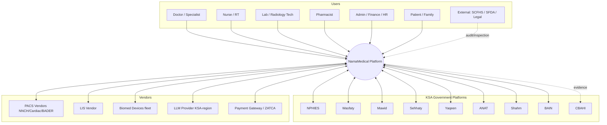
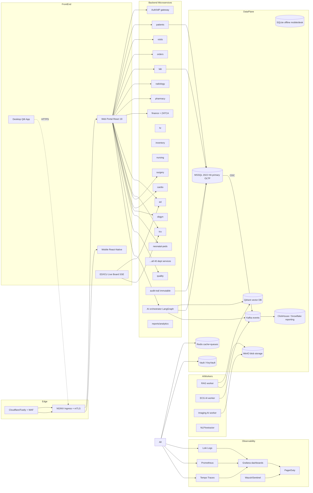

# NamaMedical — Architecture (C4 Model)

## L1 — System Context



## L2 — Containers



## L3 — Components (example: AI Orchestrator)

```
┌────────────────────────────────────────────────────────┐
│  AI Orchestrator service                               │
│  ┌──────────────┐  ┌──────────────┐  ┌──────────────┐  │
│  │ HTTP API     │  │ LangGraph    │  │ Tool Registry │ │
│  │ FastAPI      │─▶│ Workflows    │─▶│ (per dept)    │ │
│  └──────────────┘  └──────────────┘  └──────────────┘  │
│         │                  │                  │        │
│         ▼                  ▼                  ▼        │
│  ┌──────────────┐  ┌──────────────┐  ┌──────────────┐  │
│  │ PHI Redactor │  │ RAG Retriever│  │ Tool Caller   │ │
│  └──────────────┘  └──────────────┘  └──────────────┘  │
│         │                  │                  │        │
│         ▼                  ▼                  ▼        │
│  ┌──────────────┐  ┌──────────────┐  ┌──────────────┐  │
│  │ LLM Adapter  │  │ Qdrant Client│  │ ERP REST     │  │
│  │ (Anthropic)  │  │              │  │ SDK          │  │
│  └──────────────┘  └──────────────┘  └──────────────┘  │
│                                                        │
│  Cross-cutting: AuthN/Z (JWT), Audit (hash-chain),     │
│                 Observability (OTel), Rate limit       │
└────────────────────────────────────────────────────────┘
```

## L4 — Code (example file layout)
```
services/
├── ai-orchestrator/
│   ├── api/
│   │   ├── routes_health.py
│   │   ├── routes_ai.py
│   │   └── deps.py
│   ├── orchestration/
│   │   ├── base.py            # DeptOrchestrator
│   │   ├── cardio.py
│   │   ├── ed.py
│   │   └── ...
│   ├── rag/
│   │   ├── client.py
│   │   └── ingest.py
│   ├── tools/
│   │   └── registry.py
│   ├── safety/
│   │   ├── redact.py
│   │   ├── critique.py
│   │   └── audit.py
│   ├── settings.py
│   └── main.py
└── cardio-api/, ed-api/, icu-api/, ...
```

## Cross-cutting concerns
- **API Gateway**: Kong or NGINX — JWT validation, rate limit, request-id propagation.
- **Service mesh**: Linkerd / Istio — mTLS, retries, circuit breakers.
- **Config**: ConfigMaps + Vault for secrets; per-env overlays via Kustomize/Helm.
- **Schema migrations**: Alembic (Python) and EF Core (.NET) in `migrations/` per service.
- **Backups**: nightly full + 15-min incremental; immutable storage 30 d.
- **Disaster Recovery**: warm standby in second region; quarterly DR drills.

## Latency budgets (SLOs)
| Path | p50 | p95 | p99 |
|------|----|----|----|
| Patient search | 60 ms | 200 ms | 500 ms |
| Order create | 100 ms | 400 ms | 800 ms |
| Lab result post | 80 ms | 300 ms | 700 ms |
| AI co-pilot ask (text only) | 1.2 s | 3.5 s | 6 s |
| AI co-pilot with RAG | 1.8 s | 5 s | 8 s |
| ECG AI inference | 2 s | 5 s | 10 s |
| Live ED board update (SSE) | 200 ms | 1 s | 2 s |

## Capacity assumptions
- 3 hospitals × 800 beds × 200 staff each = 1,800 daily concurrent users.
- 150,000 OPD visits / month, 8,000 ED visits / month, 2,000 admissions.
- 500K lab results, 80K imaging studies, 3M med admins per month.
