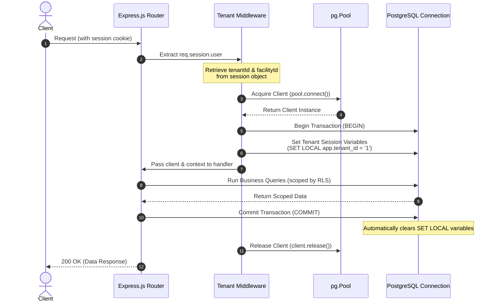

# Technical Design: PostgreSQL Tenant Session Context Middleware

This document outlines the technical architecture and code patterns for securely passing the tenant context (`tenant_id`, `facility_id`, `branch_id`) to PostgreSQL session variables for Row-Level Security (RLS) enforcement.

---

## 1. Flow Diagram



---

## 2. Helper Implementation (Pseudo-Code)

Below is the proposed design for the `withTenantTransaction` utility wrapper to be placed inside `namaweb/db_postgres.js` or a separate db utility module.

### A. Core Utility: `withTenantTransaction`

```javascript
/**
 * Executes database operations within a scoped transaction,
 * setting PostgreSQL session variables for tenant isolation.
 *
 * @param {Object} req - The Express request object to extract context from.
 * @param {Function} handler - Async callback: (client, context) => Promise<any>
 * @returns {Promise<any>}
 */
async function withTenantTransaction(req, handler) {
    const { pool } = require('./db_postgres');
    
    // 1. Extract context
    const tenantId = req.session?.user?.tenantId || null;
    const facilityId = req.session?.user?.facilityId || null;
    const isProduction = process.env.NODE_ENV === 'production';

    // 2. Security validation
    if (!tenantId) {
        if (isProduction) {
            throw new Error('SEC_ERR_MISSING_TENANT: Tenant scope is required in production');
        } else {
            // Development fallback
            console.warn('[DEV WARNING] Missing tenant context, falling back to default tenant 1');
        }
    }

    const context = {
        tenantId: tenantId || 1,
        facilityId: facilityId || null
    };

    // 3. Connect to database
    const client = await pool.connect();
    
    try {
        // Start transaction
        await client.query('BEGIN');

        // Set session parameters (LOCAL ensures they discard on COMMIT/ROLLBACK)
        await client.query('SET LOCAL app.tenant_id = $1', [context.tenantId]);
        
        if (context.facilityId) {
            await client.query('SET LOCAL app.facility_id = $1', [context.facilityId]);
        } else {
            await client.query('SET LOCAL app.facility_id = NULL');
        }

        // Execute queries inside the handler
        const result = await handler(client, context);

        // Commit transaction
        await client.query('COMMIT');
        return result;

    } catch (error) {
        // Rollback transaction on failure
        try {
            await client.query('ROLLBACK');
        } catch (rollbackError) {
            console.error('Failed to rollback transaction:', rollbackError.message);
        }
        throw error;
    } finally {
        // Release client back to pool
        client.release();
    }
}
```

### B. Router Integration Example

```javascript
// Express route for fetching patient profile
app.get('/api/patients/:id', requireAuth, async (req, res) => {
    try {
        const patientId = req.params.id;
        
        const data = await withTenantTransaction(req, async (client, ctx) => {
            // The RLS policy will automatically intercept this query
            // and filter by the session variable app.tenant_id set above
            const result = await client.query(
                'SELECT * FROM patients WHERE id = $1', 
                [patientId]
            );
            return result.rows[0];
        });

        if (!data) {
            return res.status(404).json({ error: 'Patient not found' });
        }
        
        res.json(data);
    } catch (err) {
        if (err.message.startsWith('SEC_ERR_')) {
            return res.status(403).json({ error: 'Access Denied: Missing Tenant Scope' });
        }
        console.error('Error fetching patient:', err);
        res.status(500).json({ error: 'Server error' });
    }
});
```

---

## 3. Mitigation Checklist for Pooling Leaks

| Risk Scenario | Mitigation Strategy | Status / Recommendation |
| :--- | :--- | :--- |
| **Physical connection reuse** | Use `SET LOCAL` instead of `SET`. `SET LOCAL` binds session parameters strictly to the lifetime of the transaction block. | **Mandatory** |
| **Transaction failure** | Wrap commands in `try/catch`. If an error occurs, execute `ROLLBACK` which instantly discards the parameters. | **Mandatory** |
| **Connection contamination** | Run a fallback `client.release(true)` or execute `RESET ALL` / `DISCARD ALL` in the connection manager if any transaction block error escapes. | **Recommended** |
| **Performance Overhead** | Avoid wrapping static public assets or public configuration checks in transactions. Only use `withTenantTransaction` on sensitive RLS tables. | **Recommended** |
