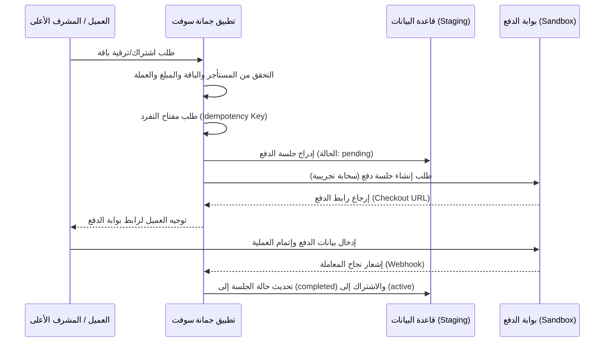

# تصميم دورة حياة جلسات الدفع للعملاء (Jumanasoft Billing Checkout Lifecycle Design)

* **المشروع:** منصة نما الطبية (NamaMedical ERP)
* **المرحلة:** إعداد بوابات الدفع التجريبية مستندياً (PHASE_BILLING_SANDBOX_PREP_DOCS_ONLY)
* **البوابة:** البوابة 4.1 — دورة حياة جلسات الدفع (Gate 4.1 — Checkout Lifecycle Design)
* **الحالة:** تم التصميم والتوثيق بنجاح (DESIGN_ONLY) ✅

---

## 1. تسلسل ودورة حياة جلسات الدفع (Checkout Session Flow)

تم تخطيط دورة حياة جلسات الدفع مستقبلاً وتحديد حارس الفرض لكل مرحلة كالتالي:

---

## 2. قواعد ومحددات أمان جلسات الدفع

* **التحقق من البيانات (Strict Validation):** التحقق من هوية المستأجر وصلاحية اسم الباقة وتوافق القيمة والعملة.
* **فرض مفتاح التفرد:** لمنع إنشاء جلسات دفع مكررة لنفس الطلب.
* **معالجة نهاية الجلسة (Expiration Handling):** انتهاء صلاحية الجلسة تلقائياً بعد **24 ساعة** في حال عدم الدفع، وتغيير حالتها في الجدول المخصص إلى `expired`.
* **أحداث المراقبة:** توثيق كل عملية بدء جلسة دفع وإلغاء وإتمام في سجل التدقيق الموحد.

---
**القرار:** تم تصميم دورة حياة جلسات الدفع، ومصرح بالانتقال لـ GATE 4.2 لتصميم آلة الحالة للاشتراكات.
