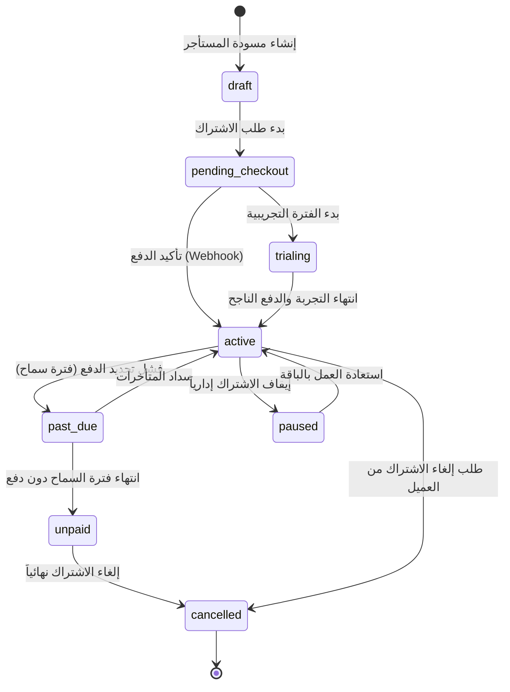

# تصميم آلة الحالة لاشتراكات التعددية لجمانة سوفت (Jumanasoft Billing Subscription State Machine)

* **المشروع:** منصة نما الطبية (NamaMedical ERP)
* **المرحلة:** إعداد بوابات الدفع التجريبية مستندياً (PHASE_BILLING_SANDBOX_PREP_DOCS_ONLY)
* **البوابة:** البوابة 4.2 — آلة الحالة للاشتراكات (Gate 4.2 — Subscription State Machine)
* **الحالة:** تم التصميم والتوثيق بنجاح (DESIGN_ONLY) ✅

---

## 1. تصميم الحالات وانتقالاتها للاشتراكات (Subscription State Machine)

تم تحديد آلة الحالة لإدارة دورة حياة اشتراكات المستأجرين لضمان انتظام العمل وحظر التجاوزات:

---

## 2. جدول حوكمة انتقالات الحالة (Transitions Governance)

| الحالة الحالية (Source) | الحالة المستهدفة (Target) | المشغل/الحدث (Trigger/Event) | حارس الأمان والتدقيق (Guard/Audit) |
| :--- | :--- | :--- | :--- |
| **`pending_checkout`** | **`active`** | استقبال حدث `payment.succeeded` | مطابقة مبلغ المعاملة وجلسة الدفع. |
| **`active`** | **`past_due`** | استقبال حدث `invoice.payment_failed` | بدء فترة سماح لمدة 7 أيام وإرسال تنبيه للمستأجر. |
| **`past_due`** | **`unpaid`** | انتهاء فترة السماح | حظر استحقاق المستأجر (تجميد علم النشاط). |
| **`active`** | **`paused`** | إجراء إداري يدوي من الـ Super Admin | توثيق الحدث في سجل المراقبة وتعديل حدود الاستحقاق. |
| **`unpaid`** | **`active`** | سداد المتأخرات بالكامل | التحقق من تفرد الفاتورة وتفادي تداخل الاشتراكات. |

---
**القرار:** تم تصميم آلة الحالة وتحديد حراس الانتقالات، ومصرح بالانتقال لـ GATE 4.3 لتصميم مزامنة الاستحقاقات.
