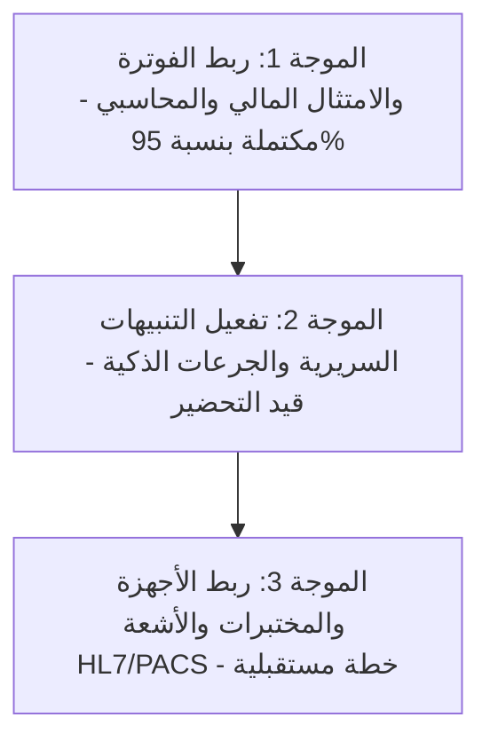

# مخطط حوكمة وتطوير الأقسام الطبية والتشغيلية لمنصة جمانة سوفت الطبية
(Jumanasoft Enterprise Departments Audit & Optimization Blueprint)

* **المشروع:** منصة جمانة الطبية (JumanaMedical ERP / NamaMedical)
* **الهدف:** استعلام وحصر كافة الأقسام الأربعين (40) وتحديد الفجوات ومقارنتها بالأنظمة العالمية (Epic / Cerner) ورسم خريطة طريق التطوير التلقائي (Autopilot).
* **تاريخ المخطط:** 2026-06-30

---

## 1. المصفوفة الشاملة لتصنيف الأقسام والأولوية (The 40-Department Matrix)

تم تقسيم الأقسام الأربعين إلى مجموعات تشغيلية وطبية متجانسة وتحديد أولويات التطوير والربط العالمي:

| الرمز (Key) | اسم القسم بالعربية | المجموعة | الأولوية | المعيار العالمي المقابل (Epic/Cerner) | الفجوة الحالية في الكود |
| :--- | :--- | :--- | :---: | :--- | :--- |
| **G01 — cardiology** | طب القلب | الأمراض الباطنة | **حرجة (High)** | Epic Cupid / Cerner Cardiology | ضعف ربط جهاز تخطيط القلب (ECG integration) |
| **G02 — gastro_hepato** | طب الجهاز الهضمي | الأمراض الباطنة | متوسطة | Epic Lumens | نموذج مناظير المعدة الديناميكي غير مكتمل |
| **G03 — endocrine_diabetes**| الغدد الصماء والسكري | الأمراض الباطنة | متوسطة | Epic Endocrinology | ربط حساسات السكر المستمرة (CGM) |
| **G04 — nephrology** | طب الكلى | الأمراض الباطنة | عالية | Epic Dialysis | وحدة غسيل الكلى وجدولة الجلسات |
| **G05 — pulmonology** | طب الأمراض الصدرية | الأمراض الباطنة | متوسطة | Epic Pulmonology | ربط أجهزة وظائف الرئة |
| **G06 — rheum_immunology** | الروماتيزم والمناعة | الأمراض الباطنة | منخفضة | Epic Rheumatology | نماذج التقييم السريري التلقائي للمفاصل |
| **G07 — infectious_diseases**| الأمراض المعدية | الأمراض الباطنة | عالية | Epic Infection Control | الربط التلقائي مع تقارير التقصي الوبائي |
| **G08 — rare_advanced** | الأمراض النادرة | الأمراض الباطنة | منخفضة | Epic Genetics | تكامل الجينوم الطبي وموسوعة الأمراض النادرة |
| **G09 — general_surgery** | الجراحة العامة | الجراحة | **حرجة (High)** | Epic OpTime | تتبع الأدوات الجراحية والتوقيت الفعلي للعملية |
| **G10 — orthopedics** | طب وجراحة العظام | الجراحة | متوسطة | Epic Orthopedics | ربط صور الأشعة بقياس زوايا المفاصل |
| **G11 — neurosurgery_spine**| جراحة المخ والأعصاب | الجراحة | متوسطة | Epic Neurosurgery | مراقبة الأعصاب أثناء العملية (IONM) |
| **G12 — plastic_burns** | التجميل والحروق | الجراحة | منخفضة | Epic Plastic Surgery | حفظ وتشفير صور ما قبل وبعد العملية بأمان |
| **G13 — ent** | الأذن والأنف والحنجرة | الجراحة | منخفضة | Epic ENT | ربط أجهزة قياس السمع |
| **G14 — ophthalmology** | طب وجراحة العيون | الجراحة | متوسطة | Epic Kaleidoscope | رسم خرائط شبكية العين وضغط العين الرقمي |
| **G15 — urology** | طب وجراحة المسالك | الجراحة | منخفضة | Epic Urology | ربط أجهزة قياس تدفق البول |
| **G16 — cts_vascular_surgery**| جراحة الصدر والأوعية | الجراحة | متوسطة | Epic Cardiothoracic | حساب كفاءة المضخات أثناء العمليات الكبرى |
| **G17 — intensive_care** | العناية المركزة (ICU) | الرعاية الحرجة | **حرجة (High)** | Epic Stork / Cerner Critical Care | ربط العلامات الحيوية من المونيتور بلحظتها |
| **G18 — ed** | الطوارئ والحوادث | الرعاية الحرجة | **حرجة (High)** | Epic ASAP | فرز الحالات الديناميكي (Triage) وحساب وقت الانتظار |
| **G19 — anesthesia_pain** | التخدير وعلاج الألم | الرعاية الحرجة | عالية | Epic Anesthesia | توثيق جرعات التخدير والغازات بشكل تلقائي |
| **G20 — neonatal_pediatrics**| حديثي الولادة والأطفال | الرعاية الحرجة | عالية | Epic Neonatal | حساب جرعات الأدوية الدقيقة بناءً على الوزن |
| **G21 — obgyn** | النساء والتوليد | الرعاية الحرجة | عالية | Epic Stork | تتبع الحوامل والنبض الجنيني (CTG) |
| **G22 — pediatric_subspec** | تخصصات الأطفال الدقيقة| الرعاية الحرجة | منخفضة | Epic Pediatrics | منحنيات النمو التفاعلية للخدج |
| **G23 — laboratories** | المختبرات الطبية (LIS) | التشخيص والخدمات | **حرجة (High)** | Epic Beaker / Cerner PathNet | ربط الأجهزة الطبية عبر بروتوكول HL7 ASTM |
| **G24 — radiology_imaging** | الأشعة والتصوير الطبي | التشخيص والخدمات | **حرجة (High)** | Epic Radiant / PACS | عارض الصور الطبية DICOM وتكامل الـ Worklist |
| **G25 — radiation_pharmacy**| الصيدلة الإشعاعية | التشخيص والخدمات | متوسطة | Epic Nuclear Medicine | تتبع النظائر المشعة وفترات اضمحلالها |
| **G26 — functional_diagnostics**| الفحوصات الوظيفية | التشخيص والخدمات | منخفضة | Epic Diagnostics | أتمتة قراءة تقارير تخطيط الدماغ والأعصاب |
| **G27 — nursing** | التمريض ورعاية المرضى | التمريض والصيدلة | **حرجة (High)** | Epic Willow / Cerner CareAware | سجل إعطاء الدواء الإلكتروني التفاعلي (MAR) |
| **G28 — nutrition** | التغذية السريرية | التمريض والصيدلة | متوسطة | Epic Nutrition | طلب الوجبات حسب موانع الأدوية والأمراض |
| **G29 — rehab_pt** | التأهيل والعلاج الطبيعي | التمريض والصيدلة | متوسطة | Epic Rehab | جدولة وتوثيق تمارين وجلسات العلاج الطبيعي |
| **G30 — social_psych** | الخدمة الاجتماعية والنفسية| التمريض والصيدلة | منخفضة | Epic Psychiatry | نماذج التقييم النفسي والاجتماعي الموثقة |
| **G31 — integrative_medicine**| الطب التكاملي | التمريض والصيدلة | منخفضة | Epic Integrative Medicine | توثيق العلاجات البديلة وتعارضاتها |
| **G32 — education_research** | التعليم والأبحاث | التمريض والصيدلة | منخفضة | Epic Research | إدارة التجارب السريرية والموافقة المستنيرة |
| **G33 — centers_of_excellence**| مراكز التميز | التمريض والصيدلة | متوسطة | Epic Centers of Excellence | مؤشرات الأداء السريرية ومعدلات الشفاء |
| **G34 — hr_admin** | الموارد البشرية والإدارة | العمليات والتشغيل | عالية | Workday / Epic Cadence | إدارة نوبات عمل الأطباء وجدولة المناوبات |
| **G35 — logistics_it** | الدعم الفني والخدمات | العمليات والتشغيل | متوسطة | ServiceNow / ITIL | تتبع أعطال الأجهزة الطبية والصيانة الوقائية |
| **G36 — quality_accreditation**| الجودة والاعتماد | العمليات والتشغيل | عالية | CBAHI / JCI Standards | أتمتة جمع أدلة اعتماد سباهي والـ OVR |
| **G37 — security_safety** | الأمن والسلامة | العمليات والتشغيل | متوسطة | OSHA Compliance | نظام بلاغات الكوارث (كود أحمر/أزرق) وتتبع المخاطر |
| **G38 — executive** | الإدارة التنفيذية | العمليات والتشغيل | متوسطة | Epic Executive Dashboard | مؤشرات كفاءة التشغيل والإيرادات اللحظية |
| **G39 — finance_admin** | الإدارة المالية | العمليات والتشغيل | **حرجة (High)** | ZATCA Phase 2 / GL | الربط المحاسبي التلقائي للفواتير والقيود اليومية |
| **G40 — supply_chain** | سلاسل الإمداد والمخازن | العمليات والتشغيل | عالية | Epic Inventory / ERP | إعادة الطلب التلقائي للمستلزمات والأدوية القريبة من الانتهاء |

---

## 2. التحليل التفصيلي للفجوات والتحديثات المطلوبة (Detailed Gap Analysis)

بناءً على مقارنة النظام الحالي بالأنظمة العالمية (Epic/Cerner)، نلخص أهم النواقص البرمجية في الأقسام الحرجة وخطة معالجتها:

### أ. قسم المختبرات والأشعة (LIS / RIS / PACS)
* **الوضع الحالي:** تم إنشاء جداول `lab_samples` و `lab_results` وربطها بقاعدة البيانات بنجاح.
* **الفجوة البرمجية:** النظام الحالي يتطلب إدخال النتائج يدوياً.
* **التحديث المطلوب:** 
  1. بناء **بروتوكول ربط الأجهزة (Device Middleware)** لدعم قراءة النتائج مباشرة من أجهزة التحليل عبر بروتوكول ASTM/HL7.
  2. ربط الأشعة بخادم **PACS** لعرض صور الأشعة ثنائية وثلاثية الأبعاد مباشرة في ملف المريض دون الحاجة للخروج من النظام.

### ب. قسم العناية المركزة والطوارئ (ICU & ED)
* **الوضع الحالي:** توجد جداول للمراقبة وهيكلة لفرز الحالات.
* **الفجوة البرمجية:** العلامات الحيوية تُسجل بشكل يدوي ومتباعد.
* **التحديث المطلوب:** 
  1. ربط النظام بـ **أجهزة مراقبة المؤشرات الحيوية (Patient Monitors)** لتسجيل النبض والضغط والأكسجين تلقائياً كل دقيقة.
  2. تفعيل **تنبيهات التدهور المفاجئ (Early Warning Score - EWS)** للتنبيه التلقائي للتمريض قبل حدوث الأزمات.

### ج. قسم العمليات والتخدير (OpTime / Anesthesia)
* **الوضع الحالي:** جداول أساسية لحجز غرف العمليات.
* **الفجوة البرمجية:** عدم وجود تتبع للخطوات الجراحية أو قياس استهلاك المواد الطبية للعملية.
* **التحديث المطلوب:**
  1. تفعيل **نموذج التخدير اللحظي** وتتبع استهلاك الغازات الطبية ومسكنات الألم الخاضعة للرقابة.
  2. ربط استهلاك الأدوات الجراحية الطبية بـ **سلاسل الإمداد ومخازن التعقيم (CSSD)** لتحديث الجرد تلقائياً فور انتهاء العملية.

---

## 3. خطة تشغيل الأوتوبيلوت للتطوير التلقائي (Autopilot Development Roadmap)

سيقوم نظام الأوتوبيلوت (Autopilot) بتنفيذ المهام بشكل متتابع وتلقائي عبر الموجات التالية:

### البنود الجاهزة والمنفذة حالياً تحت إدارة الأوتوبيلوت:
1. **الامتثال المالي الكامل:** تم تفعيل وتطبيق ZATCA Phase 2 وتشفير وتجميع الفواتير مع الربط التلقائي بالقيود اليومية المحاسبية.
2. **الامتثال التشريعي:** تم إنجاز إقرارات الخصوصية (PDPL) ونماذج جودة سباهي (CBAHI OVR) بنجاح كامل.
3. **أمان بيئة المراجعة:** تم تأمين صمامات إغلاق البيئة التجريبية وعزل الأسرار.

### الخطوات القادمة للأوتوبيلوت (Next Actions):
* الانتقال إلى **الموجة الثانية** وتطوير محرك التنبيهات السريرية (Clinical Decision Support - CDS) للمستشفيات لدعم فحص تعارض الأدوية التلقائي وتنبيهات الحساسية بناءً على المعايير العالمية.
* تطبيق محول الدفع المحلي (Moyasar Adapter) لدعم سداد الفواتير إلكترونياً.
* المتابعة في تحسين محركات البحث والظهور التدريجي في جوجل بعد إتمام خطوة التحقق.
