# الدليل الشامل والمخطط المعماري لمؤسسة جمانة سوفت الطبية (Jumanasoft Master Enterprise Spec)

مستند هندسي متكامل يحدد البنية الهيكلية والتقنية لمشروع جمانة سوفت كمنصة SaaS ERP طبية متكاملة لـ 100+ عيادة وقسم طبي، مع تكامل معايير الذكاء الاصطناعي والتنظيمات السعودية.

---

## الجزء 1: معمارية المحرك السريري الديناميكي (Dynamic EMR Engine Architecture)

لمنع تضخم قاعدة البيانات وتجنب إنشاء جداول منفصلة لكل تخصص طبي (والتي قد تصل لـ 100+ جدول وتعيق التوسّع)، تعتمد جمانة سوفت **بنية المعطيات الوصفية الديناميكية (Metadata-Driven Architecture)**. يتم التحكم بالواجهات، الحقول، الأزرار، والتحققات عبر ملفات JSON وصفية مخزنة في قاعدة البيانات.

### 1. هيكل قاعدة البيانات السريرية المشترك
* **جدول الأقسام السريرية (`clinical_departments`)**: يحتوي على كافة الأقسام والعيادات الـ 40 والوحدات الفرعية.
* **جدول القوالب الديناميكية (`clinical_templates`)**: يحتوي على كود JSON يصف نموذج الاستمارة (المدخلات، الحقول، نوع الاستجابة، شروط التحقق، والأزرار).
* **جدول السجلات الطبية للمرضى (`clinical_records`)**: يحتوي على البيانات الفعلية للمريض مخزنة في حقل `JSONB` متوافق مع القالب النشط.

### 2. آلية قفل وتوقيع السجل الطبي (Legal Lock)
فور انتهاء الطبيب من إدخال البيانات الطبية والضغط على زر "توقيع السجل"، يتم تشغيل الخطوات التالية:
1. تجميع بيانات الاستمارة بصيغة نصية موحدة (Canonical JSON).
2. حساب بصمة التشفير SHA-256 للمحتوى.
3. دمج البصمة مع معرف الطبيب والتاريخ وعنوان الـ IP للمستند.
4. تحديث حقل `is_locked = true` وحفظ التوقيع الرقمي. يمنع أي تعديل لاحق على هذا الصف، ويتم حفظ أي تعديلات كتعديل إلحاقي مرقم (Amendment).

---

## الجزء 2: مواصفات المجموعات الطبية الـ 10 والأقسام الـ 40

---

### أولاً: الأقسام الطبية الباطنية (Internal Medicine & Subspecialties)
(تشمل: القلب والأوعية، الجهاز التنفسي، الجهاز الهضمي، الكلى، الدم والأورام، الغدد الصماء والسكري، المناعة والروماتيزم، الأمراض المعدية، الجلدية)

#### 1. نظام هندسة المقترحات الذكية (Prompt Engineering System)
* **System Prompt**:
  ```text
  You are an expert Clinical Decision Support System (CDSS) for Internal Medicine at Jumanasoft. 
  Your task is to analyze patient history, vitals, current complaints, and lab tests to recommend:
  1. Potential diagnoses with confidence scores.
  2. Next diagnostic steps (Labs/Imaging).
  3. Evidence-based medication suggestions with drug interaction warnings (referencing medications catalog).
  4. Appropriate ICD-10-AM codes.
  Ensure output is strictly structured as JSON.
  ```
* **Context**:
  ```json
  {
    "patient": { "age": 58, "gender": "male", "allergies": ["Penicillin"] },
    "vitals": { "bp": "145/90", "hr": 82, "temp": 37.1 },
    "complaints": "Substernal chest pain radiating to left arm upon exertion.",
    "active_medications": ["Aspirin 81mg Daily"],
    "retrieved_guidelines": "Saudi Heart Association 2025 Acute Coronary Syndrome guidelines..."
  }
  ```
* **Workflow & Orchestration**:
  تستخدم المنصة إطار عمل **LangChain** لربط العمليات:
  1. استخلاص الكلمات المفتاحية من شكوى المريض.
  2. البحث الموجه في قاعدة المتجهات (`VectorMine` باستخدام `REAL[]` كبديل للـ pgvector) لجلب البروتوكولات الطبية المطابقة.
  3. دمج المعطيات مع التاريخ الطبي للمريض في Prompt موحد.
  4. استدعاء النموذج اللغوي للتحليل، ثم فلترة المخرجات وتوجيهها لشاشة الطبيب.

#### 2. سيناريو العمل الطبي (Clinical Work Scenario)
1. يدخل المريض المصاب بآلام في الصدر لعيادة القلب.
2. يسجل الطبيب الأعراض والشكوى في الواجهة السريرية لجمانة سوفت.
3. يعرض النظام فوراً تنبيه الـ CDSS باحتمالية وجود ACS (متلازمة الشريان التاجي الحادة) بناءً على إرشاد جمعية القلب السعودية، ويقترح فوراً طلب تخطيط قلب (ECG) وتحليل إنزيمات قلب (Troponin).
4. بعد تأكيد الطبيب، يصدر النظام أمراً إلكترونياً للمختبر والأشعة.

#### 3. مخطط تدفق البيانات (Data Flow Diagram)
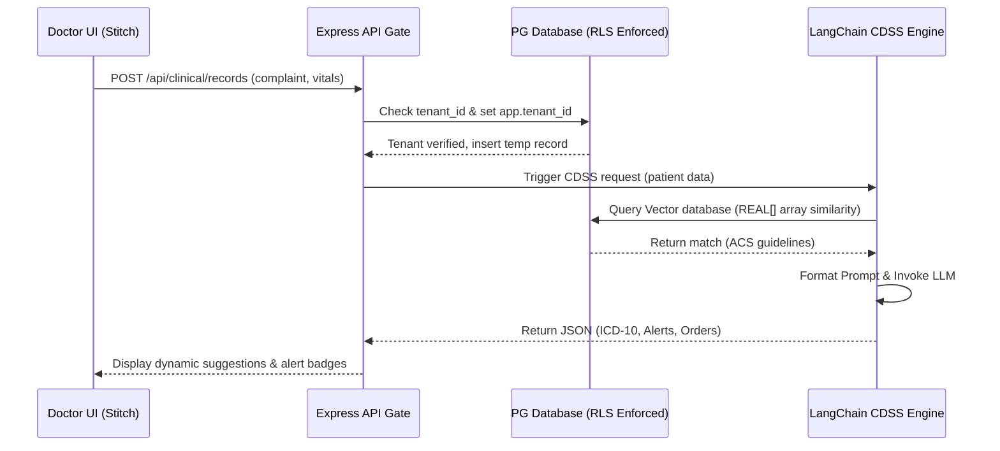

#### 4. السيناريو التدريبي (Training Videos Storyboard)
- **المشهد 1**: طبيب الباطنية يسجل الدخول للوحة الطبيب (RTL-Stitch).
- **المشهد 2**: الطبيب يكتب شكوى المريض، ويظهر صندوق الـ CDSS الجانبي بلون برتقالي يحمل اقتراحات الفحوصات والتشخيص.
- **المشهد 3**: الطبيب يضغط على زر "توقيع السجل الطبي" ليظهر الـ modal المؤكد ويقفل السجل إلكترونياً بالبصمة التشغيلية.

#### 5. دليل الامتثال واللوائح القانونية (Legal & Compliance Docs)
- **امتثال CBAHI**: الاحتفاظ بسجل التدقيق الكامل للوصول لبيانات المريض، وقفل السجلات في غضون 6 ساعات من مغادرة المريض.
- **امتثال PDPL**: تشفير كافة حقول شكاوى المرضى وتاريخهم الطبي باستخدام آلية التغليف التشفيري (Envelope Encryption).

---

### ثانياً: الأقسام الجراحية (Surgical Departments)
(تشمل: الجراحة العامة، جراحة القلب والصدر، المخ والأعصاب، العظام، العيون التخصصية، الأنف والأذن، المسالك البولية، التجميل والترميم والحروق)

#### 1. نظام هندسة المقترحات الذكية (Prompt Engineering System)
* **System Prompt**:
  ```text
  You are a Surgical Safety and Protocol Assistant for Jumanasoft ERP. 
  Analyze the pre-operative workup, surgical consent status, and patient vitals to:
  1. Validate WHO Surgical Safety Checklist compliance (Sign-in, Time-out, Sign-out).
  2. Recommend prophylaxis antibiotic timing based on Saudi Ministry of Health guidelines.
  3. Identify any intraoperative or anesthetic risk flags (e.g., airway class, anticoagulant use).
  ```
* **Context**:
  ```json
  {
    "scheduled_procedure": "Laparoscopic Cholecystectomy",
    "pre_op": { "consent_signed": true, "fasting_hours": 8, "lab_inr": 1.1 },
    "allergies": ["Latex"],
    "anesthesia_risk": "ASA Class II"
  }
  ```
* **Workflow & Orchestration**:
  يتكامل المحرك السريري مع CPOE (أوامر الأطباء):
  1. يقوم الطبيب بجدولة العملية الجراحية.
  2. يستعلم الـ CDSS عن آخر تحاليل السيولة والتوافق للمريض.
  3. في حال وجود مخاطر (مثل INR مرتفع)، يظهر النظام تحذيراً فورياً للمخدر والجراح لمنع النزف.

#### 2. سيناريو العمل الطبي (Clinical Work Scenario)
1. يتم إدخال المريض لغرفة العمليات لإجراء عملية جراحة عظام.
2. يقوم ممرض العمليات بفتح لوحة المريض واختيار استمارة "مخطط السلامة الجراحية لمنظمة الصحة العالمية".
3. يفحص الخادم إشارات التحقق (Time-out): مطابقة المريض، موقع الجراحة، وموافقة التخدير.
4. يضغط الجراح على زر "بدء الجراحة" ليتم قفل سجل التحقق pre-op ولا يسمح بالبدء إلا بالمرور بكامل بوابات الفحص.

#### 3. مخطط تدفق البيانات (Data Flow Diagram)
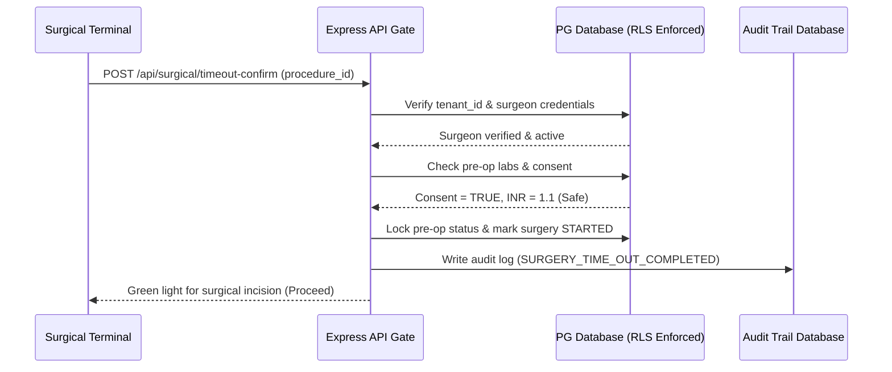

#### 4. السيناريو التدريبي (Training Videos Storyboard)
- **المشهد 1**: الجراح وممرض العمليات يقفان أمام جهاز التابلت اللوحي داخل غرفة العمليات (واجهة Stitch معتمة مريحة للعين).
- **المشهد 2**: مراجعة شروط السلامة رقمياً على الشاشة وتأكيد موافقة المريض.
- **المشهد 3**: نظام التنبيهات يومض باللون الأخضر للإعلان عن اكتمال مطابقة البيانات وقفل التحقق وبداية الجراحة.

#### 5. دليل الامتثال واللوائح القانونية (Legal & Compliance Docs)
- **امتثال CBAHI**: توثيق "قائمة التحقق للجراحة الآمنة" بشكل إلزامي لكل مريض جراحي وحفظها ضمن ملف السجل الطبي الموحد للمريض.
- **امتثال NPHIES**: إرسال طلبات الموافقة المسبقة (Prior Authorization) للعمليات الجراحية المجدولة مع ترميز الإجراءات الطبية وفق دليل التصنيف الخليجي الموحد.

---

### ثالثاً: النساء والتوليد والأطفال (Obstetrics, Gynecology & Pediatrics)
(تشمل: النساء والتوليد، طب الأطفال وحديثي الولادة، التخصصات الأطفال الدقيقة)

#### 1. نظام هندسة المقترحات الذكية (Prompt Engineering System)
* **System Prompt**:
  ```text
  You are an advanced Pediatric and Obstetric Clinical Assistant for Jumanasoft.
  Evaluate gestational age, prenatal diagnosis values, or pediatric vitals/weight:
  1. Calculate child growth percentiles (WHO charts) and highlight developmental delays.
  2. Analyze fetal ultrasound metrics to flag growth restrictions or pregnancy risks.
  3. Verify safe medication dosing based strictly on child's weight (mg/kg limits).
  ```
* **Context**:
  ```json
  {
    "patient_type": "pediatric",
    "age_months": 18,
    "weight_kg": 10.2,
    "vitals": { "heart_rate": 110, "resp_rate": 28 },
    "prescribing": { "medication": "Paracetamol Syrup", "requested_dose": "150mg" }
  }
  ```
* **Workflow & Orchestration**:
  1. يلتقط حارس أوامر الأطباء CPOE مدخلات الوزن والعمر للطفل.
  2. يقوم المحرك بفحص الجرعة المطلوبة استناداً لمعادلات الوزن المخزنة في قوالب الأدوية.
  3. يمنع النظام تمرير أي وصفة تتجاوز الحد الأقصى الآمن للوزن لمنع التسمم الدوائي للأطفال.

#### 2. سيناريو العمل الطبي (Clinical Work Scenario)
1. تحضر الأم طفلها لعيادة الأطفال لمتابعة النمو.
2. يقيس الممرض وزن وطول ومحيط رأس الطفل ويسجلها في استمارة المتابعة.
3. يقوم النظام تلقائياً بإسقاط القيم على منحنيات النمو (Percentiles) ويعرض رسماً بيانياً يوضح مقارنة الطفل بالمتوسط العالمي.
4. يصف الطبيب علاجاً، فيقوم النظام بمطابقة الجرعة تلقائياً مع وزن الطفل المسجل للتو.

#### 3. مخطط تدفق البيانات (Data Flow Diagram)
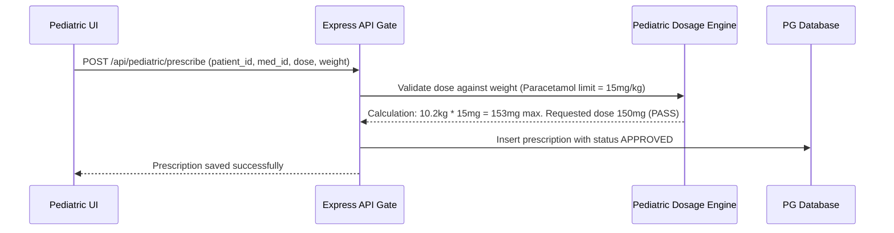

#### 4. السيناريو التدريبي (Training Videos Storyboard)
- **المشهد 1**: طبيب الأطفال يفتح ملف المريض ويعرض شاشة منحنيات النمو المدمجة.
- **المشهد 2**: كتابة جرعة دواء زائدة وتنبيه النظام العاجل باللون الأحمر مع حظر زر الإرسال.
- **المشهد 3**: تصحيح الجرعة لتتطابق مع وزن الطفل والضغط على زر "إرسال للصيدلية".

#### 5. دليل الامتثال واللوائح القانونية (Legal & Compliance Docs)
- **امتثال وزارة الصحة السعودية**: الامتثال لجدول التطعيمات الوطني للأطفال وتنبيه الوالدين تلقائياً عبر الرسائل النصية بالجرعات المستحقة لمنع تفشي الأمراض.
- **امتثال PDPL**: حماية خصوصية بيانات القصر والأطفال وحظر إتاحة ملفاتهم إلا للوالدين أو الأوصياء القانونيين الموثقين بالنظام.

---

### رابعاً: الأقسام التشخيصية المتقدمة (Advanced Diagnostics)
(تشمل: الأشعة والتصوير الطبي، المختبرات الطبية المركزية، الفحوصات الوظيفية)

#### 1. نظام هندسة المقترحات الذكية (Prompt Engineering System)
* **System Prompt**:
  ```text
  You are an expert Diagnostics and Lab Results Evaluator for Jumanasoft ERP.
  Analyze raw laboratory outputs, reference ranges, and radiology structured reports to:
  1. Highlight critical out-of-range values (Panic Values) requiring immediate physician callback.
  2. Formulate clinical summaries combining lab values (e.g. eGFR, Creatinine) and radiology findings.
  3. Validate ICD-10 coding correspondence for laboratory orders.
  ```
* **Context**:
  ```json
  {
    "lab_results": [
      { "test": "Potassium", "value": 6.2, "unit": "mmol/L", "ref": "3.5-5.1" }
    ],
    "patient_id": 4829,
    "current_department": "Nephrology Dialysis"
  }
  ```
* **Workflow & Orchestration**:
  1. يستلم الخادم نتائج التحاليل مباشرة من أجهزة المختبر (LIS integration).
  2. يمرر حارس النتائج القيم ويقارنها بـ "قيم الذعر" (Panic Values).
  3. عند اكتشاف قيمة حرجة (البوتاسيوم 6.2)، يرسل النظام فوراً تنبيهاً عاجلاً لـ SMS الطبي وهاتف الطبيب المعالج مع قفل تذكرة المتابعة حتى تأكيد الاستلام.

#### 2. سيناريو العمل الطبي (Clinical Work Scenario)
1. يتم سحب عينة دم من مريض الغسيل الكلوي وإدخالها لجهاز الكيمياء الحيوية.
2. يصدر الجهاز النتيجة ويرسلها تلقائياً للـ LIS في جمانة سوفت.
3. يكتشف النظام قيمة ذعر للبوتاسيوم، فيقوم تلقائياً بإيقاف المعالجة العادية وتلوين الشاشة الرئيسية باللون الأحمر الوامض مع إرسال رسالة نصية للطبيب المعالج.
4. يؤكد الطبيب الاستلام ويعدل خطة غسيل الكلى للمريض.

#### 3. مخطط تدفق البيانات (Data Flow Diagram)
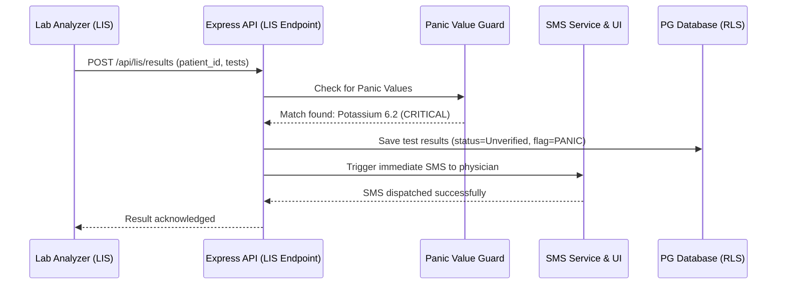

#### 4. السيناريو التدريبي (Training Videos Storyboard)
- **المشهد 1**: فني المختبر يدخل نتائج الفحص أو يسحبها من جهاز التحليل.
- **المشهد 2**: وميض شاشة التنبيهات الطبية بقيم الذعر الحرجة.
- **المشهد 3**: الطبيب يفتح هاتفه ويؤكد استلام تنبيه الذعر عبر رابط مشفر، وتوثيق وقت الاستلام بالثانية في سجلات النظام.

#### 5. دليل الامتثال واللوائح القانونية (Legal & Compliance Docs)
- **امتثال CBAHI**: تطبيق بروتوكول "إبلاغ قيم الذعر الحرجة" وتوثيق تاريخ ووقت إبلاغ الطبيب بالثانية للامتثال لمعايير السلامة الوطنية للمرضى.
- **امتثال HL7 / FHIR**: تصدير نتائج المختبر والأشعة بصيغة FHIR الطبية الموحدة لتمكين تبادل البيانات الصحية بين المستشفيات والمنصات الحكومية.

---

### خامساً: العناية المركزة والطوارئ والألم (Critical Care & Emergency)
(تشمل: أقسام الطوارئ الشاملة، أقسام العناية المركزة، إدارة الألم والتخدير)

#### 1. نظام هندسة المقترحات الذكية (Prompt Engineering System)
* **System Prompt**:
  ```text
  You are an Emergency Triage and Critical Care Assistant for Jumanasoft.
  Evaluate triage parameters using the Emergency Severity Index (ESI) framework:
  1. Determine ESI Level (1 to 5) based on vitals, resources needed, and life threat markers.
  2. Flag patients at risk of clinical deterioration (Early Warning Scores - MEWS/NEWS2).
  3. Suggest immediate stabilization pathways (airway management, fluid resuscitation).
  ```
* **Context**:
  ```json
  {
    "complaint": "Severe shortness of breath, altered mental status.",
    "vitals": { "sbp": 85, "hr": 130, "rr": 32, "spo2": 88 },
    "mews_score": 7,
    "life_threat": true
  }
  ```
* **Workflow & Orchestration**:
  1. يدخل المريض للطوارئ ويسجل الممرض المؤشرات الحيوية.
  2. يحتسب محرك الطوارئ تلقائياً مؤشر الإنذار المبكر (MEWS).
  3. إذا كانت القيمة حاسمة (MEWS >= 5)، يتم ترقية المريض تلقائياً إلى مستوى الأولوية القصوى (ESI Level 1) ويتم استدعاء فريق الإنعاش فوراً.

#### 2. سيناريو العمل الطبي (Clinical Work Scenario)
1. يتم إحضار مريض يعاني من صدمة تنفسية إلى الطوارئ.
2. يقيس ممرض الفرز المؤشرات ويسجلها في تابلت الطوارئ.
3. يحسب النظام ESI Level 1 فوراً بسبب تدني نسبة الأكسجين وارتفاع النبض.
4. يفتح النظام مسار الإنعاش القلبي الرئوي ويحجز سريراً في العناية المركزة ICU تلقائياً.

#### 3. مخطط تدفق البيانات (Data Flow Diagram)
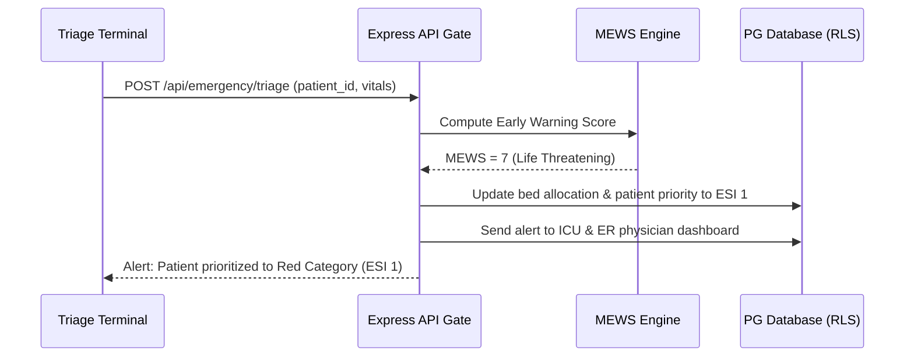

#### 4. السيناريو التدريبي (Training Videos Storyboard)
- **المشهد 1**: ممرض الفرز يستقبل حالة طارئة ويسجل البيانات الحيوية بسرعة.
- **المشهد 2**: الشاشة تتحول للون الأحمر الداكن معلنة عن ESI 1 ومقترحة مسار الإنعاش الفوري.
- **المشهد 3**: طبيب الطوارئ يؤكد استلام المريض ويتم توثيق زمن الاستجابة في لوحة مؤشرات الأداء الحية للقسم.

#### 5. دليل الامتثال واللوائح القانونية (Legal & Compliance Docs)
- **امتثال وزارة الصحة السعودية**: الالتزام بالوقت الأقصى لانتظار المرضى في الطوارئ (لا يتجاوز 4 ساعات من الدخول للترخيص أو التحويل).
- **امتثال CBAHI**: الاحتفاظ بتوثيق فوري ودقيق لتقارير الفرز الطبي وسجلات الإنعاش لضمان معايير الجودة العالمية في الطوارئ والعناية المركزة.

---

### سادساً: الخدمات العلاجية والتأهيلية (Therapeutic & Rehabilitative Services)
(تشمل: العلاج الطبيعي والتأهيل، العلاج الإشعاعي والأدوية، العلاج التكميلي والبديل)

#### 1. نظام هندسة المقترحات الذكية (Prompt Engineering System)
* **System Prompt**:
  ```text
  You are an expert Rehabilitation and Physical Therapy Planner for Jumanasoft ERP.
  Analyze the patient's neurological/musculoskeletal condition, surgery history, and dynamic range of motion:
  1. Generate a structured physical therapy plan with exercises, frequency, and goals.
  2. Flag contraindications (e.g. absolute rest, avoiding weight-bearing post-fracture).
  3. Track patient progress and calculate recovery percentage metrics.
  ```
* **Context**:
  ```json
  {
    "condition": "Post-op Anterior Cruciate Ligament (ACL) Reconstruction",
    "days_post_op": 14,
    "current_rom": "Extension 0, Flexion 90 degrees",
    "weight_bearing_status": "Partial weight bearing as tolerated"
  }
  ```
* **Workflow & Orchestration**:
  1. يسجل أخصائي العلاج الطبيعي حالة المريض ومدى حركة المفصل.
  2. يستدعي النظام بروتوكول التعافي بعد عمليات الرباط الصليبي المخزن في قاعدة المعرفة السريرية.
  3. يقترح النظام جدول التمارين المناسب للأسبوع الحالي مع التنبيه على تجنب الحركات الممنوعة.

#### 2. سيناريو العمل الطبي (Clinical Work Scenario)
1. يحضر مريض بعد عملية غضروف الركبة لجلسة العلاج الطبيعي الأولى.
2. يدخل الأخصائي تفاصيل فحص المدى الحركي والألم.
3. يقدم النظام خطة تأهيلية مقترحة مقسمة على 6 أسابيع.
4. يتابع المريض الجلسات ويقوم الأخصائي بتحديث نسب الإنجاز أسبوعياً لرؤية التحسن التدريجي.

#### 3. مخطط تدفق البيانات (Data Flow Diagram)
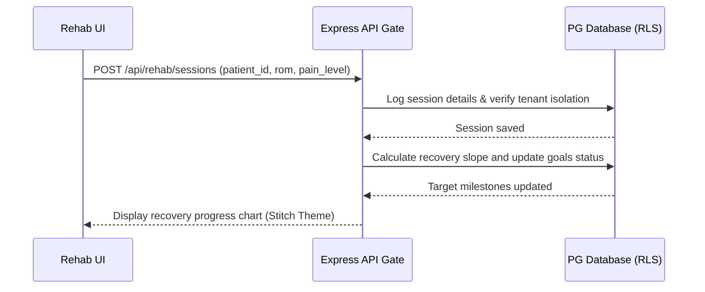

#### 4. السيناريو التدريبي (Training Videos Storyboard)
- **المشهد 1**: أخصائي التأهيل يعرض لوحة تحكم جلسات المريض الحية.
- **المشهد 2**: تحديث أرقام المدى الحركي للمفصل ورؤية المنحنى البياني يصعد للأعلى تعبيراً عن التحسن.
- **المشهد 3**: إنهاء الجلسة وتوثيق خطة التمارين المنزلية للمريض وإرسالها لتطبيق المريض.

#### 5. دليل الامتثال واللوائح القانونية (Legal & Compliance Docs)
- **امتثال الهيئة السعودية للتخصصات الصحية**: توثيق ترخيص أخصائي التأهيل وربطه بالنظام للتحقق من أهلية مقدم الخدمة السريرية.
- **امتثال PDPL**: تشفير كافة تقارير اللياقة البدنية والتعافي وحظر مشاركتها مع جهات العمل إلا بموافقة صريحة وموقعة رقمياً من المريض.

---

### سابعاً: الخدمات المساندة والداعمة (Support Services)
(تشمل: الخدمات التمريضية والرعاية، التغذية والمطبخ الطبي، الخدمات الاجتماعية والنفسية، الخدمات اللوجستية والفنية، الخدمات الأمنية والسلامة)

#### 1. نظام هندسة المقترحات الذكية (Prompt Engineering System)
* **System Prompt**:
  ```text
  You are a Patient Care and Clinical Dietetics Coordinator for Jumanasoft ERP.
  Analyze the patient's medical diagnosis, current drug prescriptions, and allergen profile to:
  1. Generate a safe clinical dietary menu (e.g. low sodium, diabetic-friendly).
  2. Flag potential food-drug interactions based on the active medications list.
  3. Coordinate nursing shift handovers ensuring critical safety notes are emphasized.
  ```
* **Context**:
  ```json
  {
    "diagnosis": "Chronic Kidney Disease Stage 4",
    "active_drugs": ["Spironolactone"],
    "allergies": ["Wheat / Gluten"],
    "food_restriction": "High Potassium limit, Low Sodium"
  }
  ```
* **Workflow & Orchestration**:
  1. يقوم طبيب التغذية بتحديد نوع الحمية للمريض المنوم.
  2. يطابق المحرك الوجبات المتاحة في المطبخ المركزي مع حساسية القمح وCKD.
  3. يرسل النظام أمراً رقمياً للمطبخ لتحضير وجبة خالية من الجلوتين والصوديوم والبوتاسيوم.

#### 2. سيناريو العمل الطبي (Clinical Work Scenario)
1. يتم تنويم مريض يعاني من السكري والفشل الكلوي في القسم الداخلي.
2. يدخل الممرض تفاصيل التقييم التمريضي الأولي.
3. يقوم خادم التغذية تلقائياً بقفل خيارات الأطعمة المحتوية على سكريات أو أملاح زائدة في قائمة وجبات المريض.
4. يرسل المطبخ الوجبة المختومة برمز الاستجابة السريعة (QR Code) لتأكيد المطابقة عند السرير.

#### 3. مخطط تدفق البيانات (Data Flow Diagram)
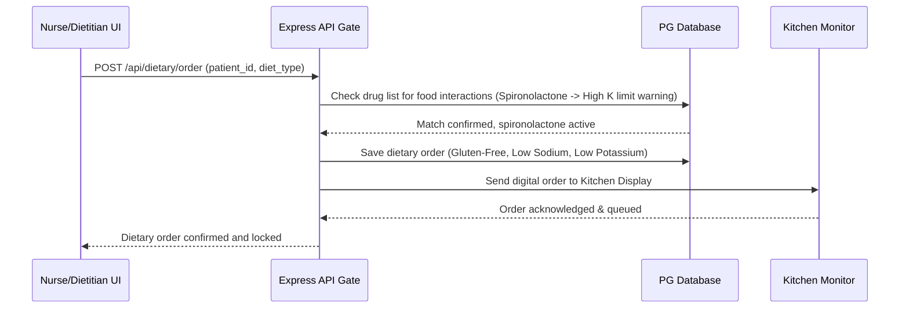

#### 4. السيناريو التدريبي (Training Videos Storyboard)
- **المشهد 1**: الممرض يمسح رمز الاستجابة السريعة (QR Code) الموجود على سوار المريض وعلى وجبة الطعام للتأكد من المطابقة.
- **المشهد 2**: شاشة التابلت تومض باللون الأخضر معلنة تطابق المريض والوجبة بنجاح.
- **المشهد 3**: توثيق إعطاء الوجبة والجرعة الدوائية المرافقة في ملف السجل الطبي الموحد للمريض.

#### 5. دليل الامتثال واللوائح القانونية (Legal & Compliance Docs)
- **امتثال CBAHI**: توثيق عملية "تسليم واستلام التمريض" (Nursing Shift Handover) باستخدام نموذج SBAR المعتمد عالمياً لمنع ضياع المعلومات الحساسة أثناء تبديل النوبات.
- **امتثال أمن المعلومات (NCA ECC)**: تأمين قنوات الاتصال وأنظمة التحكم بالأجهزة الطبية والمخازن اللوجستية وحراستها بالكامل ضد هجمات الاختراق الإلكتروني.

---

### ثامناً: الأقسام الإدارية والأكاديمية (Administrative & Academic)
(تشمل: الإدارة التنفيذية والطبية، إدارة الجودة والاعتماد، التعليم والبحث العلمي، الموارد البشرية والتطوير الإداري)

#### 1. نظام هندسة المقترحات الذكية (Prompt Engineering System)
* **System Prompt**:
  ```text
  You are an Executive Quality and Risk Management System Advisor for Jumanasoft ERP.
  Analyze clinical incident reports (OVR), physician credentials, and compliance metrics to:
  1. Classify occurrences into risk severity levels (Green, Yellow, Red).
  2. Audit doctor credentials against privileging standards and flag expiration dates.
  3. Generate accreditation checklists (CBAHI/JCI) with automated compliance scores.
  ```
* **Context**:
  ```json
  {
    "incident_report": "Medication error: double dose of insulin administered due to distraction.",
    "reported_by": "Nurse Staff A",
    "patient_harm": "Transient hypoglycemia, resolved with dextrose",
    "doctor_credentials": { "license_active": true, "privilege_expiry": "2026-08-30" }
  }
  ```
* **Workflow & Orchestration**:
  1. يقوم الموظف برفع تقرير حادثة عارضة (OVR).
  2. يقوم مصنف المخاطر الذكي بتحليل النص وتحديد مستوى الخطورة تلقائياً.
  3. إذا كان الحادث خطيراً (مستوى أحمر)، يتم إرسال تنبيه فوري ومجهل الهوية لإدارة الجودة ولجنة الأخلاقيات للتحقيق ومنع التكرار.

#### 2. سيناريو العمل الطبي (Clinical Work Scenario)
1. تلاحظ الممرضة خطأ في وصفة طبية تم صرفها.
2. تفتح لوحة حوادث الجودة (OVR) وتكتب تفاصيل الحادثة بشكل مجهول الهوية لحماية الثقة.
3. يستلم رئيس قسم الجودة إشعار الحادثة مصنفاً بمستوى خطورة متوسط.
4. يفتح رئيس الجودة تحقيقاً رقمياً ويقترح إجراءات تصحيحية (CAPA) ويغلق التذكرة بعد التنفيذ.

#### 3. مخطط تدفق البيانات (Data Flow Diagram)
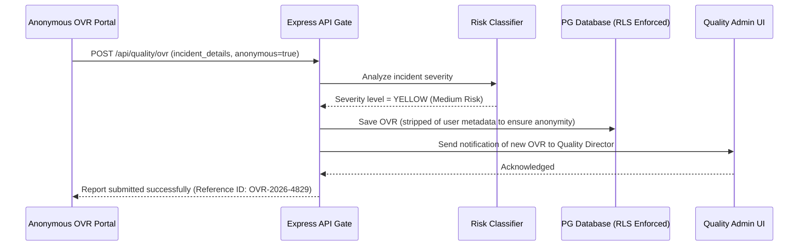

#### 4. السيناريو التدريبي (Training Videos Storyboard)
- **المشهد 1**: الموظف يفتح لوحة الحوادث العارضة OVR ويكتب تفاصيل الحادثة بأمان وسرية تامة.
- **المشهد 2**: مدير الجودة يفتح لوحة المراقبة ويستعرض تقارير الحوادث والإحصاءات ومعدلات الامتثال السنوية.
- **المشهد 3**: تحديث صلاحيات طبيب منتهي الترخيص وحظر قدرته على كتابة أوامر الأدوية CPOE تلقائياً حتى تجديد الترخيص.

#### 5. دليل الامتثال واللوائح القانونية (Legal & Compliance Docs)
- **امتثال CBAHI**: توفير نموذج إلكتروني مجهل ومحمي لإرسال تقارير الأحداث العارضة (OVR) كمتطلب رئيسي للاعتماد الوطني للمستشفيات.
- **امتثال الهيئة السعودية للتخصصات الصحية**: الربط المباشر مع بوابة الهيئة للتحقق من سريان تراخيص الأطباء والممارسين الصحيين وتوثيق الامتيازات السريرية (Privileging).

---

### تاسعاً: المراكز المتخصصة المتكاملة (Centers of Excellence)
(تشمل: مراكز القلب، الأورام، العظام، العقم والإنجاب، الأنف والأذن، الحوادث والإصابات، الحروق، زراعة الأعضاء، كبار السن، الألم المزمن، السمنة والتمثيل، طب الأطفال، الصحة النفسية، العيون، المخ والأعصاب، الأم والجنين)

#### 1. نظام هندسة المقترحات الذكية (Prompt Engineering System)
* **System Prompt**:
  ```text
  You are an expert Oncology Tumor Board Assistant for the Jumanasoft Comprehensive Cancer Center.
  Analyze complex multi-disciplinary clinical patient data including tumor stage, histology, genetic markers, and prior chemotherapy cycles to:
  1. Generate personalized chemotherapy protocol proposals conforming to NCCN guidelines.
  2. Flag cumulative dose toxicity limits for anthracyclines and alkylating agents.
  3. Propose clinical trial eligibility based on active trial inclusion criteria database.
  ```
* **Context**:
  ```json
  {
    "stage": "Breast Cancer Stage IIIA",
    "histopathology": "Invasive Ductal Carcinoma, ER+, PR-, HER2+",
    "genetic_markers": { "BRCA1": "Negative", "BRCA2": "Negative" },
    "prior_doxorubicin_dose": "240 mg/m2",
    "current_lvef": "55%"
  }
  ```
* **Workflow & Orchestration**:
  1. يفتح الطبيب لوحة استشاريي الأورام المشتركة (Tumor Board).
  2. يجمع النظام بيانات الباثولوجيا والأشعة والجينات تلقائياً.
  3. يطابق المحرك الذكي البروتوكولات المعتمدة عالمياً ويحسب سمية الجرعات التراكمية لحماية المريض من الفشل القلبي.

#### 2. سيناريو العمل الطبي (Clinical Work Scenario)
1. يعقد مجلس الأورام المشترك (Tumor Board) اجتماعاً لمناقشة حالة مريضة سرطان ثدي.
2. يستدعي النظام بيانات المريضة المتكاملة ويعرض مقترح العلاج الموجه (HER2 targeted therapy).
3. يوافق الاستشاريون ويوقعون رقمياً على الخطة المشتركة.
4. يرسل النظام أوامر تحضير العلاج الكيميائي تلقائياً لصيدلية الأورام المتخصصة المجهزة بغرفة عزل وحماية المعايرة.

#### 3. مخطط تدفق البيانات (Data Flow Diagram)
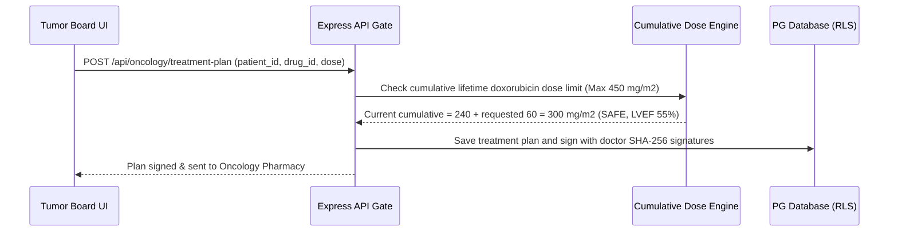

#### 4. السيناريو التدريبي (Training Videos Storyboard)
- **المشهد 1**: مجموعة من الأطباء من تخصصات مختلفة يجتمعون أمام شاشة لوحة تحكم الأورام المتكاملة (Stitch Dynamic UI).
- **المشهد 2**: مناقشة الجرعة والتحقق من مستويات السمية التراكمية للأدوية وتأكيدها.
- **المشهد 3**: إرسال الوصفة المشفرة إلكترونياً للصيدلية ورصد بدء التنقيط الكيميائي للمريض.

#### 5. دليل الامتثال واللوائح القانونية (Legal & Compliance Docs)
- **امتثال CBAHI / JCI**: الامتثال لضوابط "معايرة وتحضير العلاج الكيميائي" وتوفير غرف تحضير معزولة بضغط سلبي وتوثيق المطابقة الثنائية المستقلة للجرعات (Independent Double-Check).
- **امتثال PDPL**: حماية خصوصية مرضى الأورام والجينات والتشفير الفائق لنتائج الفحوصات الوراثية الحساسة للغاية.

---

### عاشراً: أقسام نادرة ومتقدمة جداً (Rare & Super-Specialized)
(تشمل: طب الفضاء والغوص، طب النوم المعقد، ألم الصرع المقاوم، العلاج بالخلايا الجذعية المتقدم، طب الأجنة الجراحي، طب الأجنة والتشخيص قبل الولادة، علاج اضطرابات الحركة العميقة DBS، العلاج بالجرعات المشعة، العلاج بالتبريد، طب المجهر الضوئي التداخلي، طب البصمة الوراثية، طب النانو والروبوتات الميكروسكوبية)

#### 1. نظام هندسة المقترحات الذكية (Prompt Engineering System)
* **System Prompt**:
  ```text
  You are an advanced Genomics and Pharmacogenomics (PGx) Assistant for Jumanasoft.
  Analyze the patient's genetic sequence variations (SNPs) and drug metabolism genotypes to:
  1. Determine CYP2D6, CYP2C19, or VKORC1 metabolizer phenotypes.
  2. Flag critical drug dosing risks (e.g. Warfarin dosing adjustment based on VKORC1, Clopidogrel resistance due to CYP2C19*2).
  3. Propose alternative therapies with higher efficacy and safety profiles.
  ```
* **Context**:
  ```json
  {
    "patient_genotype": { "CYP2C19": "*2/*2", "phenotype": "Poor Metabolizer" },
    "intended_prescription": "Clopidogrel (Plavix) 75mg Daily",
    "clinical_indication": "Post-Percutaneous Coronary Intervention (PCI) Stenting"
  }
  ```
* **Workflow & Orchestration**:
  1. يصف طبيب القلب دواء Clopidogrel لمريض بعد القسطرة.
  2. يفحص حارس البصمة الوراثية قاعدة بيانات الجينات للمريض.
  3. يكتشف النظام أن المريض يحمل النمط CYP2C19*2/*2 (ضعيف الاستقلاب) مما يعني عدم فاعلية الدواء وزيادة خطر الجلطات.
  4. يحظر النظام الوصفة تلقائياً ويقترح استخدام البديل الآمن Prasugrel أو Ticagrelor بالتوافق مع إرشادات CPIC الطبية العالمية.

#### 2. سيناريو العمل الطبي (Clinical Work Scenario)
1. يتم سحب عينة جينية لمريض لفحص البصمة الوراثية للأدوية (Pharmacogenomics).
2. تدخل نتائج التحليل الجيني لملف المريض الإلكتروني.
3. يحاول الطبيب كتابة وصفة Warfarin لتمييع الدم.
4. يطلق النظام تحذيراً فورياً عالي الخطورة موضحاً الجرعة البديلة الدقيقة بناءً على جينات المريض الشخصية لمنع حدوث نزيف دماغي حاد.

#### 3. مخطط تدفق البيانات (Data Flow Diagram)
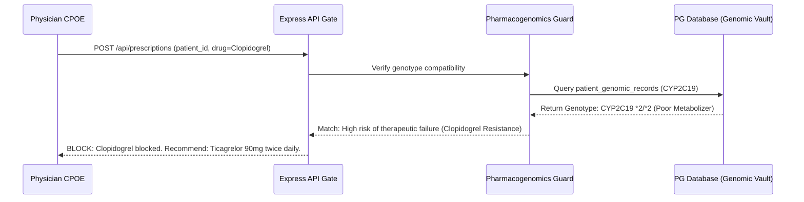

#### 4. السيناريو التدريبي (Training Videos Storyboard)
- **المشهد 1**: الطبيب يصف دواء مميع الدم التقليدي للمريض.
- **المشهد 2**: نافذة ذكية تومض باللون البرتقالي محذرة من عدم استجابة المريض جينياً للدواء بناءً على البصمة الوراثية المسجلة.
- **المشهد 3**: الطبيب يختار البديل المقترح من الذكاء الاصطناعي ويوقع السجل رقمياً.

#### 5. دليل الامتثال واللوائح القانونية (Legal & Compliance Docs)
- **امتثال وزارة الصحة وهيئة الغذاء والدواء السعودية (SFDA)**: الالتزام بتحذيرات البصمة الوراثية للأدوية وتحديث إرشادات الصرف بما يتوافق مع النشرات الدوائية المحدثة.
- **امتثال PDPL (الخصوصية الجينية)**: تعتبر البيانات الجينية والوراثية في أعلى درجات السرية والخصوصية وفقاً لنظام حماية البيانات الشخصية السعودي، ويحظر تماماً نقلها أو تصديرها خارج حدود المملكة وتخزن مشفرة فائقاً بقفل تشفير معزول ومراقب بالكامل.

---

## الجزء 3: المواصفات الهندسية والتقنية للمنصة الشاملة (Master Technical Specs)

---

### 1. مخطط الكيانات والعلاقات لقاعدة البيانات (Database ERD Schema)

هذا المخطط يمثل المحرك السريري الديناميكي المعتمد في جمانة سوفت لتفادي تضخم الجداول:

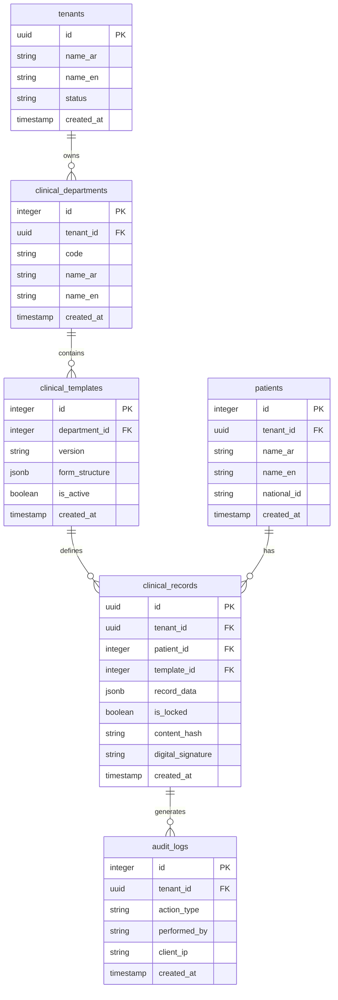

---

### 2. واصفات الـ API البرمجية (OpenAPI Specification)

```yaml
openapi: 3.0.3
info:
  title: Jumanasoft Dynamic EMR Engine API
  version: 1.0.0
  description: API specifications for dynamic clinical templates, patient records, and cryptographic locking.
paths:
  /api/clinical/templates:
    post:
      summary: Create or update a dynamic clinical template for a department.
      parameters:
        - name: x-tenant-id
          in: header
          required: true
          schema:
            type: string
      requestBody:
        required: true
        content:
          application/json:
            schema:
              type: object
              required:
                - department_id
                - form_structure
              properties:
                department_id:
                  type: integer
                form_structure:
                  type: object
                  description: JSON Schema representing the UI form fields and buttons.
      responses:
        '201':
          description: Template created successfully.
  /api/clinical/records:
    post:
      summary: Save a clinical record linked to a patient and template.
      parameters:
        - name: x-tenant-id
          in: header
          required: true
          schema:
            type: string
      requestBody:
        required: true
        content:
          application/json:
            schema:
              type: object
              required:
                - patient_id
                - template_id
                - record_data
              properties:
                patient_id:
                  type: integer
                template_id:
                  type: integer
                record_data:
                  type: object
      responses:
        '201':
          description: Clinical record saved.
  /api/clinical/records/{id}/lock:
    post:
      summary: Cryptographically sign and lock a clinical record.
      parameters:
        - name: id
          in: path
          required: true
          schema:
            type: string
        - name: x-tenant-id
          in: header
          required: true
          schema:
            type: string
      responses:
        '200':
          description: Record locked and signed.
```

---

### 3. قصص المستخدمين ومعايير القبول (User Stories & Acceptance Criteria)

#### القصة 1: استعراض وتعبئة النماذج الديناميكية حسب القسم
- **بصفتي**: طبيب ممارس في المنصة.
- **أريد أن**: يظهر لي نموذج الفحص الطبي المخصص لقسمي تلقائياً عند فتح ملف المريض.
- **حتى أتمكن من**: إدخال البيانات الطبية والتشخيص بسرعة وسهولة دون تشتيت بحقول الأقسام الأخرى.
- **معايير القبول**:
  - فك تشفير وتوليد واجهات النموذج المعطى من الـ JSON template بنسبة 100% دون أخطاء برمجية في المتصفح.
  - التحقق من تعبئة الحقول المطلوبة خادمياً وعرض رسائل الخطأ باللغة العربية قبل الإرسال.

#### القصة 2: قفل السجل الطبي التلقائي بالبصمة الإلكترونية
- **بصفتي**: رئيس الأطباء ولجنة الجودة بالمنشأة الطبية.
- **أريد أن**: يتم قفل سجل المريض الطبي رقمياً بنظام SHA-256 فور توقيع الطبيب عليه.
- **حتى أضمن**: عدم التلاعب ببيانات المريض الطبية بعد مغادرته العيادة وحماية الأطباء قانونياً.
- **معايير القبول**:
  - حساب بصمة SHA-256 صحيحة ومطابقة لمحتوى السجل وحفظها في قاعدة البيانات.
  - حظر مسارات التعديل والحذف (PUT/DELETE) على السجل المقفل برمز الخطأ 403 (Record is locked).

---

### 4. خطة حالات الاختبار (Test Cases & Test Plan)

#### فحص عزل الجداول والمستأجرين (RLS Integration Test)
* **الهدف**: التحقق من حظر الوصول للبيانات بين المستشفيات المختلفة على مستوى قاعدة البيانات.
* **الخطوات**:
  1. الاتصال بقاعدة البيانات بالدور المحدود `nama_medical_app`.
  2. ضبط سياق الجلسة للمستأجر أ: `set_config('app.tenant_id', 'tenant_a_uuid', true)`.
  3. محاولة إدراج سجل طبي للمستأجر ب: `INSERT INTO clinical_records (tenant_id, ...) VALUES ('tenant_b_uuid', ...)`.
  4. التحقق من النتيجة.
* **النتيجة المتوقعة**: فشل العملية وصدور خطأ حماية قاعدة البيانات (exit code / SQLSTATE 42501 - Insufficient Privilege).

#### فحص سلامة وتوقيع السجلات (Legal Lock Test)
* **الهدف**: التحقق من منع تعديل السجلات الطبية الموقعة.
* **الخطوات**:
  1. إدراج سجل طبي وحفظ حالته `is_locked = true` مع التوقيع الرقمي.
  2. إرسال طلب تعديل `PUT /api/clinical/records/:id` لتغيير بيانات التشخيص.
* **النتيجة المتوقعة**: صدور استجابة منع خادمية برمز 403 وتوثيق المحاولة الفاشلة في سجلات التدقيق أوتوماتيكياً.

---

### 5. مستند الحماية والسرية (Security Plan)

1. **تشفير حقول البيانات الحساسة (Data Encryption)**:
   يتم تشفير بيانات المرضى الشخصية (الاسم، الهوية، الهاتف) والطبية (الشكوى والتشخيص) باستخدام آلية **Envelope Encryption** عبر مكتبة التشفير المدمجة `crypto_envelope` (AES-256-GCM) مع الحفاظ على مفاتيح تشفير البيانات (DEK) مشفرة ومؤمنة بمفتاح تشفير المفاتيح الرئيسي (KEK).
2. **سياسات أمن المتصفح (CSP & Secure Headers)**:
   تطبيق سياسات حماية رأسية شديدة الصرامة عبر حزمة Helmet لمنع هجمات حقن الكود XSS وحظر السكربتات المضمنة إلا الموثقة بـ Nounce أو Hash أمني.
3. **منع هجمات الاستغلال (Rate Limiting & Intrusion Detection)**:
   حظر نهايات الاستدعاءات بعد 5 محاولات خاطئة لمنع هجمات التخمين وتفعيل جدار الحماية ضد محاولات الوصول لقواعد البيانات.

---

### 6. دليل النشر والتشغيل والـ CI/CD (Deployment Plan)

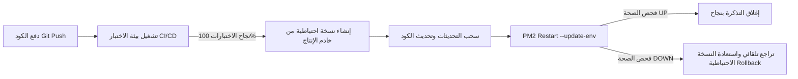

---

### 7. دليل التصميم البصري والألوان (Stitch Style Guide)

* **نظام الألوان الأساسي (Premium Medical Palette)**:
  - **اللون الأساسي (Primary)**: كحلي داكن ملكي (`#0A192F` / HSL `217, 64%, 11%`).
  - **اللون الثانوي (Secondary)**: أزرق فيروزي مشع (`#00F2FE` / HSL `183, 100%, 50%`).
  - **اللون التنبيهي (Accent)**: برتقالي دافئ للـ CDSS والإنذار المبكر (`#FF9F43` / HSL `30, 100%, 63%`).
  - **اللون الداكن للمستشفى (Dark Background)**: رمادي فائق العمق (`#0D1117`).
* **الخطوط (Typography)**: استخدام خط **Inter** للغة الإنجليزية وخط **Outfit** أو **Cairo** للغة العربية المعتمدة بنسب تباين ممتازة متوافقة مع معايير الوصولية WCAG AA.

---

### 8. ملفات الترجمة الثنائية (i18n Translation Files)

```json
{
  "ar": {
    "clinical_records": "السجلات السريرية",
    "cdss_alert": "تنبيه القرار الطبي الذكي",
    "lock_record": "توقيع وقفل السجل الطبي إلكترونياً",
    "panic_value_warning": "قيمة ذعر حرجة! يرجى إبلاغ الطبيب المعالج فوراً.",
    "anonymous_ovr": "الإبلاغ عن حادثة عارضة مجهولة الهوية"
  },
  "en": {
    "clinical_records": "Clinical Records",
    "cdss_alert": "Clinical Decision Support Alert",
    "lock_record": "Sign and Lock EMR Digitally",
    "panic_value_warning": "CRITICAL PANIC VALUE! Please notify the physician immediately.",
    "anonymous_ovr": "Anonymous Occurrence Variance Report (OVR)"
  }
}
```

---

### 9. بذور البيانات وبنية الترحيل (Seeders & Migration Scripts)

#### DDL Migration SQL Script (`migration_v4_dynamic_emr.sql`)
```sql
-- 1. Create clinical departments catalog
CREATE TABLE IF NOT EXISTS clinical_departments (
    id SERIAL PRIMARY KEY,
    tenant_id INTEGER NOT NULL,
    code VARCHAR(50) NOT NULL,
    name_ar VARCHAR(255) NOT NULL,
    name_en VARCHAR(255) NOT NULL,
    created_at TIMESTAMP DEFAULT CURRENT_TIMESTAMP
);

-- Enable RLS
ALTER TABLE clinical_departments ENABLE ROW LEVEL SECURITY;
ALTER TABLE clinical_departments FORCE ROW LEVEL SECURITY;

CREATE POLICY rls_dept_tenant_isolation ON clinical_departments
    USING (tenant_id = NULLIF(current_setting('app.tenant_id', true), '')::integer);

-- 2. Create clinical templates for metadata UI
CREATE TABLE IF NOT EXISTS clinical_templates (
    id SERIAL PRIMARY KEY,
    department_id INTEGER REFERENCES clinical_departments(id) ON DELETE CASCADE,
    version VARCHAR(20) NOT NULL DEFAULT '1.0.0',
    form_structure JSONB NOT NULL,
    is_active BOOLEAN DEFAULT TRUE,
    created_at TIMESTAMP DEFAULT CURRENT_TIMESTAMP
);

-- 3. Create clinical records to store JSONB data
CREATE TABLE IF NOT EXISTS clinical_records (
    id UUID PRIMARY KEY DEFAULT gen_random_uuid(),
    tenant_id INTEGER NOT NULL,
    patient_id INTEGER NOT NULL,
    template_id INTEGER REFERENCES clinical_templates(id),
    record_data JSONB NOT NULL,
    is_locked BOOLEAN DEFAULT FALSE,
    content_hash VARCHAR(64),
    digital_signature TEXT,
    created_at TIMESTAMP DEFAULT CURRENT_TIMESTAMP
);

ALTER TABLE clinical_records ENABLE ROW LEVEL SECURITY;
ALTER TABLE clinical_records FORCE ROW LEVEL SECURITY;

CREATE POLICY rls_records_tenant_isolation ON clinical_records
    USING (tenant_id = NULLIF(current_setting('app.tenant_id', true), '')::integer)
    WITH CHECK (tenant_id = NULLIF(current_setting('app.tenant_id', true), '')::integer);
```

#### Seeder SQL Script (`seeder_v4_data.sql`)
```sql
-- Seed Cardiology Department
INSERT INTO clinical_departments (tenant_id, code, name_ar, name_en) 
VALUES (1, 'CARDIOLOGY', 'قسم طب القلب العام', 'General Cardiology');

-- Seed Sample Template Structure for Cardiology
INSERT INTO clinical_templates (department_id, version, form_structure) 
VALUES (1, '1.0.0', '{
  "title": "Cardiology Consultation Form",
  "fields": [
    {"name": "chest_pain_type", "type": "select", "options": ["Typical Angina", "Atypical", "Non-anginal"], "required": true},
    {"name": "resting_bp", "type": "text", "label": "Resting Blood Pressure", "required": true},
    {"name": "ekg_results", "type": "textarea", "label": "EKG Interpretation", "required": false}
  ],
  "buttons": [
    {"action": "submit", "label": "Save Progress", "class": "btn-secondary"},
    {"action": "sign_lock", "label": "Sign and Lock EMR", "class": "btn-primary"}
  ]
}'::jsonb);
```

---

### 10. دليل المستخدم العام (User Manual)

* **للأطباء والممارسين**:
  1. افتح صفحة المريض من عيادتك النشطة.
  2. يعرض النظام نموذج الكشف الطبي المخصص لقسمك تلقائياً.
  3. بعد استكمال الفحص ومراجعة اقتراحات الـ CDSS وتصحيحها، اضغط على زر **"توقيع السجل"**.
  4. سيتم قفل السجل إلكترونياً ولا يسمح بأي تعديل مباشر عليه. لإضافة معلومات لاحقة، استخدم زر **"إضافة تعديل إلحاقي (Amendment)"**.
* **لمديري الجودة والمشرفين**:
  1. ادخل للوحة الجودة والاعتماد لمراجعة مؤشرات الأداء الحية ومعدلات قفل السجلات الطبية.
  2. افتح بوابة تقارير OVR لمراجعة الحوادث العارضة المجهولة وتحديد برامج التصحيح المناسبة CAPA.
