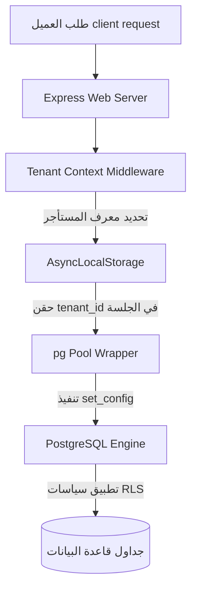

# المخطط المعماري الشامل لمنصة جمانة سوفت (Master SaaS Architecture Blueprint)

مستند معماري يصف الهيكل التقني النهائي والآليات البرمجية المعتمدة لعزل البيانات، إدارة الاشتراكات، الصلاحيات، الفوترة، ومراقبة التشغيل في منصة جمانة سوفت.

---

## 1. نموذج عزل وتعدد المستأجرين (Tenant Model)

تعتمد المنصة معمارية **قاعدة البيانات المشتركة مع عزل البيانات منطقياً (Shared Database, Logical Isolation)** لضمان الكفاءة الاقتصادية وسهولة الصيانة، مع تعزيز الأمان بأقوى الحواجز الأمنية:



### آليات العزل والتشغيل
1. **تحديد المستأجر (Identification)**: يقوم الـ Middleware بفحص النطاق الفرعي (Subdomain) أو ترويسة الطلب (`x-tenant-id`) لتحديد الكيان الطالب.
2. **سياق العملية (AsyncLocalStorage)**: يتم تخزين معرف المستأجر `tenant_id` في مخزن سياق محلي غير متزامن يرافق الطلب طوال دورة حياته.
3. **أمان قاعدة البيانات (PostgreSQL RLS)**:
   - يتم تفعيل خيار الـ Row Level Security على كافة الجداول المشتركة.
   - عند قيام تطبيق Node.js بسحب اتصال من pool قاعدة البيانات، يقوم بتمرير معرف المستأجر الحالي كمتغير جلسة مؤقت:
     ```sql
     SELECT set_config('app.tenant_id', 'current_tenant_uuid', true);
     ```
   - تحتوي سياسات الاستعلام على حظر تلقائي يمنع الوصول لأي صف لا يطابق سياق الجلسة:
     ```sql
     CREATE POLICY tenant_isolation_policy ON patients
     FOR ALL TO nama_medical_app
     USING (tenant_id = NULLIF(current_setting('app.tenant_id', true), '')::uuid);
     ```

---

## 2. نظام التحقق والتحكم بالصلاحيات الهجين (Authentication & User RBAC)

تعتمد جمانة سوفت نموذج صلاحيات ثلاثي الطبقات متوافق مع لوحة تحكم متكاملة:

1. **الطبقة الأولى: Super Admin (إدارة المنصة)**
   - التحكم الكامل في مستأجري المنصة.
   - إدارة خطط الأسعار والاشتراكات والميزات المتاحة.
   - مسارات منفصلة ومحمية بـ Middleware خاص (`/api/super-admin/*`) لا تتأثر بسياسات RLS العادية.

2. **الطبقة الثانية: Tenant Admin (مدير المستأجر/المستشفى)**
   - إدارة المستخدمين داخل نطاق مستشفاه فقط.
   - تغيير إعدادات الفروع والأقسام المحلية.
   - مراقبة استهلاك الفوترة وتحديث الفواتير والاشتراكات.

3. **الطبقة الثالثة: User Roles (المستخدمون التشغيليون)**
   - أدوار دقيقة (طبيب، ممرض، موظف استقبال، صيدلي، فني أشعة، محاسب).
   - التحقق من الصلاحيات محلياً وعبر راصدات المسارات (Route Guards) المحددة في `rbac_guards.js`.

---

## 3. خطط الأسعار وإدارة التراخيص (Plans & Entitlements)

تدار خطط الاشتراكات بشكل ديناميكي صارم:
- **دليل الخطط (Plan Catalog)**: يحتوي على الخطط القياسية (تجريبية، أساسية، احترافية، مؤسسات).
- **التحقق الاستباقي (Pre-emptive Enforcement)**:
  - عند قيام مدير المستأجر بإضافة مستخدم أو فرع جديد، يتم استعلام العدادات ومقارنتها بالحدود المسموح بها في خطة الاشتراك قبل السماح بعملية الإدخال.
- **ميزات الخطط (Feature Flags)**: تفعيل أو تعطيل موديولات كاملة (مثل وحدة الرعاية المركزة ICU، أو بنك الدم Bloodbank) بموجب حزم الاشتراك المرتبطة بالمستأجر.

---

## 4. محول الفوترة والدفع المالي (Payment Provider Abstraction)

لتفادي التكبيل ببوابة دفع معينة (Vendor Lock-in)، تم تصميم طبقة التجريد `BillingAdapter` التي تدعم البوابات التالية:
- **Stripe**: للمدفوعات الدولية والدورات الشهرية الآلية.
- **Moyasar / HyperPay**: لمعاملات مدى والبطاقات الائتمانية المحلية في المملكة العربية السعودية.
- **Mock Provider**: لبيئات التطوير والاختبار للتأكد من عدم تمرير أي بيانات حساسة أو استدعاءات خارجية حقيقية.

---

## 5. سجل التدقيق والمراقبة الصحية (Audit Logs & Health Monitor)

- **سجل التدقيق (Audit Logs)**: يتم تسجيل كافة العمليات الإدارية والمالية والطبية الهامة في جدول `audit_logs` بشكل فوري، مع تسجيل تفاصيل الهوية ومعرف المستأجر وعنوان الـ IP لدواعي الامتثال الأمني.
- **مراقبة الصحة التشغيلية (Operations Health Check)**:
  - يوفر التطبيق رابط فحص صحي عام ومحمي `/api/health`.
  - يختبر الرابط اتصال PostgreSQL، اتصال Redis، ومؤشرات الذاكرة والمعالج لضمان استقرار الخادم.

---

## 6. صفحات الموقع العام المحسنة للـ SEO/GEO

تصميم معمارية الصفحات العامة لمنصة `jumanasoft.com` بشكل يعزز حضورها الرقمي:
- **تحسين الهوية والكيان (Entity Optimization)**: تضمين وسوم Schema.org الدقيقة لتعريف المنصة كشركة تقنية طبية متكاملة.
- **عنونة واضحة ومحتوى منظم**: استخدام الأقسام الدقيقة لصفحات الميزات والأسعار لتسهيل قراءتها واستخراج الكلمات المفتاحية بواسطة محركات بحث الذكاء الاصطناعي وجوجل على حد سواء.

---

## 7. تأكيد الحفاظ على سلامة بيئة الإنتاج والتشغيل

- **لا توجد أي تعديلات أو كتابة لبيانات على خادم الإنتاج**.
- المخطط المعماري يعبر عن الأسلوب المعياري المعتمد والمطبق محلياً في المنصة لضمان عزل متعدد المستأجرين بنسبة 100%.
