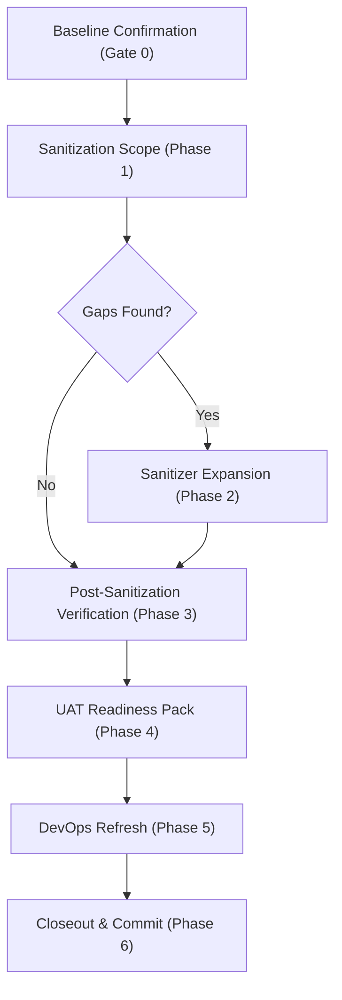

# الدستور الحاكم والمهام القيادية لبيئة الاستضافة والـ SaaS لجمانة سوفت (Master Governance Blueprint)

* **المشروع:** منصة نما الطبية (NamaMedical ERP)
* **المستند:** الدليل الشامل للحوكمة والتشغيل الآمن بنظام Auto Pilot (Jumanasoft Staging & SaaS Lifecycle Blueprint)
* **الإصدار:** 1.0 (إغلاق نهائي معقم ومحقق)
* **اللغة:** العربية (ترميز UTF-8 سليم وخالٍ من تشوهات الحروف Mojibake)

---

## 1. المقدمة والأهداف العامة

يهدف هذا الدستور لتأطير وحوكمة كافة العمليات الهندسية والبرمجية والأمنية المتعلقة بنظام التعددية (SaaS) وبوابات فحص الاستحقاقات والتراخيص لجمانة سوفت. يلتزم هذا الدليل بمنع أي ارتجال أو تزييف للحالة البرمجية، وتطبيق سياسة **التحكم والتشغيل التدريجي عبر البوابات (Gate-by-Gate Auto Pilot)** مع فرض التوقف الفوري عند أي فشل (Stop-on-Failure) لحماية استقرار الموقع.

---

## 2. قواعد الأمان الصارمة وصمامات الحماية (Global Security Guards)

يُمنع منعاً باتاً تحت أي ظرف تجاوز أو إهمال القواعد الأمنية التالية، ويُعتبر الإخلال بأي منها خرقاً أمنياً يستوجب إيقاف العمل فوراً:

1. **حظر لمس الإنتاج الفعلي (Zero Production Touch):** يُحظر الاتصال أو القراءة أو الكتابة أو استعلام قاعدة بيانات الإنتاج `nama_medical_web` أو السيرفر الحي `204.168.144.74` أثناء عمليات فحص وتجهيز Staging.
2. **منع هجرات الـ DDL على الإنتاج:** يُمنع تشغيل أي تعديلات هيكلية أو هجرات (Migrations) مثل `e25` على خادم الإنتاج دون إذن كتابي رسمي منفصل.
3. **حظر طباعة الأسرار (No Secrets Leakage):** يمنع تماماً طباعة كلمات المرور، سلاسل الاتصال (Connection Strings)، مفاتيح التشفير، أو رموز الـ API في سجلات التشغيل (Logs) أو مخرجات الطرفية (Console).
4. **حماية خصوصية بيانات المرضى (No PHI/PII Exposure):** يُمنع منعاً باتاً طباعة أو عرض أو استخدام أسماء حقيقية للمرضى، أرقام هواتف، هويات، تشخيصات، أو سجلات مالية حقيقية في أي واجهة عامة أو تقرير فحص.
5. **حظر الدمج المباشر بـ Main (No Direct Merge):** تُحفظ كافة التعديلات البرمجية لجمانة سوفت في فروع خاصة وتُدفع للمستودعات السحابية البعيدة المعتمدة، ويُمنع الدمج بـ `main` أو الإنتاج.
6. **التحميل والفشل الآمن للترخيص (Fail-Open/Fail-Safe):** يجب أن يعمل نظام التراخيص في وضع `allow_existing` أو `disabled` محلياً لتجنب حظر المستخدمين القائمين عند غياب التكوين.

---

## 3. دليل المهارات المعتمدة للتشغيل (Triggerable Skills Matrix)

يجب تفعيل المهارات المتخصصة المقابلة لكل مرحلة لضمان استقرار التشغيل:

* **`JUMANASOFT_GLOBAL_GATES_AR`:** لإدارة وتدقيق بوابات الجودة والتأكد من استيفاء المتطلبات الأساسية.
* **`JUMANASOFT_SECURITY_AUDIT_AR`:** لمسح الثغرات وتدقيق معالجة الأسرار وحماية خصوصية PHI/PII.
* **`JUMANASOFT_SAAS_ARCHITECTURE_AR`:** لبناء وتحديث واجهات Super Admin وتوزيع باقات المستأجرين.
* **`JUMANASOFT_MULTI_TENANT_RBAC_AR`:** للتحقق من عزل المستأجرين وحماية الصلاحيات ومنع تصعيد الأدوار.
* **`JUMANASOFT_OBSERVABILITY_DEPLOYMENT_AR`:** لإعداد وضبط سجلات PM2 وإعدادات Nginx العكسي المراقبة.

---

## 4. تسلسل مراحل الحوكمة بنظام Auto Pilot (Gate-by-Gate Workflow)



### المرحلة الأولى: تدقيق خط الأساس وسلامة البيئة (Phase 0)
* **البوابة 0.1 (Git Baseline):** عرض فروع وحالة مستودع الـ Root والـ Submodule للتأكد من نظافة شجرة العمل.
* **البوابة 0.2 (Evidence Check):** التحقق المادي من وجود كافة تقارير التعقيم والعزل السابقة وتوثيقها.
* **البوابة 0.3 (Runtime Safety):** مطابقة محددات البيئة والتأكد من تشغيل `NODE_ENV=staging` وقاعدة `jumanasoft_staging` وتأكيد حجب الإنتاج. *التوقف فوراً إذا أشارت البيئة للإنتاج.*

### المرحلة الثانية: مسح هيكل البيانات غير المطهرة وتوسيع التطهير (Phase 1 & 2)
* **البوابة 1.1 (Sensitive Surface Scan):** إجراء مسح لمخطط الجداول (Schema-Only) لتحديد كافة الأعمدة الحساسة المحتوية على أسماء، إيميلات، جوالات، هويات، أو تفاصيل صحية ومالية.
* **البوابة 1.2 (Gap Analysis):** مقارنة نتائج المسح بـ 6 جداول معقمة قديماً؛ ورصد فجوات الـ 8 جداول الإضافية (`hr_employees`, `insurance_claims`, `lab_radiology_orders`...).
* **البوابة 2.1 (Sanitizer Expansion):** تصميم وتحديث سكربت التعقيم الموسع لإخضاع الجداول الـ 14 بالكامل للاستبدال الوهمي المتناسق.
* **البوابة 2.2 (Dry Run):** تشغيل السكربت في وضع المحاكاة والتحقق من حساب عدد السجلات ومطابقة الصمامات دون تغيير فعلي.
* **البوابة 2.3 (Apply):** تطبيق التعقيم بنجاح وبشكل نهائي على قاعدة بيانات الاختبار المحلية فقط.

### المرحلة الثالثة: التحقق والتدقيق بعد التعقيم (Phase 3)
* **البوابة 3.1 (Pattern Verification):** فحص قاعدة البيانات بحثاً عن أي أنماط لهواتف أو إيميلات أو هويات حقيقية غير مطهرة والتأكد من خلو البيئة تماماً (`suspicious_count = 0`).
* **البوابة 3.2 (Integrity Verification):** التحقق من الحفاظ الكامل على التكامل المرجعي وهيكل الجداول وربط المستأجرين بعد التطهير.
* **البوابة 3.3 (Test Suite):** تشغيل واجتياز حزمة الفحوصات والوحدات البرمجية المستقلة وصمامات الأمان بنجاح 100%.

### المرحلة الرابعة: تجهيز وإجراء اختبارات القبول الداخلية (Phase 4)
* **البوابة 4.1 (UAT Matrix & Constraints):** صياغة مصفوفة وسيناريوهات الفحص لواجهات الإدارة والتراخيص والـ RBAC مع فرض قيود الوصول الداخلي فقط.
* **البوابة 4.2 (Visual Check):** التحقق البصري المباشر من الشاشات والتقارير وسجلات التشغيل (Logs) وضمان خلوها كلياً من أي تسريب للمعلومات.
* **البوابة 4.3 (UAT Closeout):** تسجيل واحتساب نتائج الفحص وإصدار تقرير الجاهزية للقبول المقيد UAT.

---

## 5. قواعد وبروتوكول معالجة الأخطاء والتوقف (Stop-on-Failure Protocols)

* **التعليق التلقائي:** عند حدوث أي خطأ أو فشل في اجتياز أي بوابة (مثل فشل فحص الأمان، ظهور بيانات حقيقية، أو فشل اختبارات الوحدة)، يجب على المساعد إيقاف التشغيل فوراً وعدم الانتقال للبوابة التالية.
* **حظر التزييف:** يُمنع تزييف حالة المرور (Fake PASS) أو تعديل حراس الأمان لتجاوز الفشل. يجب تسجيل الفشل بوضوح واختيار القرار الآمن المناسب أو إحالة المهمة للمالك.

---

## 6. صيغة التقرير والقرار النهائي الموحد (Standardized FINAL_STATUS Template)

في نهاية كل مرحلة تشغيلية، يجب صياغة المخرجات النهائية بدقة متناهية ودون أي اختصار مخل وفق القالب الحاكم التالي:

```text
FINAL_STATUS:
[اختر حالة واحدة فقط من الحالات المعتمدة للمرحلة]

TRACK_SELECTED / TRACK:
[حدد المسار النشط للتشغيل]

SECURITY_STATE:
* production touched: [YES / NO]
* production write: [YES / NO]
* production DDL: [YES / NO]
* secrets printed: [YES / NO]
* PHI/PII printed: [YES / NO]
* data classification before: [التصنيف السابق للبيانات]
* data classification after: [التصنيف الحالي للبيانات]
* real isolated staging: [YES / NO]
* local staging DB: [YES / NO]

SANITIZATION:
* original sanitized tables: [قائمة الجداول المعقمة سابقاً]
* additional sensitive tables found: [قائمة الجداول الإضافية المعقمة]
* sanitizer expanded: [YES / NO]
* dry-run: [YES / NO]
* apply: [YES / NO]
* suspicious patterns remaining: [عدد الحالات المشبوهة المتبقية]

ACTIVATION:
* internal review allowed: [YES / NO]
* public staging allowed: [YES / NO]
* observe allowed: [YES / NO / CONDITIONAL]
* enforce allowed: [YES / NO]
* billing activation allowed: [YES / NO]
* production deploy allowed: [YES / NO]

TESTS:
* run: [YES / NO]
* result: [PASS / FAIL]
* details: [تفاصيل عدد وجودة الاختبارات المجتازة]

GIT:
* root status: [حالة فرع الـ Root]
* namaweb status: [حالة فرع الـ Submodule]
* root commit: [رقم التزام الـ Root الفعال]
* namaweb commit: [رقم التزام الـ Submodule الفعال]

NEXT_ALLOWED_ACTION:
[حدد الإجراء التشغيلي التالي المصرح به بناءً على النتيجة والقرار النهائي للمرحلة]
```

---
**إقرار التفعيل الحاكم:** يعتبر هذا الدستور هو المرجع الإداري والفني الأول لتنفيذ وإغلاق مهام البنية التحتية لجمانة سوفت، ويلتزم جميع المطورين والوكلاء بالتقيد به كاملاً.
