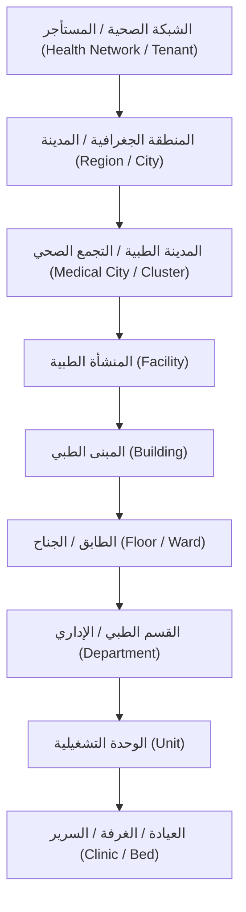

# تدفق محدد المدن الطبية والمنشآت (Medical City Selector Flow)

* **المشروع:** منصة نما الطبية (NamaMedical ERP)
* **المرحلة:** منصة المنشآت الصحية المتعددة (PHASE_ENTERPRISE_FACILITY_PLATFORM_WITH_MEDICAL_CITY_SELECTOR)
* **المستند:** تدفق محدد المدن الطبية (MEDICAL_CITY_SELECTOR_FLOW_AR)
* **الحالة:** معتمد ✅

---

## 1. التدرج الهرمي للمنشآت في النظام

لتوفير إدارة متسقة لشبكات الرعاية الصحية، تم اعتماد التدرج الهرمي التالي للمنشآت والتقسيم الهيكلي:

---

## 2. تدفق وسلوك محدد المدينة الطبية (Selector Logic)

يتكون محدد المنشأة والمدينة الطبية من واجهة منسدلة ثلاثية المراحل (Cascade Selector) في لوحة التحكم لإدارة النطاق كالتالي:

### أ. مرحلة الاختيار المبدئي (Initial Selection)
* **اختيار المدينة الطبية (Medical City Selection):** 
  * يحدد المستخدم الموثق المدينة الطبية (مثال: مدينة الملك فهد الطبية).
  * **سلوك النظام:** يعرض النظام لوحة معلومات شاملة (Cluster Command Center View) تجمع إحصائيات كافة المستشفيات التابعة لها، ومؤشرات الأداء الكلية، والتدفقات المالية الإجمالية.

### ب. مرحلة المنشأة الفردية (Facility Selection)
* **اختيار المنشأة:** يختار المستخدم مستشفى أو مركز متخصص ضمن المدينة الطبية المحددة (مثال: مستشفى الأطفال التخصصي).
  * **سلوك النظام:** يعيد النظام بناء شريط التنقل الجانبي والواجهات ديناميكياً لتقتصر فقط على الأقسام والخدمات التابعة لمستشفى الأطفال.

### ج. فحص وتدقيق القيود والصلاحيات (RBAC Checks)
* يتم فحص صلاحيات المستخدم بعد كل تغيير في محدد المنشأة للتأكد من امتلاكه ترخيص ودور ملائم للمنشأة المختارة:
  * إذا امتلك المستخدم ترخيصاً عاماً لجميع المنشآت (Super Admin / Cluster Auditor): يُتاح له التبديل وعرض كافة البيانات.
  * إذا اقتصر ترخيص المستخدم على منشأة محددة (مثال: طبيب أطفال): يتم تثبيت النطاق على منشأته تلقائياً ويُمنع من التبديل للآخرين.
