# بنية النموذج الأولي للواجهات المحلية (Local Mock API Architecture)

* **المشروع:** منصة نما الطبية (NamaMedical ERP)
* **المرحلة:** النموذج الأولي للواجهات البرمجية المحلية التجريبية (PHASE_LOCAL_MOCK_API_RUNTIME_PROTOTYPE_NO_STAGING_NO_PRODUCTION)
* **الهدف:** شرح الهيكل البرمجي وتدفق البيانات للنموذج الأولي للواجهات المحلية وعلاقته بعقود البيانات وحواجز الأمان.

---

## 1. مخطط الهندسة والتدفق الهيكلي (Data Flow Architecture)

يعتمد النموذج الأولي للواجهات المحلية على المعالجة المغلقة داخل المتصفح (In-Memory Sandbox). ويوضح المخطط التالي تسلسل معالجة الطلب التجريبي:

```mermaid
sequenceDiagram
    participant UI as واجهة المعاينة التفاعلية
    participant Runtime as محرك الواجهات الوهمية (Runtime)
    participant Contracts as عقود البيانات (Contracts)
    participant Safety as حواجز الأمان (Safety Guards)

    UI->>Runtime: استدعاء getMockApiResponse(resource, params)
    
    rect rgb(30, 41, 59)
        Note over Runtime, Safety: فحص حواجز الأمان والاتصالات
        Runtime->>Safety: تحقق assertNoLiveEndpoint(endpoint)
        Safety-->>Runtime: العنوان آمن ومحلي
        Runtime->>Safety: تحقق assertNoPhiPayload(payload)
        Safety-->>Runtime: الطلب خالٍ من البيانات الحساسة
        Runtime->>Safety: تحقق assertNoWriteOperation(action)
        Note over Safety: إذا كانت كتابة (POST) -> تفشل فوراً
    end

    alt الطلب للقراءة (GET)
        Runtime->>Contracts: مطابقة البيانات مع DTO_SCHEMAS
        Contracts-->>Runtime: البيانات مطابقة 100% لعقد البيانات
        Runtime->>Runtime: بناء الاستجابة buildReadOnlyResponse()
        Runtime-->>UI: إرجاع البيانات التجريبية بنجاح
    else الطلب للكتابة (POST)
        Runtime->>Runtime: بناء استجابة المنع buildErrorResponse()
        Runtime-->>UI: إرجاع حالة الحجب (BLOCKED)
    end
```

---

## 2. المكونات البرمجية الرئيسية (Core Architectural Components)

يتكون النظام البرمجي للمحاكاة من أربعة أجزاء رئيسية تعمل معاً بشكل متكامل:

### أ. مخزن البيانات الوهمية المنسق (Anonymized Mock Store)
* مصفوفات برمجية ثابتة خالية تماماً من أي معلومات صحية حقيقية للمرضى أو أرقام هواتف أو هويات حقيقية.
* تم تنسيق البيانات لتطابق الخصائص البرمجية المطلوبة في عقود DTO الخاصة بنظام المستشفيات.

### ب. محرك التحقق والمصادقة الصارم (Assertion Engine)
* **`assertNoWriteOperation`:** يمنع أي محاولة تعديل.
* **`assertNoLiveEndpoint`:** يمنع ربط التطبيق بأي خوادم خارجية أو شبكات حية.
* **`assertNoPhiPayload`:** يفحص المدخلات لمنع تسرب أي بيانات حقيقية للمرضى.

### ج. مطبق العقود (Contract Enforcer)
* يرتبط مباشرة بملف [enterprise-contracts.js](file:///c:/Users/ice/Desktop/NamaMedical/namaweb/public/js/enterprise-contracts.js).
* يقوم بالتحقق من هيكل البيانات لكل مورد من الموارد الـ 10 للتأكد من مطابقتها التامة للـ DTOs المعرفة مسبقاً، مما يضمن توافق الواجهات التجريبية مع التصميم النهائي للمشروع.

### د. مولد سجلات التدقيق الافتراضي (Simulated Audit Generator)
* **`getMockAuditPreview`:** يقوم بإنشاء كائن تدقيق وهمي يوضح دور المستخدم والعملية المنفذة وحالة العملية (ناجحة أو محجوبة) لمحاكاة امتثال النظام لمتطلبات CBAHI دون كتابة فعلية في الجداول.

---
**الخلاصة:** يوفر هذا التصميم الهيكلي حماية قصوى للنظام مع الحفاظ على مرونة عالية تمكن المطورين وفريق اختبار الجودة من استعراض الميزات الجديدة بشكل كامل وآمن.
