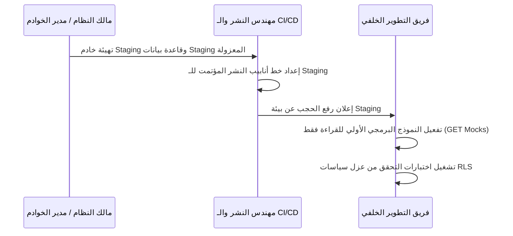

# وثيقة إنهاء مرحلة جاهزية بيئة الاختبار - منصة نما الطبية (Phase Staging Readiness Closeout)

* **المشروع:** منصة نما الطبية (NamaMedical ERP)
* **المرحلة:** جاهزية بيئة الاختبار وفجوات البيئة (PHASE_STAGING_READINESS_AND_ENVIRONMENT_GAP_REPORT)
* **تاريخ الإغلاق:** 30 يونيو 2026
* **القرار النهائي للمرحلة:** **محجوب لوجود فجوات في البيئة (STAGING_BLOCKED_GAPS_FOUND)**

---

## 1. ملخص المخرجات والوثائق المنجزة (Deliverables Summary)

تم إنجاز وتوثيق كافة متطلبات المرحلة بنجاح كامل وحفظها في المسار المعتمد للحوكمة:

1. [PHASE_STAGING_READINESS_PREFLIGHT_AR.md](file:///c:/Users/ice/Desktop/NamaMedical/namaweb/docs/governance/enterprise-hospital-platform/PHASE_STAGING_READINESS_PREFLIGHT_AR.md) - فحص وتحقق المعايير المسبقة.
2. [STAGING_ENVIRONMENT_DISCOVERY_AR.md](file:///c:/Users/ice/Desktop/NamaMedical/namaweb/docs/governance/enterprise-hospital-platform/STAGING_ENVIRONMENT_DISCOVERY_AR.md) - تقرير استكشاف بيئة العمل.
3. [STAGING_ISOLATION_CHECKLIST_AR.md](file:///c:/Users/ice/Desktop/NamaMedical/namaweb/docs/governance/enterprise-hospital-platform/STAGING_ISOLATION_CHECKLIST_AR.md) - قائمة التحقق لعزل بيئة الاختبار.
4. [STAGING_READONLY_RUNTIME_VERIFICATION_PLAN_AR.md](file:///c:/Users/ice/Desktop/NamaMedical/namaweb/docs/governance/enterprise-hospital-platform/STAGING_READONLY_RUNTIME_VERIFICATION_PLAN_AR.md) - خطة التحقق للقراءة فقط.
5. [STAGING_API_PROTOTYPE_SCOPE_AR.md](file:///c:/Users/ice/Desktop/NamaMedical/namaweb/docs/governance/enterprise-hospital-platform/STAGING_API_PROTOTYPE_SCOPE_AR.md) - نطاق العمل للنموذج البرمجي الأولي للـ APIs.
6. [STAGING_BACKEND_RLS_GAP_REPORT_AR.md](file:///c:/Users/ice/Desktop/NamaMedical/namaweb/docs/governance/enterprise-hospital-platform/STAGING_BACKEND_RLS_GAP_REPORT_AR.md) - تقرير الفجوات البرمجية وهيكلية قاعدة البيانات.
7. [STAGING_READINESS_DECISION_REPORT_AR.md](file:///c:/Users/ice/Desktop/NamaMedical/namaweb/docs/governance/enterprise-hospital-platform/STAGING_READINESS_DECISION_REPORT_AR.md) - التقرير النهائي للقرار البرمجي للجاهزية.
8. [PHASE_STAGING_READINESS_IMPLEMENTATION_AR.md](file:///c:/Users/ice/Desktop/NamaMedical/namaweb/docs/governance/enterprise-hospital-platform/PHASE_STAGING_READINESS_IMPLEMENTATION_AR.md) - تقرير تنفيذ أعمال المرحلة.
9. [STAGING_SECURITY_BOUNDARY_REPORT_AR.md](file:///c:/Users/ice/Desktop/NamaMedical/namaweb/docs/governance/enterprise-hospital-platform/STAGING_SECURITY_BOUNDARY_REPORT_AR.md) - تقرير حدود الأمان المعتمد.
10. [STAGING_READINESS_TEST_REPORT_AR.md](file:///c:/Users/ice/Desktop/NamaMedical/namaweb/docs/governance/enterprise-hospital-platform/STAGING_READINESS_TEST_REPORT_AR.md) - تقرير الفحص البرمجي واختبار الجاهزية.
11. [PHASE_STAGING_READINESS_CLOSEOUT_AR.md](file:///c:/Users/ice/Desktop/NamaMedical/namaweb/docs/governance/enterprise-hospital-platform/PHASE_STAGING_READINESS_CLOSEOUT_AR.md) - (هذا الملف) وثيقة الإغلاق والاعتماد للمرحلة.

---

## 2. ملخص الفحص البرمجي والحماية (Security & Testing Summary)

* **الفحص البرمجي للجاهزية:** تم بنجاح كامل (PASS). تم إدراج الاختبار [staging_readiness_design_test.js](file:///c:/Users/ice/Desktop/NamaMedical/namaweb/staging_readiness_design_test.js) كجزء من الفحص العام للمشروع.
* **الالتزام بالـ Zero-DDL:** تم تأكيده بنسبة 100%؛ لم يتم تشغيل أي ترحيلات أو تكوين جداول أو كتابة أي بيانات على السيرفر.
* **حماية أسرار النظام:** تم التحقق من خلو جميع الوثائق والملفات من أي كلمات مرور أو مفاتيح حية.

---

## 3. خطة سد الفجوات والانتقال للمرحلة التالية (Next Phase Roadmap)

بمجرد قيام مالك المشروع بتهيئة خادم Staging مستقل وإعداد قاعدة البيانات المعزولة `nama_medical_staging` وتوفير النطاق الفرعي المطلوب، سيتم الانتقال للخطوات التالية:

---
**تمت مراجعة واعتماد إغلاق هذه المرحلة بنجاح.**
*فريق الحوكمة والجودة - منصة نما الطبية*
