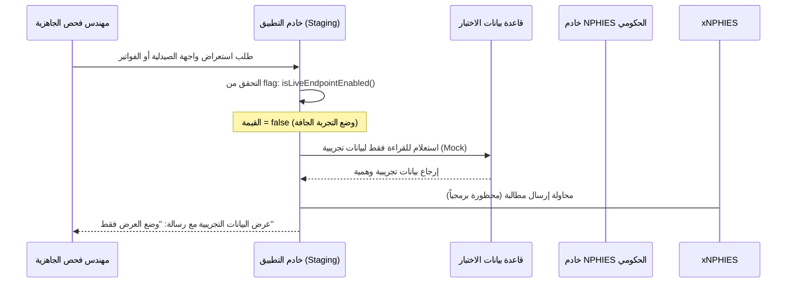

# خطة التحقق للتشغيل للقراءة فقط - بيئة الاختبار (Read-only Runtime Verification Plan)

* **المشروع:** منصة نما الطبية (NamaMedical ERP)
* **المرحلة:** جاهزية بيئة الاختبار وفجوات البيئة (PHASE_STAGING_READINESS_AND_ENVIRONMENT_GAP_REPORT)
* **الهدف:** توفير خطة عمل منهجية وآمنة للتحقق من تشغيل التطبيق في بيئة Staging دون إجراء أي عمليات كتابة أو تعديل هيكلي في قاعدة البيانات، وضمان فاعلية حواجز الحماية.

---

## 1. بروتوكول التحقق من بدء التشغيل والاستقرار (Boot & Health Checks)

عند نشر الإصدار الجديد على خادم الاختبار، يتم تنفيذ خطوات التحقق التالية بترتيب صارم:

1. **التحقق من بدء تشغيل التطبيق (App Boot Cleanliness):**
   * تشغيل التطبيق ومراقبة سجلات PM2 فوراً للتأكد من عدم وجود أخطاء صامتة أو توقف مفاجئ:
     `pm2 logs nama-medical-staging --lines 50`
   * التحقق من عدم وجود أخطاء تتعلق بالاتصال بقاعدة البيانات أو تحميل المكتبات البرمجية.

2. **فحص نقطة الاستجابة للصحة (Health Endpoint Verification):**
   * استدعاء واجهة التحقق من الصحة عبر سطر الأوامر أو المتصفح:
     `curl -i http://localhost:3000/api/health`
   * **النتيجة المتوقعة:** رمز الحالة `200 OK` واستجابة JSON تحتوي على: `{"status":"UP"}`.

3. **تحميل واجهات المستخدم الثابتة (Static UI Modules Load):**
   * فتح المتصفح على صفحات الواجهات الجديدة (مثل لوحة تحكم الأقسام، إدارة غرف العمليات، الصيدلية).
   * فتح نافذة المطورين (F12 Console) والتحقق من عدم وجود أي أخطاء JavaScript تعيق عمل الصفحة أو تحميل الملفات الثابتة.

---

## 2. التحقق من حواجز الأمان وعقود النظام (Security Guards & Contracts)

يجب إجراء فحص برمجي مباشر للتأكد من بقاء بيئة الاختبار في وضع القراءة فقط وعدم تفعيل أي خصائص حية:

1. **فحص ثنائية الأعلام في العقود (Contracts Flags Verification):**
   * فتح وحدة المطورين في المتصفح وتشغيل الأوامر التالية والتحقق من قيمها الراجعة:
     * `window.isLiveEndpointEnabled()` يجب أن تُرجع **`false`**.
     * `window.isWriteOperationEnabled()` يجب أن تُرجع **`false`**.
   * تشغيل الاختبار البرمجي المخصص للتحقق من بقاء هذه الدوال مغلقة بشكل قاطع.

2. **تأكيد تعطيل واجهات OpenAPI (OpenAPI Endpoints Status):**
   * محاولة استدعاء أي واجهة من واجهات المؤسسة الجديدة المخطط لها (مثل `/api/v1/clinical-orders`).
   * **النتيجة المتوقعة:** استلام رمز الحالة `404 Not Found` أو استجابة تفيد بأن الواجهة غير مفعلة ومخطط لها فقط (`PLANNED_DISABLED`).

---

## 3. حظر الكتابة والعمليات النهائية (No Database Writes & Final Actions)

يتضمن البروتوكول ضمانات لمنع العمليات المؤثرة على سير العمل الفعلي:

* **منع هجرات البيانات (No DDL/No Migrations):**
   * منع تشغيل أي ملفات `.sql` أو عمليات ترحيل بيانات في بيئة Staging أثناء مرحلة التحقق من الواجهات البرمجية الأولية.
* **منع المعلومات الصحية المحمية (No PHI Leakage):**
   * التحقق من عدم تخزين أو عرض أي بيانات مرضى حقيقية. استخدام بيانات وهمية (Mock Data) بالكامل لجميع العمليات التجريبية.
* **منع المعاملات المالية والصيدلانية والسريرية النهائية (No Final Actions):**
   * التأكد من حظر عمليات الصرف الفعلي للأدوية (No Pharmacy Dispense).
   * التأكد من حظر إرسال الفواتير أو المطالبات إلى نظام NPHIES (No NPHIES Calls).
   * التأكد من حظر التوقيعات السريرية النهائية على الملفات الطبية (No Clinical Signatures).

---

## 4. سيناريو الاختبار الجاف (Dry-Run Verification Scenario)

لإثبات أن بيئة Staging آمنة تماماً، يتم تشغيل السيناريو الجاف التالي:

---
**الخلاصة:** توفر هذه الخطة إطار عمل آمن ومحكم يضمن الحفاظ على سلامة النظام وعدم التداخل مع أي بيانات حية أثناء فحص جاهزية التطبيق في بيئة الاختبار.
